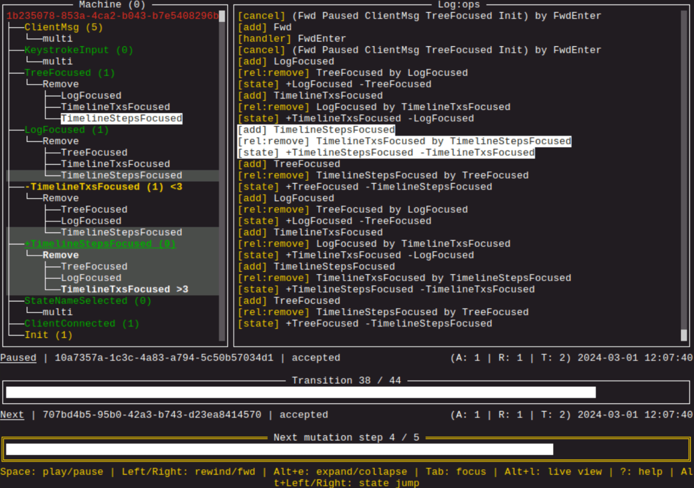

<br>
<div align="center">
  <a href="https://glasskube.dev?utm_source=github">
    
  </a>

<h3 align="center">Declarative workflows with relations (state machine)</h3>

  <p align="center">
    <a href="#usage"><strong>Usage »</strong></a>
    <br>
    <a href="#examples"><strong>Examples »</strong></a>
    <br>
    <a href="#documentation"><strong>Documentation »</strong></a>
    <br>
    <a href="#tools"><strong>Tools »</strong></a>
    <br>
    <a href="#integrations"><strong>Integrations »</strong></a>
    <br>
    <a href="#case-studies"><strong>Case Studies »</strong></a>
    <br>
  </p>
</div>

<hr>


**asyncmachine-go** is a minimal implementation of [AsyncMachine](https://github.com/TobiaszCudnik/asyncmachine)
in Golang using **channels and context**. It aims at simplicity and speed.

It can be used as a lightweight in-memory [Temporal](https://github.com/temporalio/temporal)
alternative, worker for [Asynq](https://github.com/hibiken/asynq), or to create simple consensus engines, stateful
firewalls, telemetry, bots, etc.

> **asyncmachine-go** is a general purpose state machine for managing complex asynchronous workflows in a safe and
> structured way

### Comparison

Common differences from other state machines:

- many states can be active at the same time
- transitions between all the states are allowed
- states are connected by relations
- every transition can be rejected
- error is a state

### Buzzwords

> **AM technically is:** event emitter, queue, dependency graph, AOP, logical clocks, ~2.5k LoC, no deps

> **AM gives you:** states, events, thread-safety, logging, metrics, traces, debugger, history, flow constraints, scheduler

> **Flow constraints are:** state mutations, negotiation, relations, "when" methods, state contexts, external contexts

## Usage

### Basics

```go
// ProcessingFile -> FileProcessed (1 async and 1 sync state)
package main

import am "github.com/pancsta/asyncmachine-go/pkg/machine"

func main() {
    // init the machine
    mach := am.New(nil, am.Struct{
        "ProcessingFile": {
            Add: am.S{"InProgress"},
            Remove: am.S{"FileProcessed"},
        },
        "FileProcessed": {
            Remove: am.S{"ProcessingFile", "InProgress"},
        },
        "InProgress": {},
    }, nil)
    mach.BindHandlers(&Handlers{
        Filename: "README.md",
    })
    // change the state
    mach.Add1("ProcessingFile", nil)
    // wait for completed
    select {
    case <-time.After(5 * time.Second):
        println("timeout")
    case <-mach.WhenErr(nil):
        println("err:", mach.Err)
    case <-mach.When1("FileProcessed", nil):
        println("done")
    }
}

type Handlers struct {
    Filename string
}

// negotiation handler
func (h *Handlers) ProcessingFileEnter(e *am.Event) bool {
    // read-only ops
    // decide if moving fwd is ok
    // no blocking
    // lock-free critical zone
    return true
}

// final handler
func (h *Handlers) ProcessingFileState(e *am.Event) {
    // read & write ops
    // no blocking
    // lock-free critical zone
    mach := e.Machine
    // tick-based context
    stateCtx := mach.NewStateCtx("ProcessingFile")
    go func() {
        // block in the background, locks needed
        if stateCtx.Err() != nil {
            return // expired
        }
        // blocking call
        err := processFile(h.Filename, stateCtx)
        if err != nil {
            mach.AddErr(err)
            return
        }
        // re-check the tick ctx after a blocking call
        if stateCtx.Err() != nil {
            return // expired
        }
        // move to the next state in the flow
        mach.Add1("FileProcessed", nil)
    }()
}
```

### Waiting

```go
// wait until FileDownloaded becomes active
<-mach.When1("FileDownloaded", nil)

// wait until FileDownloaded becomes inactive
<-mach.WhenNot1("DownloadingFile", args, nil)

// wait for EventConnected to be activated with an arg ID=123
<-mach.WhenArgs("EventConnected", am.A{"ID": 123}, nil)

// wait for Foo to have a tick >= 6 and Bar tick >= 10
<-mach.WhenTime(am.S{"Foo", "Bar"}, am.T{6, 10}, nil)

// wait for DownloadingFile to have a tick increased by 2 since now
<-mach.WhenTick("DownloadingFile", 2, nil)

// wait for an error
<-mach.WhenErr()
```

See [docs/cookbook.md](docs/cookbook.md) for more snippets.

## Examples

### [FSM - Finite State Machine](/examples/fsm/fsm_test.go)

- [origin](https://en.wikipedia.org/wiki/Finite-state_machine)

<details>

<summary>States structure</summary>

```go
var (
    states = am.Struct{
        // input states
        InputPush: {},
        InputCoin: {},

        // "state" states
        Locked: {
            Auto:   true,
            Remove: groupUnlocked,
        },
        Unlocked: {Remove: groupUnlocked},
    }
)
```

</details>

### [NFA - Nondeterministic Finite Automaton](/examples/nfa/nfa_test.go)

- [origin](https://en.wikipedia.org/wiki/Nondeterministic_finite_automaton)

<details>

<summary>States structure</summary>

```go
var (
    states = am.Struct{
        // input states
        Input: {Multi: true},

        // action states
        Start: {Add: am.S{StepX}},

        // "state" states
        StepX: {Remove: groupSteps},
        Step0: {Remove: groupSteps},
        Step1: {Remove: groupSteps},
        Step2: {Remove: groupSteps},
        Step3: {Remove: groupSteps},
    }
)
```

</details>

### [PathWatcher](/examples/watcher/watcher.go)

- [origin](https://github.com/pancsta/sway-yast/)

<details>

<summary>States structure</summary>

```go
// States map defines relations and properties of states (for files).
var States = am.Struct{
    Init: {Add: S{Watching}},

    Watching: {
        Add:   S{Init},
        After: S{Init},
    },
    ChangeEvent: {
        Multi:   true,
        Require: S{Watching},
    },

    Refreshing: {
        Multi:  true,
        Remove: S{AllRefreshed},
    },
    Refreshed:    {Multi: true},
    AllRefreshed: {},
}

// StatesDir map defines relations and properties of states (for directories).
var StatesDir = am.Struct{
    Refreshing:   {Remove: groupRefreshed},
    Refreshed:    {Remove: groupRefreshed},
    DirDebounced: {Remove: groupRefreshed},
    DirCached:    {},
}
```

</details>

### [Temporal Expense Workflow](/examples/temporal-expense/expense_test.go)

- [origin](https://github.com/temporalio/samples-go/blob/main/expense/)

<details>

<summary>States structure</summary>

```go
// States map defines relations and properties of states.
var States = am.Struct{
    CreatingExpense: {Remove: GroupExpense},
    ExpenseCreated:  {Remove: GroupExpense},
    WaitingForApproval: {
        Auto:   true,
        Remove: GroupApproval,
    },
    ApprovalGranted: {Remove: GroupApproval},
    PaymentInProgress: {
        Auto:   true,
        Remove: GroupPayment,
    },
    PaymentCompleted: {Remove: GroupPayment},
}

```

</details>

### [Temporal FileProcessing Workflow](/examples/temporal-fileprocessing/fileprocessing.go)

- [origin](https://github.com/temporalio/samples-go/blob/main/fileprocessing/)
- [Asynq worker version](examples/asynq-fileprocessing/fileprocessing_task.go)

<details>

<summary>States structure</summary>

```go
// States map defines relations and properties of states.
var States = am.Struct{
    DownloadingFile: {Remove: GroupFileDownloaded},
    FileDownloaded:  {Remove: GroupFileDownloaded},
    ProcessingFile: {
        Auto:    true,
        Require: S{FileDownloaded},
        Remove:  GroupFileProcessed,
    },
    FileProcessed: {Remove: GroupFileProcessed},
    UploadingFile: {
        Auto:    true,
        Require: S{FileProcessed},
        Remove:  GroupFileUploaded,
    },
    FileUploaded: {Remove: GroupFileUploaded},
}
```

</details>

## Documentation

- [godoc](https://godoc.org/github.com/pancsta/asyncmachine-go/pkg/machine)
- [cookbook](/docs/cookbook.md)
- [manual](/docs/manual.md)
  - [Machine and States](/docs/manual.md#machine-and-states)
      - [State Clocks and Context](/docs/manual.md#state-clocks-and-context)
      - [Auto States](/docs/manual.md#auto-states)
      - [Categories of States](/docs/manual.md#categories-of-states)
      - ...
  - [Changing State](/docs/manual.md#changing-state)
      - [State Mutations](/docs/manual.md#state-mutations)
      - [Transition Lifecycle](/docs/manual.md#transition-lifecycle)
      - [Calculating Target States](/docs/manual.md#calculating-target-states)
      - [Negotiation Handlers](/docs/manual.md#negotiation-handlers)
      - [Final Handlers](/docs/manual.md#final-handlers)
      - ...
  - [Advanced Topics](/docs/manual.md#advanced-topics)
      - [State's Relations](/docs/manual.md#states-relations)
      - [Queue and History](/docs/manual.md#queue-and-history)
      - [Typesafe States](/docs/manual.md#typesafe-states)
      - ...
  - [Cheatsheet](/docs/manual.md#cheatsheet)

## Tools

### Generator

`am-gen` will quickly bootstrap a typesafe states file for you.

`$ am-gen states-file Foo,Bar`

<details>

<summary>See the result for Foo and Bar</summary>

```go
package states

import am "github.com/pancsta/asyncmachine-go/pkg/machine"

// S is a type alias for a list of state names.
type S = am.S

// States map defines relations and properties of states.
var States = am.Struct{
    Foo: {},
    Bar: {},
}

// Groups of mutually exclusive states.

//var (
//      GroupPlaying = S{Playing, Paused}
//)

//#region boilerplate defs

// Names of all the states (pkg enum).

const (
    Foo = "Foo"
    Bar = "Bar"
)

// Names is an ordered list of all the state names.
var Names = S{
    Foo,
    Bar,
    am.Exception,
}

//#endregion
```

</details>

See [`tools/cmd/am-gen`](tools/cmd/am-gen/README.md) for more info.

### Debugger



`am-dbg` is a lightweight, multi-client debugger for AM. It easily handles >100
 client machines simultaneously (and potentially many more). Some features include:

- states tree
- log view
- time travel
- transition steps
- import / export
- matrix view

See [`tools/cmd/am-dbg`](tools/cmd/am-dbg/README.md) for more info.

## Integrations

### Open Telemetry

<picture>
  <source media="(prefers-color-scheme: dark)" srcset="assets/otel-jaeger.dark.png?raw=true">
  <source media="(prefers-color-scheme: light)" srcset="assets/otel-jaeger.light.png?raw=true">
  
</picture>

[`pkg/telemetry`](pkg/telemetry/README.md) provides [Open Telemetry](https://opentelemetry.io/) integration which exposes
machine's states and transitions as Otel traces, compatible with [Jaeger](https://www.jaegertracing.io/).

See [`pkg/telemetry`](pkg/telemetry/README.md) for more info or [import a sample asset](assets/bench-jaeger-3h-10m.traces.json?raw=true).

### Prometheus

<picture>
  <source media="(prefers-color-scheme: dark)" srcset="assets/prometheus-grafana.dark.png?raw=true">
  <source media="(prefers-color-scheme: light)" srcset="assets/prometheus-grafana.light.png?raw=true">
  
</picture>

[`pkg/telemetry/prometheus`](pkg/telemetry/prometheus/README.md) binds to machine's transactions and averages the
values withing an interval window and exposes various metrics. Combined with [Grafana](https://grafana.com/), it can be
used to monitor the metrics of you machines.

See [`pkg/telemetry/prometheus`](pkg/telemetry/prometheus/README.md) for more info.

## Case Studies

Several case studies are available to show how to implement various types of machines, measure performance and produce
a lot of inspectable data.

### libp2p-pubsub benchmark

<picture>
  <source media="(prefers-color-scheme: dark)" srcset="assets/bench.dark.jpg?raw=true">
  <source media="(prefers-color-scheme: light)" srcset="assets/bench.light.png?raw=true">
  
</picture>

- **pubsub host** - eg `ps-17` (20 states)<br />
  PubSub machine is a simple event loop with Multi states which get responses via arg channels. Heavy use of `Machine.Eval()`.
- **discovery** - eg `ps-17-disc` (10 states)<br />
  Discovery machine is a simple event loop with Multi states and a periodic refresh state.
- **discovery bootstrap** - eg `ps-17-disc-bf3` (5 states)<br />
  `BootstrapFlow` is a non-linear flow for topic bootstrapping with some retry logic.

See
[github.com/pancsta/**go-libp2p-pubsub-benchmark**](https://github.com/pancsta/go-libp2p-pubsub-benchmark/#libp2p-pubsub-benchmark)
or the [pdf results](https://github.com/pancsta/go-libp2p-pubsub-benchmark/raw/main/assets/bench.pdf) for more info.

### libp2p-pubsub simulator

<picture>
  <source media="(prefers-color-scheme: dark)" srcset="assets/sim-grafana.dark.png?raw=true">
  <source media="(prefers-color-scheme: light)" srcset="assets/sim-grafana.light.png?raw=true">
  
</picture>

- **simulator** `sim` (14 states)<br />
  Root simulator machine, initializes the network and manipulates it during heartbeats according to frequency
  definitions. Heavily dependent on state negotiation.
- **simulator's peer** - eg `sim-p17` (17 states)<br />
  Handles peer's connections, topics and messages. This machine has a decent amount of relations. Each sim peer has its
  own pubsub host.
- **topics** - eg `sim-t-se7ev` (5 states)<br />
  State-only machine (no handlers, no goroutine). States represent correlations with peer machines.

See
[github.com/pancsta/**go-libp2p-pubsub-benchmark**](https://github.com/pancsta/go-libp2p-pubsub-benchmark?tab=readme-ov-file#libp2p-pubsub-simulator)
for more info.

### am-dbg

am-dbg is a [tview](https://github.com/rivo/tview/) TUI app with a single machine consisting of:

- input events (7 states)
- external state (11 states)
- actions (14 states)

This machine features a decent amount of relations within a large number of states and 4 state groups. It's also a good
example to see how easily an AM-based program can be controller with a script in [tools/cmd/am-dbg-demo](tools/cmd/am-dbg-demo/main.go#L68).

<details>

<summary>See states structure and relations</summary>

```go
// States map defines relations and properties of states.
var States = am.Struct{
    ///// Input events

    ClientMsg:       {Multi: true},
    ConnectEvent:    {Multi: true},
    DisconnectEvent: {Multi: true},

    // user scrolling tx / steps
    UserFwd: {
        Add:    S{Fwd},
        Remove: GroupPlaying,
    },
    UserBack: {
        Add:    S{Back},
        Remove: GroupPlaying,
    },
    UserFwdStep: {
        Add:     S{FwdStep},
        Require: S{ClientSelected},
        Remove:  am.SMerge(GroupPlaying, S{LogUserScrolled}),
    },
    UserBackStep: {
        Add:     S{BackStep},
        Require: S{ClientSelected},
        Remove:  am.SMerge(GroupPlaying, S{LogUserScrolled}),
    },

    ///// External state (eg UI)

    // focus group

    TreeFocused:          {Remove: GroupFocused},
    LogFocused:           {Remove: GroupFocused},
    SidebarFocused:       {Remove: GroupFocused},
    TimelineTxsFocused:   {Remove: GroupFocused},
    TimelineStepsFocused: {Remove: GroupFocused},
    MatrixFocused:        {Remove: GroupFocused},
    DialogFocused:        {Remove: GroupFocused},

    StateNameSelected:    {Require: S{ClientSelected}},
    HelpDialog:           {Remove: GroupDialog},
    ExportDialog: {
        Require: S{ClientSelected},
        Remove:  GroupDialog,
    },
    LogUserScrolled: {},
    Ready:           {Require: S{Start}},

    ///// Actions

    Start: {},
    TreeLogView: {
        Auto:   true,
        Remove: GroupViews,
    },
    MatrixView:     {Remove: GroupViews},
    TreeMatrixView: {Remove: GroupViews},
    TailMode: {
        Require: S{ClientSelected},
        Remove:  GroupPlaying,
    },
    Playing: {
        Require: S{ClientSelected},
        Remove:  am.SMerge(GroupPlaying, S{LogUserScrolled}),
    },
    Paused: {
        Auto:    true,
        Require: S{ClientSelected},
        Remove:  GroupPlaying,
    },

    // tx / steps back / fwd

    Fwd: {
        Require: S{ClientSelected},
        Remove:  S{Playing},
    },
    Back: {
        Require: S{ClientSelected},
        Remove:  S{Playing},
    },
    FwdStep: {
        Require: S{ClientSelected},
        Remove:  S{Playing},
    },
    BackStep: {
        Require: S{ClientSelected},
        Remove:  S{Playing},
    },

    ScrollToTx: {Require: S{ClientSelected}},

    // client selection

    SelectingClient: {Remove: S{ClientSelected}},
    ClientSelected: {
        Remove: S{SelectingClient, LogUserScrolled},
    },
    RemoveClient: {Require: S{ClientSelected}},
}
```

</details>

See [tools/debugger/states](tools/debugger/states) for more info.

## Roadmap

- negotiation testers (eg `CanAdd`)
- helpers for composing networks of machines
- helpers for queue and history traversal
- "state-trace" navbar in am-dbg (via `AddFromEv`)
- go1.22 traces
- inference
- optimizations
- manual updated to a spec

See also [issues](https://github.com/pancsta/asyncmachine-go/issues).

## Development

- all PRs welcome
- before
  - `./scripts/dep-taskfile.sh`
  - `task install-deps`
- after
  - `task test`
  - `task format`
  - `task lint`

## Changelog

Latest release: `v0.5.0`

- feat: add tools/cmd/am-gen [\#63](https://github.com/pancsta/asyncmachine-go/pull/63) (@pancsta)
- feat\(am-dbg\): add `--select-connected` and `--clean-on-connect`
  [\#62](https://github.com/pancsta/asyncmachine-go/pull/62) (@pancsta)
- feat\(am-dbg\): add search as you type \(clients, tree\) [\#61](https://github.com/pancsta/asyncmachine-go/pull/61) (@pancsta)
- feat\(am-dbg\): add matrix view [\#60](https://github.com/pancsta/asyncmachine-go/pull/60) (@pancsta)
- feat\(am-dbg\): optimize UI processing [\#59](https://github.com/pancsta/asyncmachine-go/pull/59) (@pancsta)
- feat\(am-dbg\): add tree relations UI [\#58](https://github.com/pancsta/asyncmachine-go/pull/58) (@pancsta)
- feat\(am-dbg\): add import/export [\#57](https://github.com/pancsta/asyncmachine-go/pull/57) (@pancsta)
- feat\(am-dbg\): add multi client support [\#56](https://github.com/pancsta/asyncmachine-go/pull/56) (@pancsta)
- feat\(machine\): add empty roadmap methods [\#55](https://github.com/pancsta/asyncmachine-go/pull/55) (@pancsta)
- feat\(machine\): add Eval [\#54](https://github.com/pancsta/asyncmachine-go/pull/54) (@pancsta)
- refac\(pkg/machine\): rename many identifiers, shorten [\#53](https://github.com/pancsta/asyncmachine-go/pull/53) (@pancsta)
- feat\(machine\): drop all dependencies \(lo, uuid\) [\#52](https://github.com/pancsta/asyncmachine-go/pull/52) (@pancsta)
- feat\(machine\): alloc handler goroutine on demand [\#51](https://github.com/pancsta/asyncmachine-go/pull/51) (@pancsta)
- feat\(machine\): add Transition.ClocksAfter [\#50](https://github.com/pancsta/asyncmachine-go/pull/50) (@pancsta)
- feat\(machine\): add HasStateChangedSince [\#49](https://github.com/pancsta/asyncmachine-go/pull/49) (@pancsta)
- feat: add pkg/x/helpers [\#48](https://github.com/pancsta/asyncmachine-go/pull/48) (@pancsta)
- feat: add pkg/telemetry/prometheus
  [\#46](https://github.com/pancsta/asyncmachine-go/pull/46) (@pancsta)
- feat: add pkg/history [\#45](https://github.com/pancsta/asyncmachine-go/pull/45) (@pancsta)
- fix\(machine\): add funcs SMerge, NormalizeID, IsActiveTick, CloneStates
  [\#44](https://github.com/pancsta/asyncmachine-go/pull/44) (@pancsta)
- fix\(machine\): fix thread safety [\#43](https://github.com/pancsta/asyncmachine-go/pull/43) (@pancsta)
- feat\(machine\): add Tracer API and Opts.Tracers [\#42](https://github.com/pancsta/asyncmachine-go/pull/42) (@pancsta)
- feat\(machine\): add SetStruct, EventStructChange
  [\#41](https://github.com/pancsta/asyncmachine-go/pull/41) (@pancsta)
- feat\(machine\): add getters \(ActiveStates, Queue, Struct\)
  [\#40](https://github.com/pancsta/asyncmachine-go/pull/40) (@pancsta)
- feat\(machine\): add single-state shorthands \(Add1, Has1, etc\)
  [\#39](https://github.com/pancsta/asyncmachine-go/pull/39) (@pancsta)
- feat\(machine\): add Switch\(states...\) [\#38](https://github.com/pancsta/asyncmachine-go/pull/38) (@pancsta)
- feat\(machine\): add Opts.Parent [\#37](https://github.com/pancsta/asyncmachine-go/pull/37) (@pancsta)
- feat\(machine\): add Opts.LogArgs, NewArgsMapper [\#36](https://github.com/pancsta/asyncmachine-go/pull/36) (@pancsta)
- feat\(machine\): add Opts.QueueLimit [\#35](https://github.com/pancsta/asyncmachine-go/pull/35) (@pancsta)
- feat\(machine\): add WhenDisposed, RegisterDisposalHandler [\#34](https://github.com/pancsta/asyncmachine-go/pull/34) (@pancsta)
- feat\(machine\): add WhenArgs [\#33](https://github.com/pancsta/asyncmachine-go/pull/33) (@pancsta)
- feat\(machine\): add WhenTime, WhenTicks [\#32](https://github.com/pancsta/asyncmachine-go/pull/32) (@pancsta)

See [CHANELOG.md](/CHANGELOG.md) for the full list.
