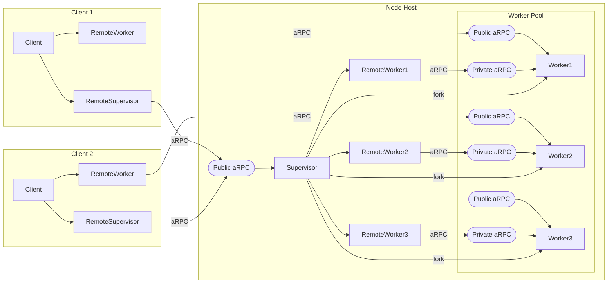

[](https://goreportcard.com/report/github.com/pancsta/asyncmachine-go)
[](https://pkg.go.dev/github.com/pancsta/asyncmachine-go)
[](https://github.com/pancsta/asyncmachine-go/commits/main/)

[](https://matrix.to/#/#room:asyncmachine)

<div align="center">
    <a href="#samples">Samples</a> |
    <a href="#getting-started">Getting Started</a> |
    <a href="#packages">Packages</a> |
    <a href="#case-studies">Case Studies</a> |
    <a href="#documentation">Docs</a> |
    <a href="#community">Community</a> |
    <a href="#development">Status</a> |
    <a href="#development">Dev</a> |
    <a href="#development">FAQ</a> |
    <a href="#changes">Changes</a>
    <br />
</div>

#  asyncmachine-go

<div align="center">
    
</div>



> [!NOTE]
> State machines communicate through states (mutations, checking and waiting).

**Asyncmachine-go** is an AOP Actor Model library for distributed workflows, built on top of a lightweight state machine
(nondeterministic, multi-state, clock-based, relational, optionally-accepting, and non-blocking). It has atomic
transitions, RPC, logging, TUI debugger, metrics, tracing, and soon diagrams.

Use cases depend on the layer of the stack used, and range from [goroutine synchronization](/pkg/machine/README.md) and
[state synchronization](/pkg/rpc/README.md) to [worker synchronization](/pkg/node/README.md), bots, consensus algos,
etc. **Asyncmachine-go** can precisely target a specific scenario and bring order, structure, and resiliency to
event-based systems.

## Stack

<table>
  <tr>
    <td>.</td>
    <td>.</td>
    <td>.</td>
    <td>.</td>
    <td>.</td>
    <td>.</td>
    <td>PubSub</td>
    <td>.</td>
    <td>.</td>
    <td>.</td>
    <td>.</td>
    <td>.</td>
    <td>.</td>
  </tr>
  <tr>
    <td>.</td>
    <td>.</td>
    <td>.</td>
    <td>.</td>
    <td>.</td>
    <td colspan="3" align=center>Workers</td>
    <td>.</td>
    <td>.</td>
    <td>.</td>
    <td>.</td>
    <td>.</td>
  </tr>
  <tr>
    <td>.</td>
    <td>.</td>
    <td>.</td>
    <td>.</td>
    <td colspan="5" align=center>RPC</td>
    <td>.</td>
    <td>.</td>
    <td>.</td>
    <td>.</td>
  </tr>
  <tr>
    <td>.</td>
    <td>.</td>
    <td>.</td>
    <td colspan="7" align=center>Handlers</td>
    <td>.</td>
    <td>.</td>
    <td>.</td>
  </tr>
  <tr>
    <td>.</td>
    <td>.</td>
    <td colspan="9" align=center>Machine API</td>
    <td>.</td>
    <td>.</td>
  </tr>
  <tr>
    <td>.</td>
    <td colspan="11" align=center>Relations</td>
    <td>.</td>
  </tr>
  <tr>
    <td colspan="13" align=center><b><u>States</u></b></td>
  </tr>
</table>

## Samples

**Minimal** - an untyped definition of 2 states and 1 relation, then 1 mutation and a check.

```go
import am "github.com/pancsta/asyncmachine-go/pkg/machine"
// ...
mach := am.New(nil, am.Struct{
    "Foo": {Require: am.S{"Bar"}},
    "Bar": {},
}, nil)
mach.Add1("Foo", nil)
mach.Is1("Foo") // false
```

**Complicated** - wait on a multi state (event) with 1s timeout, and mutate with typed args, on top of a state context.

```go
// state ctx is a non-err ctx
ctx := client.Mach.NewStateCtx(ssC.WorkerReady)
// time-based subscription
whenPayload := client.Mach.WhenTicks(ssC.WorkerPayload, 1, ctx)
// mutation
client.WorkerRpc.Worker.Add1(ssW.WorkRequested, Pass(&A{
    Input: 2}))
// WaitFor replaces select statements
err := amhelp.WaitForAll(ctx, 1*time.Second, whenPayload)
if ctx.Err() != nil {
    // state ctx expired
    return
}
if err != nil {
    // mutation
    client.Mach.AddErr(err, nil)
    return
}
// WorkerPayload activated
```

**Schema** - states of a node worker.

```go
type WorkerStatesDef struct {
    ErrWork        string
    ErrWorkTimeout string
    ErrClient      string
    ErrSupervisor  string

    LocalRpcReady     string
    PublicRpcReady    string
    RpcReady          string
    SuperConnected    string
    ServeClient       string
    ClientConnected   string
    ClientSendPayload string
    SuperSendPayload  string

    Idle          string
    WorkRequested string
    Working       string
    WorkReady     string

    // inherit from rpc worker
    *ssrpc.WorkerStatesDef
}
```

All examples and benchmarks can be found in [`/examples`](/examples/README.md).

## Getting Started

[`/pkg/machine`](pkg/machine/README.md) is a mandatory ready, while [`/pkg/node`](pkg/node/README.md) is the most
interesting one. Examples in [`/examples`](/examples/README.md) and [`/docs/manual.md`](/docs/manual.md) are good
for a general grasp, while [`/docs/diagrams.md`](/docs/diagrams.md) go deeper into implementation details. Reading tests
is always a good idea.

## Packages

- [`/pkg/helpers`](/pkg/helpers/README.md) Useful functions when working with async state machines.
- [`/pkg/history`](/pkg/history/README.md) History tracking and traversal.
- **[`/pkg/machine`](/pkg/machine/README.md) State machine, the main package. Dependency free and semver compatible.**
- [`/pkg/node`](/pkg/node/README.md) Distributed worker pools with supervisors.
- [`/pkg/rpc`](/pkg/rpc/README.md) Remote state machines, with the same API as local ones.
- [`/pkg/states`](/pkg/states/README.md) Reusable state definitions and piping.
- [`/pkg/telemetry`](/pkg/telemetry/README.md) Telemetry exporters for metrics, traces, and logs.
- `/pkg/pubsub` Planned.
- [`/tools/cmd/am-dbg`](/tools/cmd/am-dbg/README.md) Multi-client TUI debugger.
- [`/tools/cmd/am-gen`](/tools/cmd/am-gen/README.md) Generates states files and Grafana dashboards.
- `/tools/cmd/am-vis` Planned.

## Case Studies

Bigger implementations worth reading:

- [libp2p PubSub Simulator](https://github.com/pancsta/go-libp2p-pubsub-benchmark/#libp2p-pubsub-simulator) Sandbox
  simulator for libp2p-pubsub.
- [libp2p PubSub Benchmark](https://github.com/pancsta/go-libp2p-pubsub-benchmark/#libp2p-pubsub-benchmark)
  Benchmark of libp2p-pubsub ported to asyncmachine-go.
- [am-dbg TUI Debugger](/tools/debugger/README.md) Single state machine TUI app.

## Documentation

- [API](https://pkg.go.dev/github.com/pancsta/asyncmachine-go/pkg/machine)
- [diagrams](/docs/diagrams.md) \| [cookbook](/docs/cookbook.md)
- [manual.md](/docs/manual.md) \| [manual.pdf](https://pancsta.github.io/assets/asyncmachine-go/manual.pdf)
  - [Machine and States](/docs/manual.md#machine-and-states)
  - [Changing State](/docs/manual.md#changing-state)
  - [Advanced Topics](/docs/manual.md#advanced-topics)
  - [Cheatsheet](/docs/manual.md#cheatsheet)

## Community

- [GH discussions](https://github.com/pancsta/asyncmachine-go/discussions)
- [Matrix chat](https://matrix.to/#/#room:asyncmachine)

## Status

Under heavy development, status depends on each package. The bottom layers seem prod grade, the top ones are alpha or testing.

## Development

- all PRs welcome
- before
  - `./scripts/dep-taskfile.sh`
  - `task install-deps`
- after
  - `task test`
  - `task format`
  - `task lint`

## FAQ

### How does asyncmachine work?

It calls certain methods on a struct in a certain order (eg BarEnter, FooFoo, FooBar, BarState).

### What is a "state" in asyncmachine?

State as in "status", not state as in "data". For example, not a JSON string, but "process RUNNING", or "car BROKEN".

### Can asyncmachine be integrated with other frameworks?

Yes, because asyncmachine is more of a set of libraries following the same conventions, than an actual framework. It can
integrate
with anything via states-based APIs.

### How does asyncmachine compare to [Temporal](https://github.com/temporalio/temporal)?

Temporal is an all-in-one solution with data persistence, which is its limitation. Asyncmachine doesn't hold any data by
itself
and has progressive layers, making it usable in a wide variety of use cases (e.g. asyncmachine could do workflows for a
desktop app).

### How does asyncmachine compare to [Ergo](https://github.com/ergo-services/ergo)?

Ergo is a great framework, but leans on old ideas and has web-based tooling. It also isn't natively based on state
machines. Asyncmachine provides productivity-focused TUI tooling and rich integrations, while having every component
natively state-based (even the [code generator](/tools/generator/states/ss_generator.go)).

### Does aRPC auto sync data?

aRPC auto syncs only states (clock values). Mutations carry data in arguments, from client to server, while the
SendPayload state passes payloads back to the client.

### Does asyncmachine return data?

No, just yes/no/later (Executed, Canceled, Queued).

### Does asyncmachine return errors?

No, but there's an error state (Exception). Optionally, there are also detailed error states (e.g. ErrNetwork).

### Why asyncmachine avoids blocking?

The lack of blocking allows for immediate adjustment to incoming changes and is backed by solid cancellation support.

### What does "clock-based" mean?

Each state has a counter of activations, and all state counters create "machine time".

### What's the difference between states and events?

Same event happening in a series will cause 1 state activation, until the state becomes inactive.

### How do I do X/Y/Z in asyncmachine?

Usually the answer is "make it a state".

## Changes

- [Changelog](CHANGELOG.md)
- [Breaking Changes](BREAKING.md)
- [Roadmap](ROADMAP.md)
