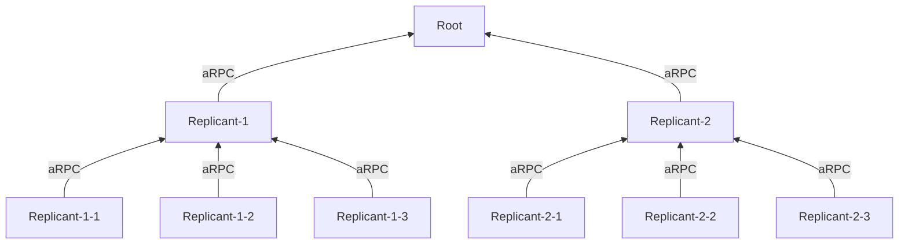
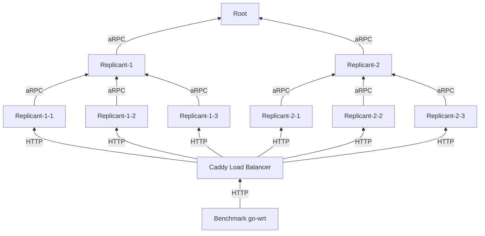

# Diagrams from Examples

## Tree State Source

- [origin](/examples/tree_state_source)

```mermaid
flowchart BT
    Root
    Replicant-1 -- aRPC --> Root
    Replicant-2 -- aRPC --> Root

    Replicant-1-1 -- aRPC --> Replicant-1
    Replicant-1-2 -- aRPC --> Replicant-1
    Replicant-1-3 -- aRPC --> Replicant-1

    Replicant-2-1 -- aRPC --> Replicant-2
    Replicant-2-2 -- aRPC --> Replicant-2
    Replicant-2-3 -- aRPC --> Replicant-2
```

## Benchmark State Source

- [origin](/examples/benchmark_state_source)

```mermaid
flowchart BT
    Root
    Replicant-1 -- aRPC --> Root
    Replicant-2 -- aRPC --> Root

    Replicant-1-1 -- aRPC --> Replicant-1
    Replicant-1-2 -- aRPC --> Replicant-1
    Replicant-1-3 -- aRPC --> Replicant-1

    Replicant-2-1 -- aRPC --> Replicant-2
    Replicant-2-2 -- aRPC --> Replicant-2
    Replicant-2-3 -- aRPC --> Replicant-2

    Caddy[Caddy Load Balancer]
    Caddy -- HTTP --> Replicant-1-1
    Caddy -- HTTP --> Replicant-1-2
    Caddy -- HTTP --> Replicant-1-3
    Caddy -- HTTP --> Replicant-2-1
    Caddy -- HTTP --> Replicant-2-2
    Caddy -- HTTP --> Replicant-2-3

    Benchmark[Benchmark go-wrt]
    Benchmark -- HTTP --> Caddy
```
