# Diagrams

## aRPC Architecture

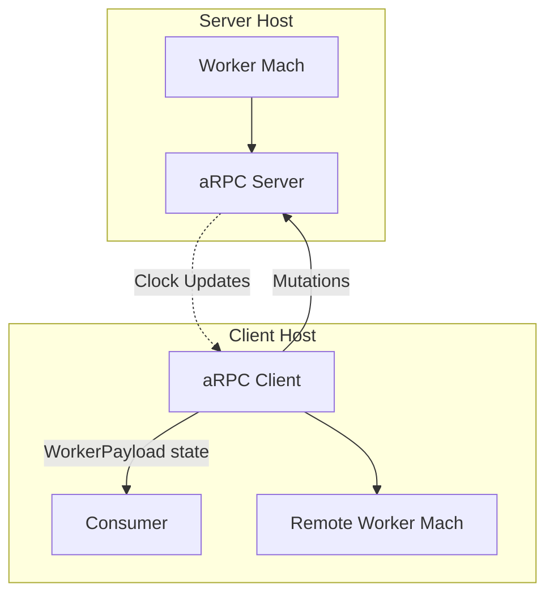

## Worker Pool Architecture

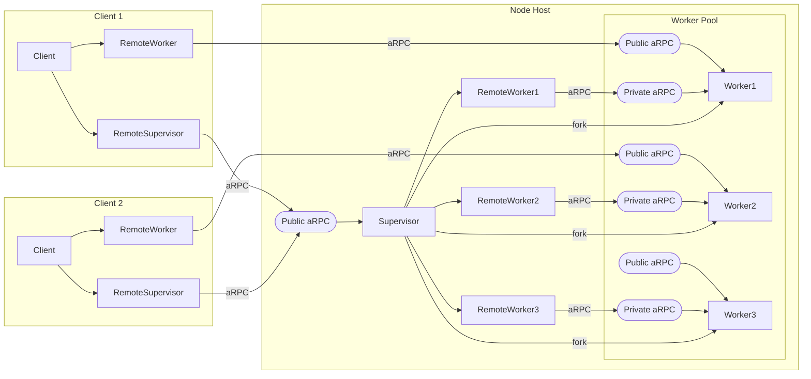

## Machine Basics

### [Many active states](/docs/manual.md#introduction)

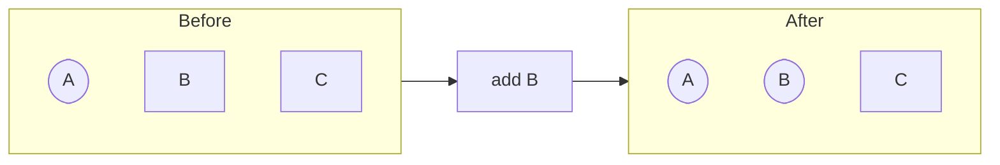

### [Clock and state contexts](/docs/manual.md#clock-and-context)

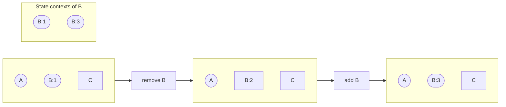

### [Queue](/docs/manual.md#queue-and-history)

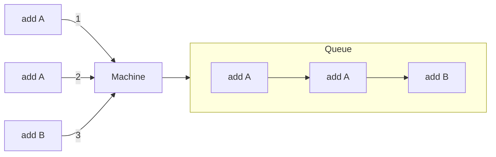

### [AOP handlers](/docs/manual.md#transition-handlers)

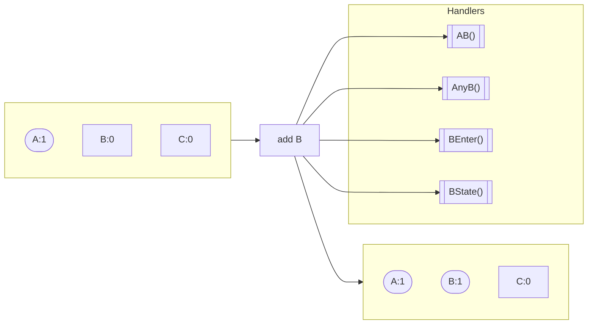

### [Negotiation](/docs/manual.md#transition-lifecycle)

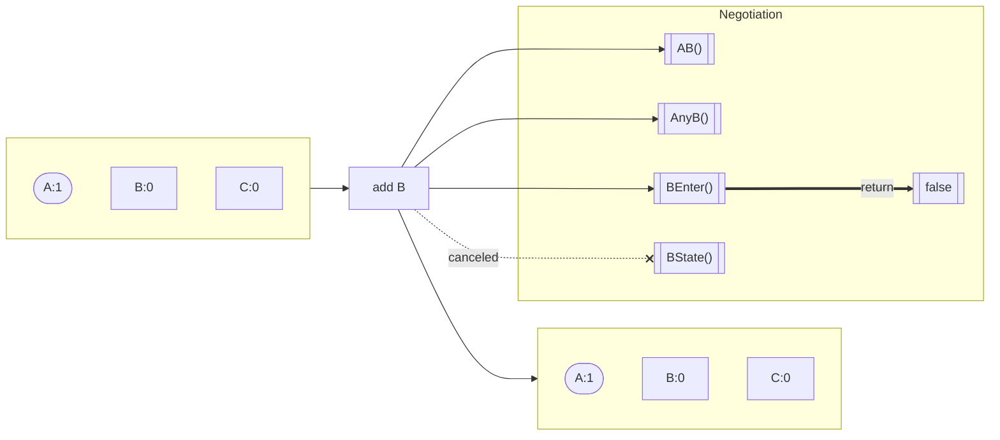

### [Relations](/docs/manual.md#relations)

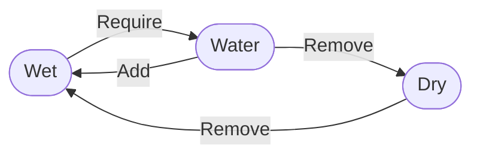

### [Subscriptions](/docs/manual.md#waiting)

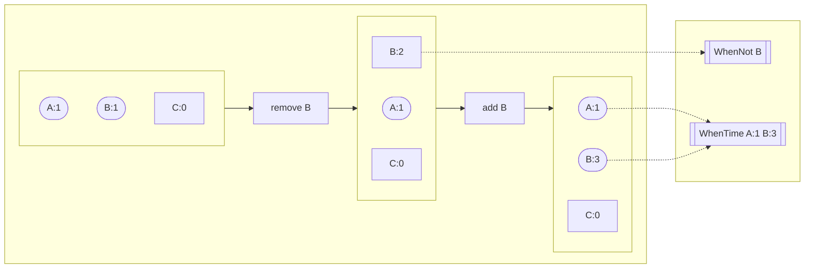

## Flows

### Legend

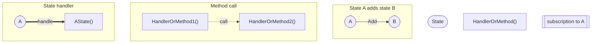

### RPC Getter Flow

Consumer requests payload from a remote worker.

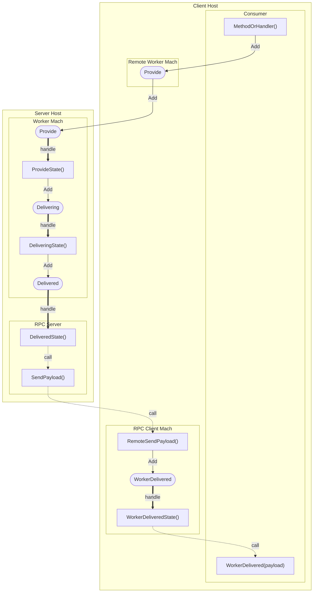

### Worker Bootstrap

[Node Supervisor](/pkg/node/README.md) forks a new worker process for the pool.

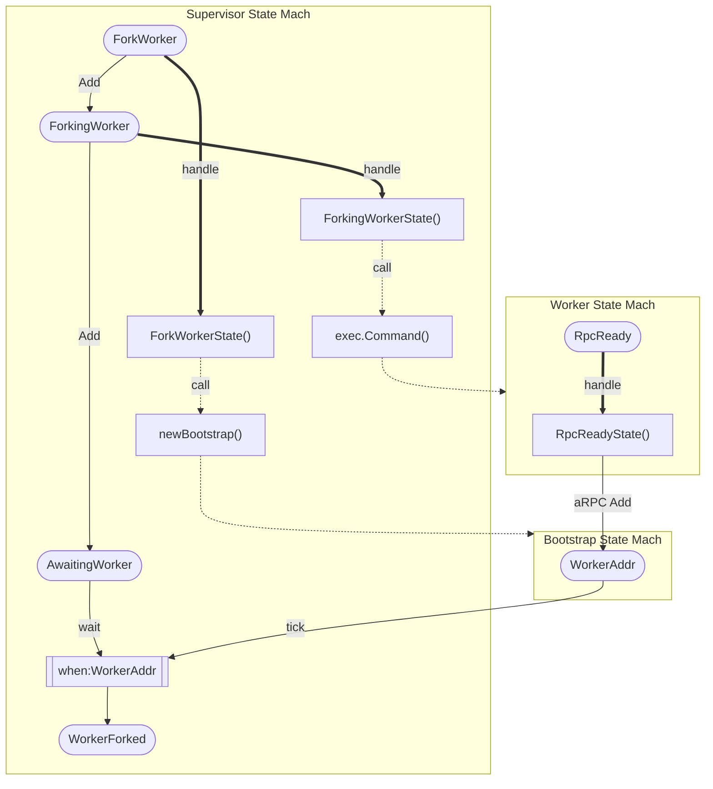
