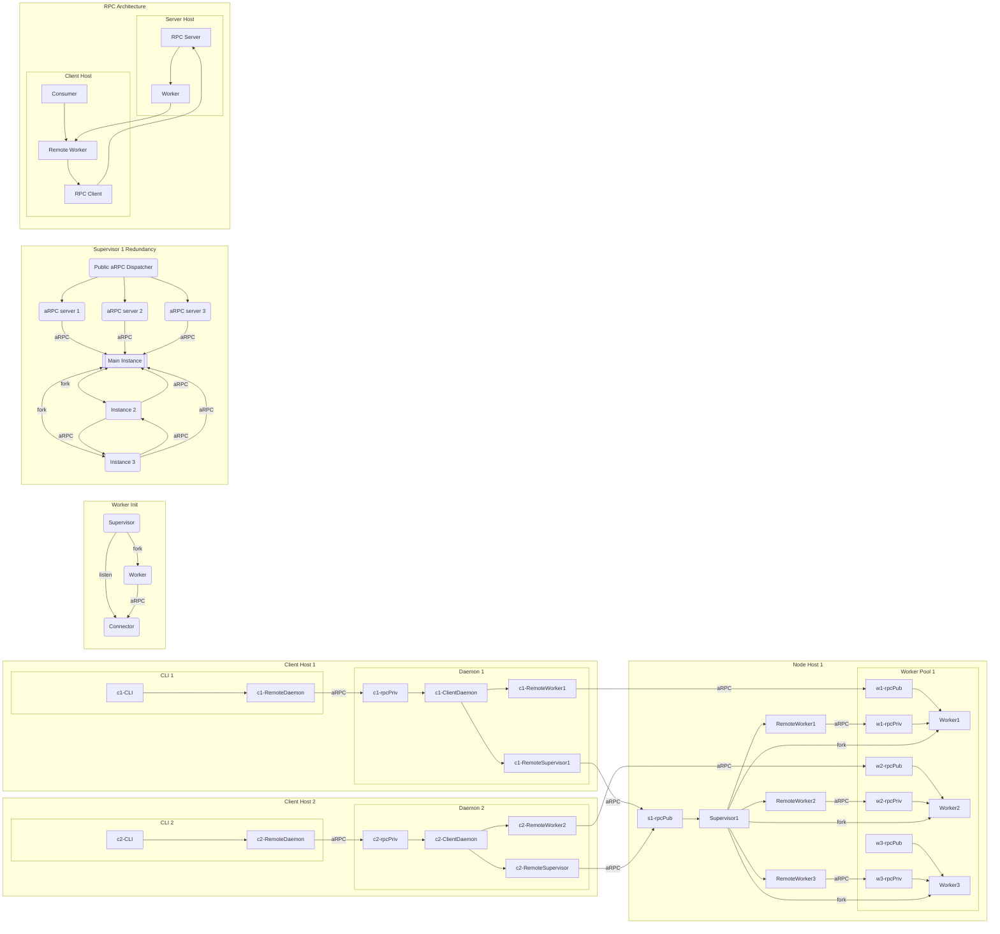
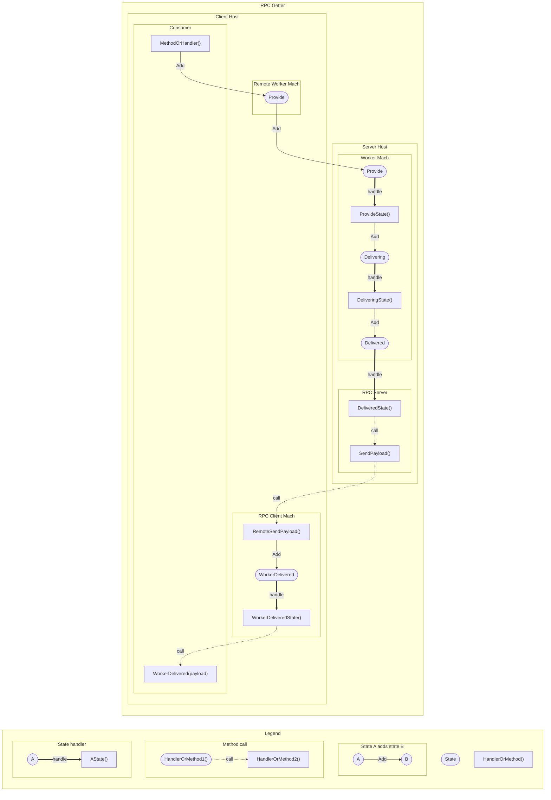

# Diagrams

## Architecture

```mermaid
flowchart LR
    c1-RemoteWorker1 -- aRPC --> w1-rpcPub
    c1-RemoteSupervisor1 -- aRPC --> s1-rpcPub

    subgraph Client Host 1
        subgraph CLI 1
            c1-CLI --> c1-RemoteDaemon
        end
        subgraph Daemon 1
            c1-RemoteDaemon -- aRPC --> c1-rpcPriv --> c1-ClientDaemon
            c1-ClientDaemon --> c1-RemoteWorker1
            c1-ClientDaemon --> c1-RemoteSupervisor1
            c1-RemoteWorker1
            c1-RemoteSupervisor1
        end
    end

    subgraph Node Host 1
        subgraph Worker Pool 1
            w1-rpcPub --> Worker1
            w1-rpcPriv --> Worker1
            w2-rpcPub --> Worker2
            w2-rpcPriv --> Worker2
            w3-rpcPub --> Worker3
            w3-rpcPriv --> Worker3
        end

        s1-rpcPub --> Supervisor1
        Supervisor1 --> RemoteWorker1
        RemoteWorker1 -- aRPC --> w1-rpcPriv
        Supervisor1 -- fork --> Worker1
        Supervisor1 --> RemoteWorker2
        RemoteWorker2 -- aRPC --> w2-rpcPriv
        Supervisor1 -- fork --> Worker2
        Supervisor1 --> RemoteWorker3
        RemoteWorker3 -- aRPC --> w3-rpcPriv
        Supervisor1 -- fork --> Worker3
    end

    c2-RemoteWorker2 -- aRPC --> w2-rpcPub
    c2-RemoteSupervisor -- aRPC --> s1-rpcPub

    subgraph Client Host 2
        subgraph CLI 2
            c2-CLI --> c2-RemoteDaemon
        end
        subgraph Daemon 2
            c2-RemoteDaemon -- aRPC --> c2-rpcPriv --> c2-ClientDaemon
            c2-ClientDaemon --> c2-RemoteWorker2
            c2-ClientDaemon --> c2-RemoteSupervisor
            c2-RemoteWorker2
            c2-RemoteSupervisor
        end
    end

    %% zoomins

    subgraph work1 [Worker Init]
        work1-worker(Worker)
        work1-super(Supervisor)
        work1-super-conn(Connector)

        work1-super -- fork --> work1-worker
        work1-super -- listen --> work1-super-conn
        work1-worker -- aRPC --> work1-super-conn
    end

    subgraph sup1 [Supervisor 1 Redundancy]
        Supervisor1-1-pub(Public aRPC Dispatcher)
        Supervisor1-1-rpc1(aRPC server 1)
        Supervisor1-1-rpc2(aRPC server 2)
        Supervisor1-1-rpc3(aRPC server 3)
        Supervisor1-1[[Main Instance]]
        Supervisor1-2(Instance 2)
        Supervisor1-3(Instance 3)

        Supervisor1-1-pub  --> Supervisor1-1-rpc1
        Supervisor1-1-pub  --> Supervisor1-1-rpc2
        Supervisor1-1-pub  --> Supervisor1-1-rpc3
        Supervisor1-1-rpc1 -- aRPC --> Supervisor1-1
        Supervisor1-1-rpc2 -- aRPC --> Supervisor1-1
        Supervisor1-1-rpc3 -- aRPC --> Supervisor1-1
        Supervisor1-1 <-- fork --> Supervisor1-2
        Supervisor1-1 <-- fork --> Supervisor1-3
        Supervisor1-2 -- aRPC --> Supervisor1-1
        Supervisor1-2 -- aRPC --> Supervisor1-3
        Supervisor1-3 -- aRPC --> Supervisor1-2
        Supervisor1-3 -- aRPC --> Supervisor1-1
    end

    subgraph rpc [RPC Architecture]
        subgraph rpc-c [Client Host]
            rpc-Consumer[Consumer]
            rpc-Client[RPC Client]
            rpc-RemoteWorker[Remote Worker]
        end

        subgraph rpc-s [Server Host]
            rpc-Server[RPC Server]
            rpc-Worker[Worker]
        end

        rpc-Consumer --> rpc-RemoteWorker
        rpc-RemoteWorker --> rpc-Client
        rpc-Client --> rpc-Server
        rpc-Server --> rpc-Worker
        rpc-Worker --> rpc-RemoteWorker
    end
```

## Flows

```mermaid
flowchart LR
    subgraph Legend
        leg-State([State])
        leg-HandlerOrMethod["HandlerOrMethod()"]

        subgraph LegendAdd [State A adds state B]
            leg-A1([A]) -- Add --> leg-B1([B])
        end

        subgraph LegendCall [Method call]
            leg-HandlerOrMethod21(["HandlerOrMethod1()"]) -. call .-> leg-MethodName22["HandlerOrMethod2()"]
        end

        subgraph LegendHandle [State handler]
            leg-A3([A]) == handle ==> leg-HandlerOrMethod3["AState()"]
        end
    end

%% RPC

    subgraph RPC Getter
        direction TB

        subgraph ClientHost [Client Host]
            subgraph Consumer
                con-MethodOrHandler["MethodOrHandler()"]
                con-WorkerDelibered["WorkerDelivered(payload)"]
            end

            subgraph RemoteWorkerMach [Remote Worker Mach]
            %% Provide Worker is requested to provide some (named) data.
                rw-Provide([Provide])
            end

            subgraph RPCClientMach [RPC Client Mach]
                c-WorkerDelivered([WorkerDelivered])
                c-RemoteSendPayload["RemoteSendPayload()"]
                c-WorkerDeliveredState["WorkerDeliveredState()"]
            end
        end

        subgraph ServerHost [Server Host]
            subgraph RPCServer [RPC Server]
                s-SendPayload["SendPayload()"]
                s-DeliveredState["DeliveredState()"]
            end

            subgraph WorkerMach [Worker Mach]
            %% Provide Worker is requested to provide some (named) data.
                w-Provide([Provide])
            %% Delivering Worker has started send data to the client.
                w-Delivering([Delivering])
                w-Delivered([Delivered])
            %% Delivered Worker has completed sending data to the client.
                w-ProvideState["ProvideState()"]
                w-DeliveringState["DeliveringState()"]
            end
        end

    %% steps
        con-MethodOrHandler -- Add --> rw-Provide
        rw-Provide -- Add --> w-Provide
        w-Provide == handle ==> w-ProvideState
        w-ProvideState -- Add --> w-Delivering
        w-Delivering == handle ==> w-DeliveringState
        w-DeliveringState -- Add --> w-Delivered
        w-Delivered == handle ==> s-DeliveredState
        s-DeliveredState -. call .-> s-SendPayload -. call .-> c-RemoteSendPayload
        c-RemoteSendPayload -- Add --> c-WorkerDelivered
        c-WorkerDelivered == handle ==> c-WorkerDeliveredState
        c-WorkerDeliveredState -. call .-> con-WorkerDelibered
    end
```
