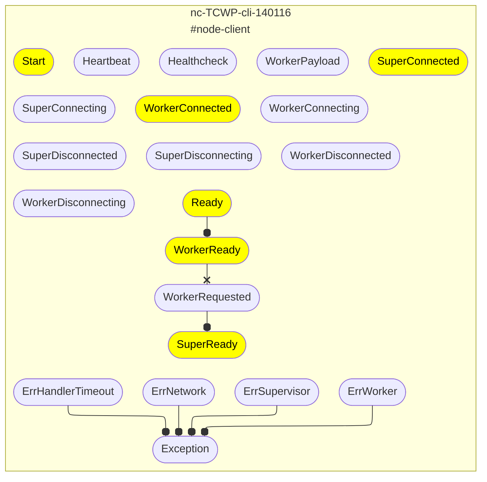
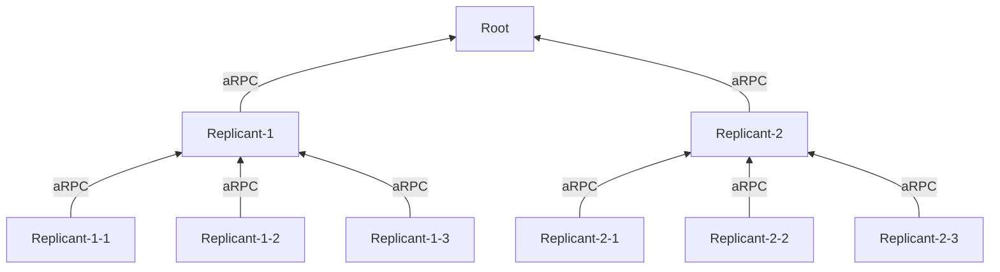
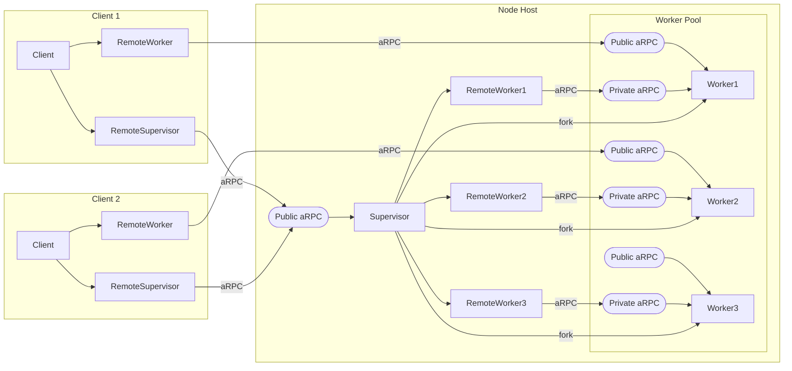

# Release Notes

- [CHANGELOG.md](../CHANGELOG.md)

---

## [v0.18.9](https://github.com/pancsta/asyncmachine-go/releases/tag/v0.18.9) (2026-05-11)

### feat: release v0.18.9

PR: [\#424](https://github.com/pancsta/asyncmachine-go/pull/424) (@pancsta)

- refac: add state refs
- fix(repl): fix completion arg duplication
- fix(machine): fix gc duplicate false-positive
- fix(machine): fix ctxs closed after final handlers
- feat(machine): add `Machine.WhenNextActive`
- feat(helpers): add `EvAdd1Async`, `Add1Async`
- feat(helpers): add `*Remove*Sync`
- feat(helpers): migrate from errgroup to pond
- feat(helpers): add `BlockChan`
- feat(helpers): add `LogToTestLog`
- feat(machine): add `Machine.GoAfter`
- feat(machine): add `StatesByTag`

The remainder of `v0.18.9` is in this PR.

### feat\(am-dbg\): release am-dbg v0.18.9

PR: [\#423](https://github.com/pancsta/asyncmachine-go/pull/423) (@pancsta)

- refac: add state refs
- fix: fix steps and mermaid diagrams
- fix: fix missing log entries
- fix: fix ctrl+c exit
- fix: fix touch counter
- fix: fix listening on 0.0.0.0
- fix: fix machine list rendering
- fix: fix `--output-log`
- feat: add network graph time in the status bar
- feat: add next/prev machine toolbar buttons
- feat: apply auto-canceled tx filter to queued txs 
- feat: add explicit and foldable tree links
- feat: add `[ ]out-log` toolbar button
- feat: add `[ ]rpc` filter and CLI

### feat\(am-vis\): improve transition steps diagrams, mach viewer

PR: [\#422](https://github.com/pancsta/asyncmachine-go/pull/422) (@pancsta)

Changes: maximize shortcut, sequence repeated headers, richer info with state trace, optimized rendering, unified colors.

Transition sequence diagrams are out of experimental and the main way to see steps in am-dbg (steps timeline becomes disabled by default).


### feat\(history\): add BadgerDB backend

PR: [\#421](https://github.com/pancsta/asyncmachine-go/pull/421) (@pancsta)

Another K/V backend for `pkg/history`, useful for WASM, as bbolt doesn't compile at all. Still needs manual binding to IndexedDB or File System API for persistence.

### feat\(docs\): add editor templates and AI skills

PR: [\#420](https://github.com/pancsta/asyncmachine-go/pull/420) (@pancsta)

"Skills" are generated from docs, divided by token usage and purpose. Live templates are often faster for everyday coding tho. See `/docs/editors/README.md`.

### feat\(integrations\): add mcp-go server creator

PR: [\#419](https://github.com/pancsta/asyncmachine-go/pull/419) (@pancsta)

Every state machine with typed args can have an MCP server. See `am-dbg` for how to extend it with custom getters (as asyncmachine does not return data).

### feat\(am-dbg\): add --output-call-log for statically typed handler log

PR: [\#418](https://github.com/pancsta/asyncmachine-go/pull/418) (@pancsta)

An explicit list of code executed by the machine with foldable negotiation. Navigable inside editors and IDEs, references for handler names and active states, ctrl+f, LSP/PSI queries. Still very experimental, manual bootstrap required (later via semlogger).

- `init.go`
```go
package main

import (
	am "github.com/pancsta/asyncmachine-go/pkg/machine"
	arpc "github.com/pancsta/asyncmachine-go/pkg/rpc"

	"github.com/pancsta/asyncmachine-go/pkg/rpc/states"
)

var (
	e      *am.Event
	active am.S

	// TODO import schema
	ss states.ClientStatesDef

	// TODO import handlers
	h0 *arpc.Client
	// h1 *MachHandlers2
)
```

- `0.go`

```go
// Code generated by am-dbg, not for execution. Edit init.go for type defs.
package main

// Omitted: Any*(), Heartbeat*(), Healthcheck*()
func callLog0() {
	// t2
	{
		h0.ConnectingEnter(e)
	}
	h0.StartState(e)
	h0.ConnectingState(e)
	// t5
	h0.ConnectedState(e)
	h0.HandshakingState(e)
	// t7
	{
		h0.HandshakeDoneEnter(e)
	}
	h0.HandshakeDoneState(e)
	// t8
	h1.ReadyState(e)

}
```

### feat\(am-dbg\): standardize machine URLs, add selection and query strings

PR: [\#417](https://github.com/pancsta/asyncmachine-go/pull/417) (@pancsta)

Examples:
 - `mach://cook/5b0e0574309ab28f36a2cd91249545d2-5/26?group=AgentBase&state=BaseDBSaving&t=76`
 - `mach://cook/?t=76`

Better support for mach time (`?t`), queue ticks (`?qt`), human time (`?ht`). Support for steps has been removed, docs are coming.

### feat\(graph\): add XML graph format

PR: [\#416](https://github.com/pancsta/asyncmachine-go/pull/416) (@pancsta)

- fix(graph): fix parsing pipes

The network graph can now be parsed as XML, available in `am-dbg --output-graph`, `am-vis inspect-dump`, and MCP/NetworkGraph. This is useful for a general overview in a single req.

```xml
<machine id="tool-searxng-cook" time="6">
    <state tick="1" active="1">
        Disposed
        <remove>Disposing</remove>
        <remove>Start</remove>
    </state>
    <state tick="2">
        Disposing
        <remove>Start</remove>
    </state>
    <state tick="1" active="1">
        DockerAvailable
        <require>Start</require>
        <remove>DockerChecking</remove>
    </state>
    <state tick="1" active="1">
        DockerChecking
        <require>Start</require>
        <remove>DockerAvailable</remove>
    </state>
    <state tick="0" auto="1">
        DockerStarting
        <require>DockerAvailable</require>
    </state>
    <state tick="0" multi="1">
        ErrHandlerTimeout
        <require>Exception</require>
        <add>Exception</add>
    </state>
    <state tick="0" multi="1">
        ErrNetwork
        <require>Exception</require>
        <add>Exception</add>
    </state>
    <state tick="0">
        ErrOnClient
        <require>Exception</require>
    </state>
    <state tick="1" active="1" multi="1">Exception</state>
    <state tick="0" multi="1">Healthcheck</state>
    <state tick="0">Heartbeat</state>
    <state tick="0" auto="1">
        Idle
        <require>Ready</require>
        <remove>Working</remove>
    </state>
    <state tick="0">
        Ready
        <require>Start</require>
        <remove>DockerStarting</remove>
    </state>
    <state tick="0" multi="1">RegisterDisposal</state>
    <state tick="0">Start</state>
    <state tick="0">
        Working
        <require>Ready</require>
        <remove>Idle</remove>
    </state>
    <pipe to="cook" add="1" as="Ready">Ready</pipe>
    <pipe to="cook" add="0" as="Ready">Ready</pipe>
    <tag>tool</tag>
</machine>
```

### feat\(am-dbg\): add full transition history navigation

PR: [\#415](https://github.com/pancsta/asyncmachine-go/pull/415) (@pancsta)

New buttons, full history traversal and by-machine jumps.


### feat\(am-dbg\): add MCP server and REPL

PR: [\#414](https://github.com/pancsta/asyncmachine-go/pull/414) (@pancsta)

These changes allow for automating repetitive tasks within the debugger.
The MCP server, unlike the REPL, returns data and has predefined mutations via `/pkg/machine.CallSignature`.

Accessible via `--ui-mcp` and `--dbg-repl`.


### feat\(machine\): include relations in TimeAfter for negotiation

PR: [\#413](https://github.com/pancsta/asyncmachine-go/pull/413) (@pancsta)

Usually used via TimeIndexAfter, previously only (shallow) called states were processed. Very useful for proper negotiation.
```go
func (d *Debugger) NarrowLayoutExit(e *am.Event) bool {
    // always allow to exit
    after := e.Transition().TimeIndexAfter()
    if after.Not1(ss.Start) {
        return true
    }

    return after.Not1(ss.UserNarrowLayout)
}
```

---

## [v0.18.8](https://github.com/pancsta/asyncmachine-go/releases/tag/v0.18.8) (2026-04-23)

The highlight of this release is a full state-trace.


### feat: release v0.18.8

PR: [\#411](https://github.com/pancsta/asyncmachine-go/pull/411) (@pancsta)

The remainder of `v0.18.8` is in this PR.

### feat\(am-dbg\): release am-dbg v0.18.8

PR: [\#410](https://github.com/pancsta/asyncmachine-go/pull/410) (@pancsta)

- fix(am-dbg): remove pipes from disconnected clients
- feat(am-dbg): add narrow layout toolbar button
- feat(am-dbg): use filtered transitions for the timeline info bars, steps
- feat(am-dbg): add log wrapping
- fix(am-dbg): fill visible log with filter-matching transitions
- refac(am-dbg): migrate to schema-v2
- refac(am-dbg): trace mutations where possible
- refac(am-dbg): migrate to typed args

A lot of quality-related refacs and a pretty important navigation feature for the timeline. Also, duplicating pipes are now fixed.

### feat\(am-dbg\): add diagram filtering \(group, called, changed, touched, relations, selected\)

PR: [\#409](https://github.com/pancsta/asyncmachine-go/pull/409) (@pancsta)

The new diagram filter options are `--output-diag-tx` and `--output-diag-group` (also on the toolbar). The former one highlights the diagram based on the current transition, while the latter one skips or completely re-renders the graph for states from the selected group. State selection will also highlight the diagram (distinctively). The diagram viewer now also has better UX.


### feat\(am-dbg\): add light theme via `--view-theme light`

PR: [\#408](https://github.com/pancsta/asyncmachine-go/pull/408) (@pancsta)

The light theme can be useful for debugging outdoors. Some fade-out colors in the dark theme have been fixed.


### feat\(am-dbg\): add explicit focus management

PR: [\#407](https://github.com/pancsta/asyncmachine-go/pull/407) (@pancsta)

- feat(am-dbg): improve toolbar keyboard nav

While still not perfect, the focus management is now handled manually which fixes many issues, including a deadlock caused by cview. The navigation in toolbars now wraps and remembers the position index.

### feat\(am-dbg\): add stack traces to queued mutations

PR: [\#406](https://github.com/pancsta/asyncmachine-go/pull/406) (@pancsta)

Every queued mutation (toolbar button) now has the stack trace attached and accessible from the log reader, with the machine-related entries filtered out.


### feat\(am-dbg\): add state-trace to the reader

PR: [\#405](https://github.com/pancsta/asyncmachine-go/pull/405) (@pancsta)

The log reader now lists the full "state trace", making it look skin to a stack trace. Machine URLs can be used to navigate / copy.


### feat\(machine\): add `Next*Active*` tick helpers

PR: [\#404](https://github.com/pancsta/asyncmachine-go/pull/404) (@pancsta)

`WhenQueue` combined with tick couting effectively allows using a sync state as an async one, and the new tick helpers make it easier. Example:

```go
// click more and wait for unclick
err = amhelp.WaitForErrAll(ctx, time.Second, mach,
    mach.WhenQueue(mach.EvAdd1(e, ss.ClickingMore, nil)),
    mach.WhenTicks(ss.ClickingMore, am.NextInactiveIn(mach.Tick(ss.ClickingMore)), ctx))
```

### feat\(machine\): add `CtxToEv` and `EvToCtx`

PR: [\#403](https://github.com/pancsta/asyncmachine-go/pull/403) (@pancsta)

A small yet helpful sugar for passing `Event` via context.

### fix\(machine\): remove counter-mut duplicate detection

PR: [\#402](https://github.com/pancsta/asyncmachine-go/pull/402) (@pancsta)

This magic caused random bugs.

### test: add tests for examples

PR: [\#401](https://github.com/pancsta/asyncmachine-go/pull/401) (@pancsta)

- fix(machine): pool init

Basic integration tests to make sure examples arent breaking.

---

## [v0.18.6](https://github.com/pancsta/asyncmachine-go/releases/tag/v0.18.6) (2026-04-07)

The highlight of this release is the updated cookbook.


### feat: release v0.18.6

PR: [\#400](https://github.com/pancsta/asyncmachine-go/pull/400) (@pancsta)

- fix(rpc): fix ID prefixing for proper pipe logs, drop rand IDs
- fix(graph): ignore duplicated pipes

The remainder of `v0.18.6 ` is in this PR.

### feat\(am-vis\): add inspect-dump cmd producing a markdown version of th…

PR: [\#399](https://github.com/pancsta/asyncmachine-go/pull/399) (@pancsta)

- fix: CLI overloads

We can now use `am-vis` to inspect the whole network as text.

```bash
am-vis inspect-dump am-dbg-dump.gob.br
```

```markdown
-----

##### rnm-srv-browser2
Parent: rc-srv-browser2

###### States
- Browser3Completed
- Browser3Disposed
- Browser3Disposing
- Browser3ErrHandlerTimeout
- Browser3ErrNetwork
- Browser3ErrOnClient
- Browser3Exception
- Browser3Failed
- Browser3Healthcheck
- Browser3Heartbeat
- Browser3Ready
- Browser3RegisterDisposal
- Browser3Retry
- Browser3Retrying
- Browser3RpcReady
- Browser3Start
- Browser3Work
- Browser3Working
- Browser4Completed
- Browser4Disposed
- Browser4Disposing
- Browser4ErrHandlerTimeout
- Browser4ErrNetwork
- Browser4ErrOnClient
- Browser4Exception
- Browser4Failed
- Browser4Healthcheck
- Browser4Heartbeat
- Browser4Ready
- Browser4RegisterDisposal
- Browser4Retry
- Browser4Retrying
- Browser4RpcReady
- Browser4Start
- Browser4Work
- Browser4Working
- Completed
- Disposed
- Disposing
- ErrHandlerTimeout
- ErrNetwork
- ErrOnClient
- Exception
- Failed
- Healthcheck
- Heartbeat
- Ready
- RegisterDisposal
- Retrying
- RpcReady
- ServerPayload
- Start
- Working

###### Pipes

####### orchestrator
- [add] Browser3Completed -> Browser3Completed
- [add] Browser3Exception -> ErrBrowser3
- [add] Browser3Failed -> Browser3Failed
- [add] Browser3Ready -> Browser3Ready
- [add] Browser3Working -> Browser3Working
- [add] Browser4Completed -> Browser4Completed
- [add] Browser4Exception -> ErrBrowser4
- [add] Browser4Failed -> Browser4Failed
- [add] Browser4Ready -> Browser4Ready
- [add] Browser4Working -> Browser4Working
- [add] Completed -> Browser2Completed
- [add] Exception -> ErrBrowser2
- [add] Failed -> Browser2Failed
- [add] Ready -> Browser2Ready
- [add] Working -> Browser2Working
- [remove] Browser3Completed -> Browser3Completed
- [remove] Browser3Exception -> ErrBrowser3
- [remove] Browser3Failed -> Browser3Failed
- [remove] Browser3Ready -> Browser3Ready
- [remove] Browser3Working -> Browser3Working
- [remove] Browser4Completed -> Browser4Completed
- [remove] Browser4Exception -> ErrBrowser4
- [remove] Browser4Failed -> Browser4Failed
- [remove] Browser4Ready -> Browser4Ready
- [remove] Browser4Working -> Browser4Working
- [remove] Completed -> Browser2Completed
- [remove] Exception -> ErrBrowser2
- [remove] Failed -> Browser2Failed
- [remove] Ready -> Browser2Ready
- [remove] Working -> Browser2Working

-----

##### rs-browser1
Parent: browser1

###### States
- ClientConnected
- ErrDelivery
- ErrHandlerTimeout
- ErrNetwork
- ErrNetworkTimeout
- ErrOnClient
- ErrRpc
- Exception
- HandshakeDone
- Handshaking
- Healthcheck
- Heartbeat
- MetricSync
- Ready
- RpcAccepting
- RpcReady
- RpcStarting
- Start
- WebSocketTunnel

###### Pipes

####### browser1
- [add] Ready -> RpcReady
- [remove] Ready -> RpcReady

-----
```

### feat\(machine\): add SemLogger.Pipes\(\) returning currently bound pipes

PR: [\#398](https://github.com/pancsta/asyncmachine-go/pull/398) (@pancsta)

- feat(telemetry): push out pipes on first schema

Binding pipes before am-dbg is not a problem any more.

### feat\(machine\): add PoolFork, PoolSetLimit, PoolSetLimitGlobal for non-blocking pools

PR: [\#397](https://github.com/pancsta/asyncmachine-go/pull/397) (@pancsta)

The previous `amhelp.Pool` used a blocking `errgroup`. PubSub adjusted. It will handle a heavy load better.

---

## [v0.18.4](https://github.com/pancsta/asyncmachine-go/releases/tag/v0.18.4) (2026-04-01)

The highlight of this release is support for WebWorkers.


### feat: release v0.18.4

PR: [\#392](https://github.com/pancsta/asyncmachine-go/pull/392) (@pancsta)

The remainder of `v0.18.4` is in this PR.

### feat\(machine\): add Tracer.TransitionFinals for more detailed tracing

PR: [\#390](https://github.com/pancsta/asyncmachine-go/pull/390) (@pancsta)

Tracer now splits negotiation and final handlers, for better timing results.

### feat\(states\): add ampipe.Sync for re-connects

PR: [\#389](https://github.com/pancsta/asyncmachine-go/pull/389) (@pancsta)

When piping states, the target should be synchronized first to catch up if the source have been previously used.

```go
err = ampipe.Sync(client.NetMach, o.mach, pipeSrc, pipeDest)
err = ampipe.BindMany(client.NetMach, o.mach, pipeSrc, pipeDest)
```

### docs\(examples\): add WebWorker workflow example

PR: [\#388](https://github.com/pancsta/asyncmachine-go/pull/388) (@pancsta)

This is the highlight of `v0.18.4` - tightly synchronized threads, enabling stateful multi-threading inside any web browser.


### feat\(telemetry\): auto exchange the root trace ID via env

PR: [\#387](https://github.com/pancsta/asyncmachine-go/pull/387) (@pancsta)

- fix(telemetry): fix Otel states filtering
- feat(telemetry): keep a singleton Otel provider

Tracing multiple state machines under the same trace is now automatic within the same process. Exchanging IDs via env makes it work for N number of sources (like browsers).


### feat\(telemetry\): add WASM support for Otel

PR: [\#386](https://github.com/pancsta/asyncmachine-go/pull/386) (@pancsta)

Traces are even more useful when there's no step-through debugger. Some build flags and a fork, and just works.

See /docs/wasm.md.

### refac\(am-dbg\): migrate to go-arg, add missing CLI filters

PR: [\#385](https://github.com/pancsta/asyncmachine-go/pull/385) (@pancsta)

Long overdue CLI refac has landed. Adding new args is now simple and all the filters are finally covered:

```bash
  --filter-auto          Filter automatic transitions
  --filter-auto-canceled
                         Filter automatic canceled transitions
  --filter-canceled      Filter canceled transitions
  --filter-checks        Filter check (read-only) transitions
  --filter-disconn       Filter disconnected clients
  --filter-empty         Filter empty transitions
  --filter-group         Filter transitions by a selected group [default: true]
  --filter-health        Filter health-check transitions
  --filter-log-level FILTER-LOG-LEVEL
                         Filter transitions up to this log level, 0-5 (silent-everything) [default: 2]
  --filter-queued        Filter queued transitions
```

### fix\(rpc\): remove SendPayload state

PR: [\#384](https://github.com/pancsta/asyncmachine-go/pull/384) (@pancsta)

- use rpc.Server.SendPayload() directly

Sending a payload from server to client via a state has been removed. This simplifies the ambiguous flow and reduces reflection.

### fix\(machine\): fix disposal with detached ctx

PR: [\#383](https://github.com/pancsta/asyncmachine-go/pull/383) (@pancsta)

Yet another disposal round, this time works for fleets of machines across the network.

---

## [v0.18.3](https://github.com/pancsta/asyncmachine-go/releases/tag/v0.18.3) (2026-03-17)

The highlight of this release is selective Otel tracing.


### feat: release v0.18.3

PR: [\#381](https://github.com/pancsta/asyncmachine-go/pull/381) (@pancsta)

The remainder of `v0.18.3` is in this PR.

### feat\(telemetry\): add selective Otel traces

PR: [\#380](https://github.com/pancsta/asyncmachine-go/pull/380) (@pancsta)

New env vars for limiting states which are traced. Useful for profiling large state machines.

- `AM_OTEL_TRACE_ALLOW_STATES`
- `AM_OTEL_TRACE_SKIP_STATES`
- `AM_OTEL_TRACE_ALLOW_STATES_RE`
- `AM_OTEL_TRACE_SKIP_STATES_RE`.

```go
os.Setenv(amtele.EnvService, "dbg")
os.Setenv(amtele.EnvOtelTrace, "1")
os.Setenv(amtele.EnvOtelTraceTxs, "1")
os.Setenv(amtele.EnvOtelTraceArgs, "1")
os.Setenv(amtele.EnvOtelTraceAllowStates,
	"ClientSelected,SelectingClient,RemoveClient,BuildingLog,LogBuilt")
os.Setenv(amtele.EnvOtelTraceAllowStatesRe, "^Diagrams")
```


### feat\(relay\): add WebSocket-to-TCP dial

PR: [\#379](https://github.com/pancsta/asyncmachine-go/pull/379) (@pancsta)

WASM aRPC clients can now dial TCP over `/tools/relay` and access `pkg/rpc.(*Mux)`, meaning a single server can accept multiple browser on the same port. #377 still to go.

```go
// client
foo, err := arpc.NewClient(ctx, example.EnvRelayHttpAddr, fooHandlerMach.Id(), states.FooSchema, &arpc.ClientOpts{
	Parent: fooHandlerMach,
	WebSocket: arpc.WsDialPath(fooHandlerMach.Id(), example.EnvFooTcpAddr),
})

// server as lib (optional, for in-process matching)
relay, err := amrelay.New(ctx, amrelayt.Args{
    Name:   "wasm-demo",
    Debug:  true,
    Parent: fooMach,
    Wasm: &amrelayt.ArgsWasm{
        ListenAddr: example.EnvRelayHttpAddr,
        StaticDir:  "./client",
        ReplAddrDir: "tmp",
        TunnelMatchers: []amrelayt.TunnelMatcher{{
            Id:        regexp.MustCompile("^browser-bar-"),
            NewClient: newClient,
        }},
        DialMatchers: []amrelayt.DialMatcher{{
            Id: regexp.MustCompile("^browser-foo-"),
            NewServer: func(ctx context.Context, id string, conn net.Conn) (*arpc.Server, error) {
                return mux.NewServer(nil, id, conn)
            },
        }},
    },
})
```

### refac\(rpc\): improve Mux APIs

PR: [\#378](https://github.com/pancsta/asyncmachine-go/pull/378) (@pancsta)

Changes for relay injections and a unified signature of `NewMux` and `NewServer`.

---

## [v0.18.2](https://github.com/pancsta/asyncmachine-go/releases/tag/v0.18.2) (2026-03-09)


### fix\(states\): fix piping log directions, RPC deadlocks

PR: [\#375](https://github.com/pancsta/asyncmachine-go/pull/375) (@pancsta)

_No PR description provided._

### fix\(rpc\): dont dispose state source on server dispose

PR: [\#374](https://github.com/pancsta/asyncmachine-go/pull/374) (@pancsta)

_No PR description provided._

### fix\(history\): fix SQL diffs, mach IDs, tracking matches

PR: [\#373](https://github.com/pancsta/asyncmachine-go/pull/373) (@pancsta)

_No PR description provided._

### fix\(am-dbg\): preserve log reader selection

PR: [\#372](https://github.com/pancsta/asyncmachine-go/pull/372) (@pancsta)

_No PR description provided._

---

## [v0.18.1](https://github.com/pancsta/asyncmachine-go/releases/tag/v0.18.1) (2026-02-24)


### feat: release `v0.18.1`

PR: [\#371](https://github.com/pancsta/asyncmachine-go/pull/371) (@pancsta)

The remainder of `v0.18.1` is in this PR.

### fix\(rpc\): fix WASM reconns hang the browser

PR: [\#370](https://github.com/pancsta/asyncmachine-go/pull/370) (@pancsta)

_No PR description provided._

### fix: fix disposal in mach, rpc, history, debugger

PR: [\#369](https://github.com/pancsta/asyncmachine-go/pull/369) (@pancsta)

_No PR description provided._

### fix\(am-vis\): fix parent and RPC graph linking

PR: [\#368](https://github.com/pancsta/asyncmachine-go/pull/368) (@pancsta)

_No PR description provided._

---

## [v0.18.0](https://github.com/pancsta/asyncmachine-go/releases/tag/v0.18.0) (2026-02-21)

The highlight of this release is WASM support. See you at [2026.wasm.io](https://2026.wasm.io/).


### feat: release `v0.18.0`

PR: [\#365](https://github.com/pancsta/asyncmachine-go/pull/365) (@pancsta)

The remainder of the `v0.18` is in this PR

### feat\(am-dbg\): release `v0.18`

PR: [\#364](https://github.com/pancsta/asyncmachine-go/pull/364) (@pancsta)

- feat: add `--ui-ssh` for SSH access and embedding
- feat: add `--ui-web` for web access to files in `--dir`
- feat: add support for WebSocket clients
- `listen-on` is now `--listen-addr`
- fix: fixed single-frame export
- feat: add `--output-log`

A lot of dev accessibility improvments in `v0.18`:
- SSH allows for embedding the debugger in an app, and connecting the UI on demand (1 simultaneous client only)
- Web UI makes browsing `--dir` assets much easier, also links to pages (for now only `/diagrams/mach`)
- some params changed, some were added


### chore\(am-dbg-ssh\): `am-dbg-ssh` is now EOL

PR: [\#363](https://github.com/pancsta/asyncmachine-go/pull/363) (@pancsta)

Because SSH is now built into `am-dbg`, there's no need to have a separate tool for basic SSH demos.

### feat\(am-vis\): render all machs when no URL given

PR: [\#362](https://github.com/pancsta/asyncmachine-go/pull/362) (@pancsta)

It's now easier to render a whole `am-dbg` snapshot without specifing a `mach://` URL. This works around a [bug with graph linking](https://github.com/pancsta/asyncmachine-go/issues/361). Example:

`am-vis --bird --render-detailed-pipes --render-pipes render-dump tmp/am-dbg-dump.gob.br`

### feat\(telemetry\): dbg protocol moved to `/pkg/telemetry/dbg`

PR: [\#360](https://github.com/pancsta/asyncmachine-go/pull/360) (@pancsta)

Turns out the WASM linker really can't handle dead code removal well, and the `dbg` protocol had to be extracted to avoid linking things like Otel and gRPC. The `dbg` protocol is `net/rpc` based.

### docs\(examples\): add WASM example with REPL

PR: [\#359](https://github.com/pancsta/asyncmachine-go/pull/359) (@pancsta)

A documented example of using the new WASM features. See [/examples/wasm/README.md](/examples/wasm/README.md).


### feat\(machine\): add `Machine.Fork` and `Machine.Go` sugar

PR: [\#358](https://github.com/pancsta/asyncmachine-go/pull/358) (@pancsta)

`Fork` helps in handler bodies:

```go
// ----- BEFORE

if !e.IsValid() {
    return
}
go func() {
    if ctx.Err() != nil {
        return // expired
    }

    // code
}()

// ----- AFTER

mach.Fork(ctx, e, func(){
    // code
})
```

`Go` is for nested forks:

```go
// ----- BEFORE

go func() {
    if ctx.Err() != nil {
        return // expired
    }

    // code
}()

// ----- AFTER

mach.Go(ctx, func(){
    // code
})
```

### feat\(am-vis\): generate tx sequence diagrams \(D2, mermaid, ASCII, SVG\)

PR: [\#357](https://github.com/pancsta/asyncmachine-go/pull/357) (@pancsta)

The visualizer API now pops out transitions with handlers in either D2 or Mermaid (basic support) format. Mermaid also has an ASCII mode thanks to [AlexanderGrooff/mermaid-ascii](https://github.com/AlexanderGrooff/mermaid-ascii). Integrated into `am-dbg`.


```text
┌────────────────┐     ┌───────┐     ┌───────┐
│ ReplaceStories │     │ Start │     │ Ready │
└────────┬───────┘     └───┬───┘     └───┬───┘
         │                 │             │
         │ called          │             │
         ├──┐              │             │
         │  │              │             │
         │◄─┘              │             │
         │                 │             │
         │ activate        │             │
         ├──┐              │             │
         │  │              │             │
         │◄─┘              │             │
         │                 │             │
         │                 │ require     │
         │                 │◄────────────┤
         │                 │             │
         │                 │ require     │
         │                 │◄────────────┤
         │                 │             │
         │ ReplaceStoriesState           │
         ├──┐              │             │
         │  │              │             │
         │◄─┘              │             │
         │                 │             │
```

### feat\(am-dbg\): add `--output-tx` to output current tx in MD and diagrams

PR: [\#356](https://github.com/pancsta/asyncmachine-go/pull/356) (@pancsta)

Detailed transition info is created in `--dir` in Markdown format, as well as various visualizations. This is useful for very large transitions (eg auto transitions).

```markdown
mach://cook/5064f50f92a8b17cc0a0043eac213284
2026-02-21T12:01:27.251627709Z

[add] CharacterReady
- called **CharacterReady**
- activate **CharacterReady**
- **DBReady** require **Start**
- **SSHReady** require **UIMode**
- **WebRPCReady** require **UIMode**
- **CheckStories** require **Start**
- **WebHTTPReady** require **UIMode**
- **BrowserRPCReady** require **WebHTTPReady**
- **HistoryDBStarting** require **Start**
- **Msg** require **Start**
- **RestoreCharacter** require **DBReady**
- **WebConnected** require **WebHTTPReady**
- **WebSSHReady** require **SSHReady**
- **BaseDBReady** require **Start**
- **CharacterReady** remove **RestoreCharacter**
- deactivate **RestoreCharacter**
- **RestoreCharacter** remove **CharacterReady**
- **DBReady** require **Start**
- **SSHReady** require **UIMode**
- **WebRPCReady** require **UIMode**
- **CheckStories** require **Start**
- **WebHTTPReady** require **UIMode**
- **BrowserRPCReady** require **WebHTTPReady**
- **HistoryDBStarting** require **Start**
- **Msg** require **Start**
- **WebConnected** require **WebHTTPReady**
- **WebSSHReady** require **SSHReady**
- **BaseDBReady** require **Start**
- handler **CharacterReady**Enter
- handler **CharacterReady**State
- handler **Any**State
```

### feat\(repl\): support connecting to WebSocket servers via addr:port/path

PR: [\#355](https://github.com/pancsta/asyncmachine-go/pull/355) (@pancsta)

`arpc` will understand WebSocket addresses followed by a path (eg `host:port/`) and the type of connected machines can be mixed (TCP and WS).

### feat\(am-relay\): add listening on TCP via WebSockets

PR: [\#354](https://github.com/pancsta/asyncmachine-go/pull/354) (@pancsta)

- feat: add in-process WebSockets relays
- feat: add optional REPL
- feat: add dedicated machine WS TCP Tun

`am-relay` is picking up can now be used also as a library. To create a WebAssembly relay, one can simply:

`am-relay wasm --static-dir .`

### feat\(rpc\): add support for WebSocket clients and servers

PR: [\#353](https://github.com/pancsta/asyncmachine-go/pull/353) (@pancsta)

The highlight of `v0.18.0` - WebAssembly support. It's now possible to control async state machines **in**-and-**from** the browser. For that, the aRPC server is now also a WebSocket-tunnel client with auto-reconnect logic. Muxing still come...

More info in the dedicated [/examples/wasm/README.md](https://github.com/pancsta/asyncmachine-go/blob/main/examples/wasm/README.md).


### feat\(machine\): add more `Transition.TimeIndex*` methods

PR: [\#352](https://github.com/pancsta/asyncmachine-go/pull/352) (@pancsta)

`TimeIndex` allows for similar state checking calls like `machine.Api` (eg `Is1`) and now provides the following on `Transition`:

- `TimeIndexBefore()`
- `TimeIndexCalled()`
- `TimeIndexDiff()`
- `TimeIndexTouched()`

Especially useful to state-navigate on transition states in handlers.

### feat\(machine\): add graceful shutdown

PR: [\#351](https://github.com/pancsta/asyncmachine-go/pull/351) (@pancsta)

Machine has now a separate context which closes later than the parent context, to allow disposal handlers to listed on `Done()`.

### fix\(rpc\): fix args value parsing

PR: [\#350](https://github.com/pancsta/asyncmachine-go/pull/350) (@pancsta)

_No PR description provided._

### fix\(repl\): fix cobra flag value slices not reset

PR: [\#349](https://github.com/pancsta/asyncmachine-go/pull/349) (@pancsta)

_No PR description provided._

### fix\(machine\): fix self handlers only triggered for called states

PR: [\#348](https://github.com/pancsta/asyncmachine-go/pull/348) (@pancsta)

Till now `FooFoo` was triggered only for called states. Now it's for all active before and after, with the previous behavior being achievable via checking `Transition.CalledStates()`.

---

## [v0.17.2](https://github.com/pancsta/asyncmachine-go/releases/tag/v0.17.2) (2026-02-20)


### fix\(machine\): dont call handlers of partially rejected auto states

PR: [\#347](https://github.com/pancsta/asyncmachine-go/pull/347) (@pancsta)

Rejecting in `FooEnter` for **Foo** being `Auto` would still call `FooState`. Fortunately using an expiration ctx mitigated most of side effects, but...

---

## [v0.17.1](https://github.com/pancsta/asyncmachine-go/releases/tag/v0.17.1) (2025-01-18)

The highlight of this release is a better REPL.


### chore: add dedicated go.mod for `/scripts`

PR: [\#344](https://github.com/pancsta/asyncmachine-go/pull/344) (@pancsta)

Remove unrelated dependencies, eg chrome.

### feat\(repl\): add typed args support with completion

PR: [\#343](https://github.com/pancsta/asyncmachine-go/pull/343) (@pancsta)

- feat(repl): only suggest non-empty transition states
- feat(repl): use pseudo-unique IDs
- fix(repl): fix duplicated reconnects
- fix(rpc): fix REPL schemas
- fix(rpc): panic less

`v0.17.1` is all about the REPL, which should be faster to work with, thanks to smarter completion:
- only inactive or `Multi` states can be added
- `--arg` will complete names from typed args struct

Fixes #338.

### feat\(am-dbg\): add disconnected filter

PR: [\#342](https://github.com/pancsta/asyncmachine-go/pull/342) (@pancsta)

- fix(am-dbg): fix export panic

The new `disconn` filter will show/hide disconnected clients on the client list.

### feat\(machine\): add OnChange handler

PR: [\#341](https://github.com/pancsta/asyncmachine-go/pull/341) (@pancsta)

`OnChange` is the most basic state change handler and almost always should be replaced with `BindHandlers`. The only exception is when we need a handler-less machine (eg for clean aRPC), but still need to react to mutations (eg from REPL).

### fix\(machine\): fix IsQueued for `PositionLast`

PR: [\#340](https://github.com/pancsta/asyncmachine-go/pull/340) (@pancsta)

_No PR description provided._

### fix\(machine\): fix SetSchema err handling

PR: [\#339](https://github.com/pancsta/asyncmachine-go/pull/339) (@pancsta)

_No PR description provided._

---

## [v0.17.0](https://github.com/pancsta/asyncmachine-go/releases/tag/v0.17.0) (2025-12-22)

The highlight of this release is partial distribution with handlers via aRPC.


### feat\(node\): add defaults to constructors, align with `pkg/rpc`

PR: [\#334](https://github.com/pancsta/asyncmachine-go/pull/334) (@pancsta)

Constructors have been aligned with new `pkg/rpc` APIs and are now shorter.

### feat\(rpc\): add partial, shallow, and mutation-clock syncing, also handler piping

PR: [\#333](https://github.com/pancsta/asyncmachine-go/pull/333) (@pancsta)

- feat(rpc): add queue flushing on lowered queue ticks
- feat(rpc): make tracers synchronous
- feat(rpc): add piping support for NetworkMachines
- fix(rpc): fix error methods and EvRemove
- refac(rpc): redo sync logic, clarify naming 
- hash-based schema sync
- support expanding schemas
- state names not needed any more
- feat(rpc): request full sync on bad checksum

`/pkg/rpc` has undegone a heavy refac, add gotten a handful of new features.

1. Partial sync, and schema-less sync allow for granular distribution and minimizing traffic in large scale deployments.


2. Client-side handlers via piping to a local machine - this approach allows for negotiation, while still minimizing blocking, as the negotiation happens in a non-networked machine. As always, if in doubt, make it a state.


Client-side mutation filtering is still TODO, although all the required info is in place now (the resolver needs integration work though).

Last but not least - naming is now more descriptive with network-source exporting state to network-machines. Nothing is called a "worker" anymore.

### feat\(helpers\): add SchemaStates, SchemaImplements, Dispose, DisposeBind

PR: [\#332](https://github.com/pancsta/asyncmachine-go/pull/332) (@pancsta)

Just a couple of convenience helpers.

### feat\(helpers\): add `AM_LOG_PRINT`

PR: [\#331](https://github.com/pancsta/asyncmachine-go/pull/331) (@pancsta)

`AM_LOG_PRINT` will start printing the output to stdout, for all machines using `amhelp.MachDebugEnv()`. This replaces the previous behavior of `AM_DEBUG=2`, so printing doesn't depend on bumped timeouts anymore.

### docs\(examples\): add CLI, CLI Daemon, and TUI examples

PR: [\#330](https://github.com/pancsta/asyncmachine-go/pull/330) (@pancsta)

Small but practical examples / templates to bootstrap TTY tools quickly:

- `examples/cli_daemon` is the most interesting one, as it uses `aRPC` to mutate a singleton state-machine (the daemon)
- `examples/cli` is a minimal CLI app mapping params to states
- `examples/tui` uses a race-free fork of cview (tview), used by `am-dbg`

### test: add `scripts/test_loop` with artifacts

PR: [\#329](https://github.com/pancsta/asyncmachine-go/pull/329) (@pancsta)

Per-package race-tests executing in a loop. In case of a failure, the following artifacts are generated:

```bash
$ ll tmp/test_loop/2025-12-05T15-33-21/
.rw-r--r--@  69k tob  5 Dec 15:33 am-dbg-dump-2025-12-05T15-33-23.gob.br
.rw-r--r--@  10k tob  5 Dec 15:33 am-dbg-dump-2025-12-05T15-33-24.gob.br
.rw-r--r--@  621 tob  5 Dec 15:33 stdout.log
.rw-r--r--@ 604k tob  5 Dec 15:33 trace.out
```

### fix\(telemetry\): fix race for queued mutations

PR: [\#328](https://github.com/pancsta/asyncmachine-go/pull/328) (@pancsta)

_No PR description provided._

### fix\(machine\): fix subscription clock on schema changes

PR: [\#327](https://github.com/pancsta/asyncmachine-go/pull/327) (@pancsta)

_No PR description provided._

---

## [v0.16.1](https://github.com/pancsta/asyncmachine-go/releases/tag/v0.16.1) (2025-11-23)

The highlights of this release are **am-vis** and **am-relay**. Last but not least - the website has launched at https://asyncmachine.dev, enjoy.


### feat: release v0.16.1

PR: [\#317](https://github.com/pancsta/asyncmachine-go/pull/317) (@pancsta)

- feat: add website generator

The remainder of `v0.16.1` is here.

### feat\(am-dbg\): release v0.16.1

PR: [\#316](https://github.com/pancsta/asyncmachine-go/pull/316) (@pancsta)

- fix: fix group re-selection
- fix: fix starting on a filtered-out tx
- feat: add exporting of single-frame dumps
- feat: extract RPC server

Bulk PR for `am-dbg v0.16.1`.

### feat\(am-relay\): add dbg protocol rotation server

PR: [\#315](https://github.com/pancsta/asyncmachine-go/pull/315) (@pancsta)

`am-relay` converts formats and relays connections. It's an early version that for now can only rotate [dbg telemetry](/pkg/telemetry/README.md#dbg)
into chunked file dumps.

```bash
.rw-r--r--@ 713k foo 17 Nov 12:19 am-dbg-dump-2025-11-17_12-19-35.gob.br
.rw-r--r--@ 737k foo 17 Nov 12:20 am-dbg-dump-2025-11-17_12-20-02.gob.br
.rw-r--r--@ 749k foo 17 Nov 12:20 am-dbg-dump-2025-11-17_12-20-28.gob.br
```

### fix\(machine\): fix Groups deadlock

PR: [\#314](https://github.com/pancsta/asyncmachine-go/pull/314) (@pancsta)

_No PR description provided._

### fix\(machine\): fix double disposal

PR: [\#313](https://github.com/pancsta/asyncmachine-go/pull/313) (@pancsta)

_No PR description provided._

### feat\(am-vis\): add diagram generator

PR: [\#216](https://github.com/pancsta/asyncmachine-go/pull/216) (@pancsta)


**am-vis** is a [`dbg` protocol](https://github.com/pancsta/asyncmachine-go/blob/main/pkg/telemetry/dbg.go) based distributed diagram renderer. It creates a graph of interconnected machines, based on fragmented data they provide via:
- state schema
  - states
  - relations
  - tags
- logs L2
  - pipes
  - RPC connections
- transitions
  - active states

It does not persist transitions and only knows the latest active states. The rendering uses ELK and is done by:
- D2 (shipped, mid-sized diagrams)
- Mermaid (basic support, not shipped, small-sized diagrams)

This prototype reads `am-dbg-dump.gob.br` export file and renderes some predefined configurations. `machIds` need to be adjusted to the dumped machine IDs.

##### Config

Graphs can be filtered using the rendering config:
```go
type Visualizer struct {
    // Render only these machines as starting points.
    RenderMachs []string
    // Render only machines matching the regular expressions as starting points.
    RenderMachsRe []*regexp.Regexp
    // Skip rendering of these machines.
    RenderSkipMachs []string
    // Distance to render from starting machines.
    RenderDistance int
    // How deep to render from starting machines. Same as RenderDistance, but only
    // for submachines.
    RenderDepth int
    
    // Render states bubbles.
    RenderStates bool
    // With RenderStates, false will hide Start, and without RenderStates true
    // will render Start.
    RenderStart bool
    // With RenderStates, false will hide Exception, and without RenderStates true
    // will render Exception.
    RenderException bool
    // With RenderStates, false will hide Ready, and without RenderStates true
    // will render Ready.
    RenderReady bool
    // Render states which have pipes being rendered, even if the state should
    // not be rendered.
    RenderPipeStates bool
    // Render group of pipes as mach->mach
    RenderPipes bool
    // Render pipes to non-rendered machines / states.
    RenderHalfPipes bool
    // Render detailed pipes as state -> state
    RenderDetailedPipes bool
    // Render relation between states.
    RenderRelations bool
    // Style currently active states.
    RenderActive    bool
    // Render the parent relation. Ignored when RenderNestSubmachines.
    RenderParentRel bool
    // Render submachines nested inside their parents. See also RenderDepth.
    RenderNestSubmachines bool
    // Render a tags box for machines having some.
    RenderTags            bool
    // Render RPC connections
    RenderConns bool
    // Render RPC connections to non-rendered machines.
    RenderHalfConns bool
    // Render a parent relation to and from non-rendered machines.
    RenderHalfHierarchy bool
    // Render inherited states.
    RenderInherited     bool
    // Mark inherited states.
    RenderMarkInherited bool
}
```
##### TODO

- refactor to support
  - `am-vis import-render mydiag --import-file dump.gob.br --output-svg --render-opt1=true ...`
  - `am-vis live-render mydiag --output-svg --render-opt1=true ...`
- extract rendering
  - parallel rendering within a single am-vis instance
- config file, watch for changes
- extract `pkg/graph`
- cleanups

##### Later / out of scope

- add a TUI version of the rendering config
- use D2 API instead of gluing strings
- support GC, store machine time for enter / exit
- add [G6 renderer](https://github.com/antvis/G6) for large graphs

##### Legend

- yellow border = machine requested by ID
- white border = machine close or deep enough from a requested one
- no border = not fully rendered machine for grouped inbound and outbound edges
- yellow state = active
- double border state = own / non-inherited state
- blue state = Ready active
- green state = Start active

##### Previews

It's recommended to view the SVGs using [SVG Navigator](https://github.com/pRizz/SVG-Navigator---Chrome-Extension).




---

## [v0.16.0](https://github.com/pancsta/asyncmachine-go/releases/tag/v0.16.0) (2025-11-11)

The highlight of this release is a proper history layer.


### feat: release v0.16

PR: [\#312](https://github.com/pancsta/asyncmachine-go/pull/312) (@pancsta)

The remainder of `v16.0` is in this PR.

### feat\(machine\): add filtering to `ActiveStates`

PR: [\#311](https://github.com/pancsta/asyncmachine-go/pull/311) (@pancsta)

The output of `ActiveStates()` can now be filtered, similarly to many other methods.

### refac\(machine\): limit queue len to `uint16`

PR: [\#310](https://github.com/pancsta/asyncmachine-go/pull/310) (@pancsta)

Lowering the limit to save space.

### feat\(machine\): add new Time methods

PR: [\#309](https://github.com/pancsta/asyncmachine-go/pull/309) (@pancsta)

- `Time.After`, `Time.Before`, `Time.Equal`
- `Time.NonZeroStates`, `Time.ToIndex`
- `Time.ActiveStates`, `Time.Filter`

Time APIs (`Time` and `TimeIndex`) have been streamlined and are now more composable.

```go
mach.Time(nil).Sum(S{"Foo", "Bar"})
mach.Time(nil).ToIndex(mach.Index(nil).ActiveStates(S{"Foo", "Bar"})
```

### feat: add WhenQuery for time queries

PR: [\#308](https://github.com/pancsta/asyncmachine-go/pull/308) (@pancsta)

Time queries assert the current machine time matches a simple function, useful for eg state proportions. The RPC compat is also implemented.

```go
mach.WhenQuery(func(c am.Clock) bool {
    return c["A"] / 2 > c["B"]
}, nil)
```

### feat\(machine\): add machine ticks

PR: [\#307](https://github.com/pancsta/asyncmachine-go/pull/307) (@pancsta)

Machine lifespans are now being counted and can be used for import/export. RPC implementation still to come.

### feat\(history\): add columnar backend experiment

PR: [\#306](https://github.com/pancsta/asyncmachine-go/pull/306) (@pancsta)

Part of #303.

There's an experimental Columnar backend based on [FrostDB](https://github.com/polarsignals/frostdb/) and [Parquet](https://parquet.apache.org/) in [/pkg/x/history/frostdb](/pkg/x/history/frostdb).

### feat\(history\): add KV backend

PR: [\#305](https://github.com/pancsta/asyncmachine-go/pull/305) (@pancsta)

Part of #303.

The Key-Value store backend uses [etcd-io/bbolt](https://github.com/etcd-io/bbolt) with [vmihailenco/msgpack](https://github.com/vmihailenco/msgpack) and writes to a single file. For debugging there's also JSON encoding, with 2x the size.

### feat\(history\): add SQL backend

PR: [\#304](https://github.com/pancsta/asyncmachine-go/pull/304) (@pancsta)

Part of #303.

The SQL backend uses [GORM](https://gorm.io/), and ships with a [WASM-based SQLite](https://github.com/ncruces/go-sqlite3) (WAL enabled), although it can be used with any SQL database.

### feat\(history\): add memory backend

PR: [\#303](https://github.com/pancsta/asyncmachine-go/pull/303) (@pancsta)

The new history layer replaces the old prototype and provides a fairly complete data schema and APIs, implemented across several backends (in-process, SQL, KV, columnar). Details in [/pkg/history](/pkg/history).

```go
type TimeRecord struct {
    // TransitionId is an optional ID of the related [TransitionRecord].
    TransitionId string
    // MutType is a mutation type.
    MutType am.MutationType
    // MTimeSum is a machine time sum after this transition.
    MTimeSum uint64
    // MTimeSum is a machine time sum after this transition for tracked states
    // only.
    MTimeTrackedSum uint64
    // MTimeDiff is a machine time difference for this transition.
    MTimeDiff uint64
    // MTimeDiff is a machine time difference for this transition for tracked
    // states only.
    MTimeTrackedDiff uint64
    // MTimeRecordDiff is a machine time difference since the previous
    // [TimeRecord].
    MTimeRecordDiff uint64
    // HTime is a human time in UTC.
    HTime time.Time
    // MTime is a machine time after this mutation.
    MTimeTracked am.Time
    // MachTick is the machine tick at the time of this transition.
    MachTick uint32
}
```

---

## [v0.15.2](https://github.com/pancsta/asyncmachine-go/releases/tag/v0.15.2) (2025-10-19)


### fix\(machine\): fix empty args map

PR: [\#302](https://github.com/pancsta/asyncmachine-go/pull/302) (@pancsta)

_No PR description provided._

### fix\(rpc\): fix queue ticks and tracers

PR: [\#301](https://github.com/pancsta/asyncmachine-go/pull/301) (@pancsta)

_No PR description provided._

### feat\(am-dbg\): add `--enable-clipboard=false`

PR: [\#300](https://github.com/pancsta/asyncmachine-go/pull/300) (@pancsta)

The clipboard integration can be disabled, so it doesn't error the UI and log.

---

## [v0.15.1](https://github.com/pancsta/asyncmachine-go/releases/tag/v0.15.1) (2025-10-02)

The highlight of this release is [goroutines-less GC of subscriptions](https://github.com/pancsta/asyncmachine-go/pull/298).


### feat\(rpc\): inherit Subscriptions from pkg/machine

PR: [\#299](https://github.com/pancsta/asyncmachine-go/pull/299) (@pancsta)

RPC worker now directly inherits `Subscriptions` from `pkg/machine` which reduces redundant code. More methods should follow this path, if possible.

### feat\(machine\): optimize ctx-based GC

PR: [\#298](https://github.com/pancsta/asyncmachine-go/pull/298) (@pancsta)

Closes https://github.com/pancsta/asyncmachine-go/issues/160.

- extract `Subscriptions`
- no goroutine per listener
- close channels on `Machine.Dispose()`

The only places where the machine was creating waiting goroutines were ctx-bound subscriptions. These are now are GCed during the processing of the queue, which may cause some delays but won't flood the VM with goroutines.

### feat\(rpc\): support queue ticks and checksums

PR: [\#297](https://github.com/pancsta/asyncmachine-go/pull/297) (@pancsta)

Closes https://github.com/pancsta/asyncmachine-go/issues/292.

aRPC is now synchronizing [queue ticks](https://github.com/pancsta/asyncmachine-go/pull/287), as well as simple checksums. This enables `pkg/helpers.Add1Sync` to work with RPC workers via `worker.WhenQueue()`.

---

## [v0.15.0](https://github.com/pancsta/asyncmachine-go/releases/tag/v0.15.0) (2025-09-23)

The highlights of this release are [queue ticks](https://github.com/pancsta/asyncmachine-go/pull/287) and [progressive log rendering](https://github.com/pancsta/asyncmachine-go/pull/289).

- docs: release v0.15 [\#296](https://github.com/pancsta/asyncmachine-go/pull/296)
- feat: release v0.15 [\#295](https://github.com/pancsta/asyncmachine-go/pull/295)
- feat\(am-dbg\): release am-dbg v0.15 [\#294](https://github.com/pancsta/asyncmachine-go/pull/294)
- feat\(helpers\): add blocking Add1Sync [\#293](https://github.com/pancsta/asyncmachine-go/pull/293)
- feat\(am-dbg\): add queue section to log reader [\#291](https://github.com/pancsta/asyncmachine-go/pull/291)
- feat\(am-dbg\): add queued and canceled txs to log view [\#290](https://github.com/pancsta/asyncmachine-go/pull/290)
- feat\(am-dbg\): progressive log rendering [\#289](https://github.com/pancsta/asyncmachine-go/pull/289)
- feat\(machine\): simulate TimeAfter for called states [\#288](https://github.com/pancsta/asyncmachine-go/pull/288)
- feat\(machine\): add QueueTick, WhenQueue [\#287](https://github.com/pancsta/asyncmachine-go/pull/287)
- feat\(machine\): add strict breakpoints [\#286](https://github.com/pancsta/asyncmachine-go/pull/286)
- feat\(machine\): add CheckDone to Can methods [\#285](https://github.com/pancsta/asyncmachine-go/pull/285)
- fix\(machine\): fix duplicate detection for Can\* [\#284](https://github.com/pancsta/asyncmachine-go/pull/284)


### docs: release v0.15

PR: [\#296](https://github.com/pancsta/asyncmachine-go/pull/296) (@pancsta)

_No PR description provided._

### feat: release v0.15

PR: [\#295](https://github.com/pancsta/asyncmachine-go/pull/295) (@pancsta)

All the remaining changes for v0.15.

### feat\(am-dbg\): release am-dbg v0.15

PR: [\#294](https://github.com/pancsta/asyncmachine-go/pull/294) (@pancsta)

- fix: fix IsCheck transitions
- fix: fix touched states counter
- fix: fix: web diagrams on port +1
- fix: fix help dialog
- feat: add Arguments to log reader
- feat: add --select-group and --filter-group

All the remaining changes for am-dbg v0.15.

### feat\(helpers\): add blocking Add1Sync

PR: [\#293](https://github.com/pancsta/asyncmachine-go/pull/293) (@pancsta)

`Add1Sync` replaces `Add1Block` and is based on the [new queue ticks](https://github.com/pancsta/asyncmachine-go/pull/287), which makes in compatible with the queue, unlike `Add1Block`. RPC compat [still to be added](https://github.com/pancsta/asyncmachine-go/issues/292). 

```go
// test
res := amhelp.Add1Sync(ctx, mach, ss.UserBack, nil)

// assert
assert.NotEqual(t, res, am.Canceled)
```

### feat\(am-dbg\): add queue section to log reader

PR: [\#291](https://github.com/pancsta/asyncmachine-go/pull/291) (@pancsta)

- am-dbg: reconstruct the queue in log reader

The queue is now fully visible in the log reader, based on the transition history and [queue ticks](TODO). Most of the lines are hyperlinked.


### feat\(am-dbg\): add queued and canceled txs to log view

PR: [\#290](https://github.com/pancsta/asyncmachine-go/pull/290)q (@pancsta)

- add queued filter
- add log gutter

Queued and canceled transactions are now explicitly visible in the log view, with dedicated UI colors. The log entries are synthetic and are the first step to completely disable text log above `LogExternal`. 


### feat\(am-dbg\): progressive log rendering

PR: [\#289](https://github.com/pancsta/asyncmachine-go/pull/289) (@pancsta)

The log is now rendered in small buffers, instead everything. This allows for viewing very large data sets. Edge cases still to be covered. 

Fixes https://github.com/pancsta/asyncmachine-go/issues/98.

### feat\(machine\): simulate TimeAfter for called states

PR: [\#288](https://github.com/pancsta/asyncmachine-go/pull/288) (@pancsta)

- add `TimeIndexAfter()`

Every `Transition` now has a simulated TimeAfter for called states, which makes negotiation much easier, especially with the new helper.

```go
func (d *Debugger) NarrowLayoutExit(e *am.Event) bool {
	// always allow to exit
	if e.Transition().TimeIndexAfter().Not1(ss.Start) {
		return true
	}

	return !d.Opts.ViewNarrow
}
```

### feat\(machine\): add QueueTick, WhenQueue

PR: [\#287](https://github.com/pancsta/asyncmachine-go/pull/287) (@pancsta)

The highlight of `v0.15` - counted queue ticks for most of the transitions, which allow for waiting until the execution happens, independently of the negotiation. Waiting is efficient as queue ticks are `uint64` and do not create a channel nor a goroutine.

Queue ticks "extend" the `Result` type and are returned by all the mutation methods, except for `PrependMut`.

```go
res := mach.Add1(state, args)
<-mach.WhenQueue(res):
if mach.Is1(state) {
    // executed
} else {
    // canceled
}
```

### feat\(machine\): add strict breakpoints

PR: [\#286](https://github.com/pancsta/asyncmachine-go/pull/286) (@pancsta)

Breakpoints now support the queue and empty transitions with the `strict` param.

### feat\(machine\): add CheckDone to Can methods

PR: [\#285](https://github.com/pancsta/asyncmachine-go/pull/285) (@pancsta)

`Can*` methods now return over a channel, which makes them compatible with the queue.

```go
done := &am.CheckDone{
    Ch: make(chan struct{}),
}
mach.CanAdd(states,  &am.AT{
    CheckDone: done,
})
<-done.Ch
```

### fix\(machine\): fix duplicate detection for Can\*

PR: [\#284](https://github.com/pancsta/asyncmachine-go/pull/284) (@pancsta)

_No PR description provided._

---

## [v0.14.0-pre1](https://github.com/pancsta/asyncmachine-go/releases/tag/v0.14.0-pre1) (2025-08-17)

The highlight of this release is a refreshed debugger. Not all the tests pass, so marked as a prerelease.

- feat: release v0.14.0 [\#281](https://github.com/pancsta/asyncmachine-go/pull/281)
- feat\(am-dbg\): release am-dbg v0.14 [\#280](https://github.com/pancsta/asyncmachine-go/pull/280)
- feat\(am-dbg\): add log pane hiding [\#279](https://github.com/pancsta/asyncmachine-go/pull/279)
- feat\(am-dbg\): add web diagram viewer [\#278](https://github.com/pancsta/asyncmachine-go/pull/278)
- feat\(am-dbg\): add support for schema groups and Can methods [\#277](https://github.com/pancsta/asyncmachine-go/pull/277)
- fix\(telemetry\): fix otel and jaeger [\#276](https://github.com/pancsta/asyncmachine-go/pull/276)
- feat\(helpers\): add CantAdd, AskAdd, CantRemove, AskRemove [\#275](https://github.com/pancsta/asyncmachine-go/pull/275)
- feat\(machine\): add CanAdd, CanRemove, and EnableCan [\#274](https://github.com/pancsta/asyncmachine-go/pull/274)
- feat\(machine\): add PrependMut [\#273](https://github.com/pancsta/asyncmachine-go/pull/273)
- feat\(machine\): add Semantic Logger [\#272](https://github.com/pancsta/asyncmachine-go/pull/272)
- feat\(machine\): add schema groups via Machine.SetGroups [\#271](https://github.com/pancsta/asyncmachine-go/pull/271)
- feat\(machine\): recover state from timeouts in final handlers [\#270](https://github.com/pancsta/asyncmachine-go/pull/270)


### feat: release v0.14.0

PR: [\#281](https://github.com/pancsta/asyncmachine-go/pull/281) (@pancsta)

- add `amhelp.EvalGetter`

All the remainder of v0.14 is in this changelist.

### feat\(am-dbg\): release am-dbg v0.14

PR: [\#280](https://github.com/pancsta/asyncmachine-go/pull/280) (@pancsta)

A lot of bugfixes, especially the race conditions being finally tackled (via the sub-handler methods `h*()` convention). It's even possible that the internal GC will now work as expected...

- fix: keyboard navigation
- fix: races with rendering
  - postpone txs during repaints
- feat: style tx times
- fix: minor mouse issues
- fix: rebuild log race
- feat: add --id
- feat: expand schema on 2nd click

### feat\(am-dbg\): add log pane hiding

PR: [\#279](https://github.com/pancsta/asyncmachine-go/pull/279) (@pancsta)

The log view is now fully optional, which makes the debugger fit into a sidebar. The reader pane can be opened without the log (although it still relies on `LogOps` to be send over telemetry). 

All the views below show the same transition:


### feat\(am-dbg\): add web diagram viewer

PR: [\#278](https://github.com/pancsta/asyncmachine-go/pull/278) (@pancsta)

After caching made diagrams fast / usable, the next step was to add a web viewer. A single-file SVG viewer is served on the same port the debugger is listening on, and features auto-refresh and zoom. More optimizations are possible in the future.

Video: https://github.com/user-attachments/assets/0225cd4b-e8a9-41b9-b6da-94f444a1a439

Hidden behind `--ui-diagrams`, as it causes some conn races.


### feat\(am-dbg\): add support for schema groups and Can methods

PR: [\#277](https://github.com/pancsta/asyncmachine-go/pull/277) (@pancsta)

The new "Can methods" have their dedicated filter in the debugger.

State groups are now first-class citizens in the debugger, making working with large schemas WAY easier. Support has been added across the whole app:

- schema tree
- timeline
- log
- diagrams
- rain
- matrix


### fix\(telemetry\): fix otel and jaeger

PR: [\#276](https://github.com/pancsta/asyncmachine-go/pull/276) (@pancsta)

- tele: fix otel index names
- tele: fix jaeger version

### feat\(helpers\): add CantAdd, AskAdd, CantRemove, AskRemove

PR: [\#275](https://github.com/pancsta/asyncmachine-go/pull/275) (@pancsta)

New helpers making ["Can methods"](ticket) easier to use in oneliners.

```go
amhelp.AskAdd1(mach, ss.MissUpdatesByGossip, Pass(&A{
    PeersGossip: msg.PeerGossips,
    PeerId:      fromId,
}))
```

### feat\(machine\): add CanAdd, CanRemove, and EnableCan

PR: [\#274](https://github.com/pancsta/asyncmachine-go/pull/274) (@pancsta)

The long-delayed "Can methods" have finally landed. These can be used to probe which mutations are possible, or rather **impossible**. Benefits:

- just for checking things out (graph traversal)
- a cleaner debug timeline for negotiation-heavy machines (less canceled transitions)

```go
func (d *Debugger) ExceptionEnter(e *am.Event) bool {
	// ignore eval timeouts, but log them
	a := am.ParseArgs(e.Args)
	if errors.Is(a.Err, am.ErrEvalTimeout) {
		if !e.IsCheck {
			d.Mach.Log(a.Err.Error())
		}

		return false
	}

	return true
}
```

### feat\(machine\): add PrependMut

PR: [\#273](https://github.com/pancsta/asyncmachine-go/pull/273) (@pancsta)

This new mutations method is for advanced use cases, like race avoidance by delaying / waiting within a handler timeout. For usage see `/tools/debugger.(AnyEnter)`.

### feat\(machine\): add Semantic Logger

PR: [\#272](https://github.com/pancsta/asyncmachine-go/pull/272) (@pancsta)

- replacing many log related methods
- `InternalLog` removed

Logging changes from `v0.13` proved not to scale well, and a new semantic logger has been introduced. `LogChanges` is now `2` (was `1` and then `3`), which is final thanks to sem logger methods:

- `EnableGraph` (for pipes and custom connections)
- `EnableSteps`
- `EnableCan`

New logging env vars were added:

- `AM_LOG_FULL`
- `AM_LOG_STEPS`
- `AM_LOG_GRAPH`
- `AM_LOG_CHECKS`

### feat\(machine\): add schema groups via Machine.SetGroups

PR: [\#271](https://github.com/pancsta/asyncmachine-go/pull/271) (@pancsta)

Schema groups can now be directly injected into the machine and processed automatically, along with schema inheritance. Manual / fallback version is also provided.

```go
// inject groups and infer parents tree
mach.SetGroups(states.MachTemplateGroups, states.MachTemplateStates)
```


### feat\(machine\): recover state from timeouts in final handlers

PR: [\#270](https://github.com/pancsta/asyncmachine-go/pull/270) (@pancsta)

Timed-out transitions now recover the final state the same way [panics do](/docs/manual.md#panic-in-a-final-handler). Manual data recovery (if any) is still necessary via catching the correct Exception.

---

## [v0.13.0](https://github.com/pancsta/asyncmachine-go/releases/tag/v0.13.0) (2025-07-09)

The highlights of this release are optimization (both space and time) and fault tolerance (via handler timeouts). Additionally, diagrams are now being cached and reused.


### feat: release v0.13.0

PR: [\#269](https://github.com/pancsta/asyncmachine-go/pull/269) (@pancsta)

All the remainder of v0.13 is in this changelist.

### feat\(am-dbg\): cache SVG diagrams based on schema hashes

PR: [\#268](https://github.com/pancsta/asyncmachine-go/pull/268) (@pancsta)

Diagrams are now usable for observing active states, as they dont re-render on each transition change. Re-rendering
completely changes the layout, so schemas are hashed and SVGs reused. Another SVG DOM cache is kept for the current machine, making results almost instantaneous.

### feat\(machine\): various space and time optimizations

PR: [\#267](https://github.com/pancsta/asyncmachine-go/pull/267) (@pancsta)

- fix(machine): dont process handlers for machines without handlers
- fix(machine): reuse the handler goroutine
- feat: prevent Heartbeat and Healthcheck from triggering auto transitions #256

Optimizations were very much needed at this point, and there's still room for improvement (especially for context GC). Load tests can now handle more load, and the debugger feels snappier.

### feat\(machine\): add LogExternal, LogSteps log levels

PR: [\#266](https://github.com/pancsta/asyncmachine-go/pull/266) (@pancsta)

A simple yet effective optimization in v0.13 is disabling the log, while still keeping external msgs. This will also prevent the machine from creating and sending out debugging steps, per each transition. This unfortunately breaks old data dumps a bit, which need to be bumped +2 for the log level.

### feat\(helpers\): support copying schemas and mirror machines

PR: [\#265](https://github.com/pancsta/asyncmachine-go/pull/265) (@pancsta)

Schemas can now be easily injected into existing machines with `err = amhelp.CopySchema(schema, mach, statesWhitelist)`.

One can also create "metrics-machines" by mirroring interesting states in eather flat or deep manner (without or with state clocks).

### feat\(pubsub\): optimize pubsub, add UDS for tests

PR: [\#264](https://github.com/pancsta/asyncmachine-go/pull/264) (@pancsta)

- update libp2p (not pubsub)
- add more rate limiting via a multiplayer
- queue-aware mutations
- evals removed
- use libp2p without prom_client
  - saves 15k goroutines for 100 peers
- load test using Unix Domain Sockets

Load test for 200 peers now passes. It's possible to debug 100 peers with metrics machines, and logging disabled.

### feat\(machine\): add OnError\(\), IsQueueAbove\(\), QueueLen\(\)

PR: [\#263](https://github.com/pancsta/asyncmachine-go/pull/263) (@pancsta)

New handy machine methods - OnError is for machines without handlers, while the other 2 are optimization-related. Still #262 remaining.

### feat\(machine\): introduce backoff for handler timeouts

PR: [\#261](https://github.com/pancsta/asyncmachine-go/pull/261) (@pancsta)

- fixes #220
 - add Backoff(), HandlerDeadline, HandlerBackoff

Fault tolerancy now works well under a heavy load with handlers timing out:

- handler is started
- timeout is reached (100ms)
- handle has to return within `HandlerDeadline` (10s)
- as early as `Event.IsValid()` returns true
- transition is canceled anyway
- in case of no return, the machine goes into a backoff state
- all the queue is flushed down the drain
- machine cancels any mutations for the period of `HandlerBackoff` (3s)
- new mutations run on a new event loop

This achieves goroutine cancellation based on probabilities (similar to hash collisions), and can be adjusted on per-machine and per-usecase basis.

### fix\(am-dbg\): fix log timestamps

PR: [\#260](https://github.com/pancsta/asyncmachine-go/pull/260) (@pancsta)

_No PR description provided._

### fix\(machine\): fix states implied by rejected auto states should also be rejected

PR: [\#259](https://github.com/pancsta/asyncmachine-go/pull/259) (@pancsta)

Fixes #255

---

## [v0.12.0](https://github.com/pancsta/asyncmachine-go/releases/tag/v0.12.0) (2025-06-26)

Highlights of v0.12:

- dynamic schemas
- naming cleanups
- lots of debugger polish
- new machine methods and TimeIndex


### feat: release v0.12

PR: [\#253](https://github.com/pancsta/asyncmachine-go/pull/253) (@pancsta)

The umbrella PR for all the code which didnt fit in a dedicated v0.12 changelist.

### feat\(pubsub\): optimize resources usage

PR: [\#252](https://github.com/pancsta/asyncmachine-go/pull/252) (@pancsta)

- feat(pubsub): add errgroup
- feat(pubsub): add worker states

Thanks to the improved concurrency management, with less multi states and a goroutine pool, the 100 peers load test went down from >1m to <3s. Still waiting on #220 to run stress tests.

### feat\(am-dbg\): add am-dbg v0.12

PR: [\#251](https://github.com/pancsta/asyncmachine-go/pull/251) (@pancsta)

- feat(dbg): add `--output-tx` to dir/am-dbg-tx.txt
- fix(dbg): show client list when started in narrow view
- fix(dbg): fix help button
- feat(dbg): click on log line selects the 1st state
- feat(dbg): add hiding stack traces
- feat(dbg): add forked txs in the reader
- feat(dbg): add support for schema changes
- feat(dbg): remember tree expansions in reader view
- feat(dbg): add detailed step descriptions in statusbar
- feat(dbg): add keybindings for steps
- feat(dbg): add sibling mutations to reader view
- fix(dbg): fix received txs not filtered for canceled and auto 
- feat(dbg): add multi state indicators to schema tree
- feat(dbg): add tags support to schema tree
- fix(dbg): empty filter wont remove canceled txs
- fix(dbg): fix tree steps color issues #167
- feat(dbg): de-noise stack traces
- fix(dbg): send disconnects with --fwd-data 
- fix(dbg): fix visualizer panic when parent mach missing

This release is full a tiny features and fixes aiming at daily usage, as well as adding support for dynamic schemas.


### feat\(dbg\): add ttyd docker image

PR: [\#250](https://github.com/pancsta/asyncmachine-go/pull/250) (@pancsta)

am-dbg now has a docker image with a web interface and REPL (via a zellij dashboard). This is useful for docker compose deployments.


### feat\(dbg\): support machine URLs in data imports

PR: [\#249](https://github.com/pancsta/asyncmachine-go/pull/249) (@pancsta)

When importing a data dump, it's possible to go to a specific transition step by passing a Machine URL:

`am-dbg mach://cook/f6578eb6cdf79e59f0ecccbe375c26c0/27/t152 --import-data dump.gob`

### feat\(repl\): support watching for address changes

PR: [\#248](https://github.com/pancsta/asyncmachine-go/pull/248) (@pancsta)

An experimental implementation of `--watch` is here for both dirs and files. It's brute-forced but seems to work well.

### feat\(rpc\): support client schema changes

PR: [\#247](https://github.com/pancsta/asyncmachine-go/pull/247) (@pancsta)

Schemas can now be safely enlarged, which will cause the server to push the new schema to the client. Schema's length is effectively its version. This feature is also supported by am-dbg.

### fix\(states\): piping ErrFoo will also add Exception

PR: [\#246](https://github.com/pancsta/asyncmachine-go/pull/246) (@pancsta)

All error states (eg `ErrFoo`) should require `Exception`, so piping to custom error states wasn't possible, unless ErrFoo:Add:Exception was in relations. This is now automated by piping methods.

### feat\(helpers\): add slog and loop guards

PR: [\#245](https://github.com/pancsta/asyncmachine-go/pull/245) (@pancsta)

- feat(helpers): add NewStateLoop(...) for state loop guards
- feat(helpers): add slog to mach log converter
- feat(helpers): log args for slices
- feat(helpers): add Cond for complex state relations

NewStateLoop helper creates a state loop guard bound to a specific state (eg Heartbeat), preventing infinite loops. It monitors context, off states, ticks of related "context states", and an optional check function.

-----

```go
type A {
  buttons []string `log:"buttons"`
}
```


-----

It's now possible to use a machine as an `slog` sink.

### fix\(telemetry\): add misc fixes v0.12

PR: [\#244](https://github.com/pancsta/asyncmachine-go/pull/244) (@pancsta)

- feat(telemetry): shorter auto exporter functions
- fix(telemetry): loki dispose, add err msg
- fix(telemetry): fix prometheus tracer races
- fix(telemetry): better logging for dbg tracers
- fix(telemetry): fix races in otel

### feat\(machine\): add misc v0.12 changes

PR: [\#243](https://github.com/pancsta/asyncmachine-go/pull/243) (@pancsta)

v0.12 release remainder for the machine package.

### feat\(machine\): AddErr methods will no-op for nil errors

PR: [\#242](https://github.com/pancsta/asyncmachine-go/pull/242) (@pancsta)

Non-actionable errors can be handled by oneliners. The two examples below are equal. All `*AddErr*` mutation methods work this way now.

Before:
```go
err := Op()
if err != nil {
    mach.AddErr(err, nil)
    // no return
}
```

After:
```go
err := Op()
mach.AddErr(err, nil) // does nothing for err == nil
```

### feat\(machine\): add dummy Event.IsCheck

PR: [\#241](https://github.com/pancsta/asyncmachine-go/pull/241) (@pancsta)

Right now, `Event.IsCheck` is always false, but allows for safe errors and logs in negotiation handlers. It will be useful for negotiation checking.

### fix\(machine\): re-add Exception with 1st handlers

PR: [\#240](https://github.com/pancsta/asyncmachine-go/pull/240) (@pancsta)

When a machine is in Exception and the first handlers are bound, the Exception state is Add-ed again, to cause the ExceptionState handler. This prevents timing issues and disappearing errors.

### feat\(machine\): add WasTime, WasClock

PR: [\#239](https://github.com/pancsta/asyncmachine-go/pull/239) (@pancsta)

To complement IsTime and IsClock (which need an exact match), the new methods consider the progressive nature of clocks.

### feat\(machine\): add TimeIndex and replace Mutation.CalledStates

PR: [\#238](https://github.com/pancsta/asyncmachine-go/pull/238) (@pancsta)

- feat(machine): add TimeIndex
- fix(machine): fix TimeAfter set too late
- feat(machine): add nice Transition.String()
- feat(machine): refac Mutation.Called to indexes

`am.TimeIndex` is a struct wrapping `[]uint64` and a state index. It exposes basic state checking methods, eg `ti.Is1("Foo")`. It can also be used to represent binary lists of states, eg `Mutation.CalledIndex(S)`.

---

## [v0.11.0](https://github.com/pancsta/asyncmachine-go/releases/tag/v0.11.0) (2025-05-01)

The highlight of this release is the more advanced OpenTelemetry integration #231.


### feat\(am-gen\): generate basic schema constructors

PR: [\#235](https://github.com/pancsta/asyncmachine-go/pull/235) (@pancsta)

Constructors directly in schemas - seems like nothing, but it really lowers the barrier of entry and makes testing / experimenting faster. Of course handlers should NOT be kept in schema packages.

```go
import "github.com/USER/REPO/states"
// ...
mach := states.NewFoo(ctx)
```

### feat\(am-dbg\): improve toolbar and statusbar

PR: [\#234](https://github.com/pancsta/asyncmachine-go/pull/234) (@pancsta)

Changes:
- feat: improve toolbar UX
- feat: show steps in the status bar
- refac: add missing focus states
- feat: bump Go to 1.24
- refac: --graph is now --diagrams
- fix: fix dashboards, add task am-dbg-dashboard-exit

The bottom of the debugger is now easier to use with ordered navigation arrows, as well as step's details when the 2nd timeline is scrolled. The dashboard also have gotten good enough to be a daily driver with the new zellij option to expand a pane using `alt+plus`, so it can look like a single instance when needed.


### refac\(machine\): rename Struct to Schema, WhenTicksEq to WhenTime1

PR: [\#233](https://github.com/pancsta/asyncmachine-go/pull/233) (@pancsta)

It's never too late to get rid of bad naming, as long it's semver-safe...

Breaking changes:
- `am.Struct` is now `am.Schema`
- `Machine.GetStruct` is now `Machine.Schema`
- `am.StructMerge` is now `am.SchemaMerge`
- `Tracer.StructChange` is now `Tracer.SchemaChange`
- `Machine.WhenTicksEq` is now `Machine.WhenTime1`

### feat\(integrations\): add NATS and JSON types with schemas

PR: [\#232](https://github.com/pancsta/asyncmachine-go/pull/232) (@pancsta)

The first integration has landed and it's [NATS](https://github.com/nats-io/nats-server/) because of how versatile and scalable it its (pubsub, queue, kv). The whole comms is through JSON (with tight schemas) and the plan is to use them for other integrations. Below an example of a subscription:

```json
{
  "kind" : "am_req_waiting",
  "states" : [ "A" ]
}
```

Types:
- MutationReq
- MutationResp
- WaitingReq
- WaitingResp
- GetterReq
- GetterResp

Usage is as simple as `res, err := amnats.Add(ctx, nc, topic, mach.Id(), am.S{"A"}, nil)`.

### feat\(telemetry\): improve Otel integration

PR: [\#231](https://github.com/pancsta/asyncmachine-go/pull/231) (@pancsta)

Changes:
- extend tracing config (add health, handlers, auto)
- link states and transitions
- group handlers as events
- group multi-states as event
- show mutations as events of states
- fix canceled txs
- link transitions to their source transitions (eg from EvAdd)
- env based loki logger
- remove dep on samber/lo
- move Grafana error panel to 2nd position

Some people seems to really like Otel traces, so this iteration covers all the postponed features like linking and noise reduction. This should be enough to handle tracing of larger datasets. Skipping canceled and empty is still pending, as it requires writing a custom processor.


---

## [v0.10.3](https://github.com/pancsta/asyncmachine-go/releases/tag/v0.10.3) (2025-04-13)


### feat\(am-dbg\): add graphs, dashboards, and others

PR: [\#229](https://github.com/pancsta/asyncmachine-go/pull/229) (@pancsta)

- feat(am-dbg): add graph rendering
- feat(am-dbg): add zellij dashboards
- feat(am-dbg): add auto narrow layout and --view-narrow
- feat(am-dbg): add --view-rain, --view-timelines
- fix(am-dbg): ignore ID-less clients
- fix(am-dbg): fix expand/collapse of schema pane
- feat(am-dbg): improve the toolbar

Dashboard can be started with `task am-dbg-dashboard`. The responsive narrow layout is useful also outside of dashboards. Requires [zellij](https://zellij.dev/).

Graph rendering has been extracted from the [am-vis](https://github.com/pancsta/asyncmachine-go/pull/216) prototype - automatic generation with 3-level of details of the currently selected machine is now built right into the toolbar.

Generated structure inside `--dir`:

```bash
#### currently visible machine
MACHID.d2
MACHID.mermaid
MACHID.svg
#### symlink for autorefresh
am-vis -> MACHID.svg
#### overall map
am-vis-map.d2
am-vis-map.mermaid
am-vis-map.svg
```


### feat: add MTimeDiff, Time.DiffSince

PR: [\#228](https://github.com/pancsta/asyncmachine-go/pull/228) (@pancsta)

`MTimeDiff` in `pkg/history` computes a diff between of the machine time for the given transition.

### feat\(telemetry\): add env-based activation for Otel, Prom, Grafana, pkg/rpc

PR: [\#227](https://github.com/pancsta/asyncmachine-go/pull/227) (@pancsta)

- feat(telemetry): add env-based activation for Otel, Prom, Grafana, pkg/rpc
- fix(rpc): improve error support for REPL
- feat: make Inspect() output more readable

This is the highlight of `v0.10.3` - all data exporters are now automatic and env-based, including Grafana dashboards. Setup code available in [mach_template](https://asyncmachine.dev/examples/mach_template/mach_template.go), env vars in [`/config/env/`](https://asyncmachine.dev/config/env/README.md).

```bash
#### telemetry source (service / job)
#### defaults to ""
AM_SERVICE=

#### prometheus address
#### defaults to ""
AM_PROM_PUSH_URL=http://localhost:9091
#### grafana address, required for automatic dashboards
#### defaults to ""
AM_GRAFANA_URL=http://localhost:3000
#### grafana API token, required for automatic dashboards
#### defaults to ""
AM_GRAFANA_TOKEN=

#### export Otel traces for states and submachines
#### defaults to ""
AM_OTEL_TRACE=1

#### create additional Otel traces for transitions
#### defaults to ""
AM_OTEL_TRACE_TXS=1
```

```go
// telemetry

mach.SetLogLevel(am.LogChanges)
mach.SetLogArgs(LogArgs)
amhelp.MachDebugEnv(mach)
// start a dedicated aRPC server for the REPL, create an addr file
arpc.MachReplEnv(mach)

// root machines only
if mach.ParentId() == "" {

    // export metrics to prometheus
    amprom.MachMetricsEnv(mach)

    // grafana dashboard
    err := amgen.MachDashboardEnv(mach)
    if err != nil {
        mach.AddErr(err, nil)
    }

    // open telemetry traces
    err = amtele.MachBindOtelEnv(mach, false)
    if err != nil {
        mach.AddErr(err, nil)
    }
}
```


### feat\(pkg/states\): add global import, BindStart, ConnPool

PR: [\#226](https://github.com/pancsta/asyncmachine-go/pull/226) (@pancsta)

We can skip the states_utils.go file now by importing the namespace into the global scope.

```go
import _ "github.com/pancsta/asyncmachine-go/pkg/states/global"
```

`ConnPool` extends `Connected` schema and adda a new `ConnectedFully` state.

```go
// ConnPoolSchema represents all relations and properties of ConnPoolStates.
var ConnPoolSchema = am.Schema{
	ssPc.ErrConnecting: {Require: S{Exception}},

	ssPc.Disconnected: {
		Remove: S{ssPc.Connecting, ssPc.ConnectedFully, ssPc.Disconnecting},
	},
	ssPc.Connecting: {
		Require: S{ssB.Start},
		Remove:  S{ssPc.Disconnecting},
	},
	ssPc.Connected: {
		Require: S{ssB.Start},
		Remove:  S{ssPc.Disconnected},
	},
	ssPc.ConnectedFully: {
		Require: S{ssPc.Connected},
		Remove:  S{ssPc.Disconnected},
	},
	ssPc.Disconnecting: {
		Remove: S{ssPc.ConnectedFully, ssPc.Connected, ssPc.Connecting},
	},
}
```

---

## [v0.10.2](https://github.com/pancsta/asyncmachine-go/releases/tag/v0.10.2) (2025-02-25)

The [REPL](https://github.com/pancsta/asyncmachine-go/tree/main/tools/cmd/arpc) has landed.


### feat\(arpc\): add aRPC REPL

PR: [\#225](https://github.com/pancsta/asyncmachine-go/pull/225) (@pancsta)

`arpc` is a network-native REPL and CLI to manage one or many asyncmachines.

Combined with `am-dbg` and a dedicated machine, it can act as a debugging agent, showing results in the debugger, while accepting commands in the REPL. It's also useful to modify live systems without restarting them.


---

## [v0.10.1](https://github.com/pancsta/asyncmachine-go/releases/tag/v0.10.1) (2025-02-15)

The highlight of this release is a [decentralized PubSub](https://github.com/pancsta/asyncmachine-go/blob/main/pkg/pubsub/README.md) based on libp2p.

Other changes are:
- handful of bugfixes for `pkg/machine`
- new features for `am-dbg`

The upcoming diagram generator `am-vis` didnt make it, but the [draft PR prototype](https://github.com/pancsta/asyncmachine-go/pull/216) is more than usable, as seen in the readmes which now feature state schemas.

Last but not least, asyncmachine-go was featured in the [Golang Weekly \#539](https://golangweekly.com/issues/539) newsletter, thank you.


### feat\(am-dbg\): add `--client-list file.txt` for a live detailed dump

PR: [\#224](https://github.com/pancsta/asyncmachine-go/pull/224) (@pancsta)

With a large list of clients, especially tagged ones, it's way easier to browser it in a plain text file. It refreshes
automatically to match the current one in the TUI. Useful for searching for peer IDs and addresses within tags.

Using `--client-list am-dbg.txt` will create `am-dbg.txt` in CWD.

```bash
ps-TestExposingMany-p0-root   R|85+
  #pubsub:TestExposingMany
  #peer:12D3KooWKBTjhWff2Vd1xbW41duMp5hJmZsBnfGrcNz4vL7XNpuy
- ps-rand-p1-0-065a            |0
    #pubsub-worker
    #src-id:rand-p1-0
- ps-rand-p1-1-41b0            |0
    #pubsub-worker
    #src-id:rand-p1-1
- ps-rand-p1-2-ab80            |0
    #pubsub-worker
    #src-id:rand-p1-2
- ps-rand-p3-0-7408            |0
    #pubsub-worker
    #src-id:rand-p3-0
- ps-rand-p3-1-8476            |0
    #pubsub-worker
    #src-id:rand-p3-1
- ps-rand-p3-2-2787            |0
    #pubsub-worker
    #src-id:rand-p3-2
- ps-rand-p4-0-1f7e            |0
    #pubsub-worker
    #src-id:rand-p4-0
- ps-rand-p4-1-5590            |0
    #pubsub-worker
    #src-id:rand-p4-1
- ps-rand-p4-2-74d8            |0
    #pubsub-worker
    #src-id:rand-p4-2
- ps-rand-p5-0-3728            |1
    #pubsub-worker
    #src-id:rand-p5-0
- ps-rand-p5-1-e61a            |1
    #pubsub-worker
    #src-id:rand-p5-1
- ps-rand-p5-2-fc37            |1
    #pubsub-worker
    #src-id:rand-p5-2

ps-TestExposingMany-p1        S|102+
  #pubsub:TestExposingMany
  #peer:12D3KooWJ6a95r7XZrHXJ8YonNH3xnwWgfdEpcPDTTmEv2Ypdh9Z
- ps-rand-p3-0-831a            |0
    #pubsub-worker
    #src-id:rand-p3-0
- ps-rand-p3-1-c081            |0
    #pubsub-worker
    #src-id:rand-p3-1
- ps-rand-p3-2-1248            |0
    #pubsub-worker
    #src-id:rand-p3-2
- ps-rand-p4-0-370b            |0
    #pubsub-worker
    #src-id:rand-p4-0
- ps-rand-p4-1-4909            |0
    #pubsub-worker
    #src-id:rand-p4-1
- ps-rand-p4-2-069f            |0
    #pubsub-worker
    #src-id:rand-p4-2
- ps-rand-p5-0-783d            |1
    #pubsub-worker
    #src-id:rand-p5-0
- ps-rand-p5-1-a73f            |1
    #pubsub-worker
    #src-id:rand-p5-1
- ps-rand-p5-2-9d04            |1
    #pubsub-worker
    #src-id:rand-p5-2
```

### docs\(pubsub\): add pubsub and schemas

PR: [\#223](https://github.com/pancsta/asyncmachine-go/pull/223) (@pancsta)

_No PR description provided._

### feat\(pubsub\): add initial pubsub implementation

PR: [\#222](https://github.com/pancsta/asyncmachine-go/pull/222) (@pancsta)

**/pkg/pubsub** is a trustful decentralized synchronization network for asyncmachine-go. Each peer exposes several state machines, then starts gossiping about them and other ones known to him. Remote state machines are then visible to other peers as `/pkg/rpc.LocalWorker`. PubSub can be used to match Clients with Workers from [/pkg/node](/pkg/node/README.md).

This is an early version and needs optimizations, as its hard to run load tests ATM. Time to settle discovery for 100 peers is around ~50s.

##### Features

- gossip-based discovery
- gossip-based clock updates
- gossip checksums via machine time
- rate limitting
- no leaders, no elections

### fix\(machine\): improve timeouts \(eg add EvalTimeout\)

PR: [\#219](https://github.com/pancsta/asyncmachine-go/pull/219) (@pancsta)

`Eval` now has a separate timeout, as the way eval funcs execute is completely different than handlers. Additionally
event now exposes `Event.IsValid()`, but changes in the handler loop are needed to properly implement timeouts.

Further work forked to https://github.com/pancsta/asyncmachine-go/issues/220.

### feat\(machine\): improve exception handling

PR: [\#218](https://github.com/pancsta/asyncmachine-go/pull/218) (@pancsta)

Error mutations will now pass through the queue limit (when needed). 

`ExceptionState` now understands richer context from arguments:
- TargetStates
- CalledStates
- TimeBefore
- TimeAfter
- Event

Still needs to be implemented in `EvAddErrState` #221.

### fix\(am-dbg\): add fixes for large amount of clients

PR: [\#217](https://github.com/pancsta/asyncmachine-go/pull/217) (@pancsta)

- fix(am-dbg): fix log scrolling H
- fix(am-dbg): optimized client list >1k
- fix(am-dbg): fix races during GC

### fix\(am-gen\): fix inheriting of Disposed

PR: [\#215](https://github.com/pancsta/asyncmachine-go/pull/215) (@pancsta)

_No PR description provided._

### feat\(am-dbg\): add 2nd toolbar, style log states

PR: [\#214](https://github.com/pancsta/asyncmachine-go/pull/214) (@pancsta)

UX:
- toolbar is now mouse accessible
- state names in the log are highlighted according to importance


### fix\(machine\): add missing args param to Toggle1, Toggle

PR: [\#213](https://github.com/pancsta/asyncmachine-go/pull/213) (@pancsta)

_No PR description provided._

### fix\(rpc\): fix RPC retry ctx

PR: [\#212](https://github.com/pancsta/asyncmachine-go/pull/212) (@pancsta)

_No PR description provided._

---

## [v0.10.0](https://github.com/pancsta/asyncmachine-go/releases/tag/v0.10.0) (2025-01-14)


### feat\(states\): add Disposed state def

PR: [\#210](https://github.com/pancsta/asyncmachine-go/pull/210) (@pancsta)

Async disposal is common and `Machine.HandleDispose()` is problematic. The new predefined Disposed mixin with handlers allows for standardized atomic disposals.

### docs\(examples\): refac NFA example

PR: [\#209](https://github.com/pancsta/asyncmachine-go/pull/209) (@pancsta)

Refactor to explicit input states (`Input0`, `Input1`).

### feat\(machine\): allow for partial auto states via handlers

PR: [\#208](https://github.com/pancsta/asyncmachine-go/pull/208) (@pancsta)

Until now, partial auto states were accepted only from resolving relation (via Remove). Now, handlers for auto states can also remove that state from target states of a transition.

These will remove `Foo` in auto transitions:

- `FooEnter`
- `BarFoo`

### fix\(node\): migrate to lock-less workers map

PR: [\#207](https://github.com/pancsta/asyncmachine-go/pull/207) (@pancsta)

Instead of using a concurrent map and per-record RW locks, everything now goes via `ListWorkers` and `SetWorker` states and the `Supervisor.Workers()` getter, while in-handler access is via a regular `map[string]*workerInfo`.

---

## [v0.9.1](https://github.com/pancsta/asyncmachine-go/releases/tag/v0.9.1) (2025-01-14)


### fix\(machine\): dont panic on topo sort with cycles

PR: [\#206](https://github.com/pancsta/asyncmachine-go/pull/206) (@pancsta)

_No PR description provided._

### feat\(machine\): improve state-state handlers \(eg FooBar\)

PR: [\#205](https://github.com/pancsta/asyncmachine-go/pull/205) (@pancsta)

`FooBar` (aka state-state) handlers were previously only fired between states exit-enter. This left holes in negotiation, as all currently active states should be asked about new ones (not just the ones being de-activated).

This is a very small breaking change (order changed and the handler is called more often).

### fix: fix `test -race` for handler.Dispose

PR: [\#204](https://github.com/pancsta/asyncmachine-go/pull/204) (@pancsta)

_No PR description provided._

### fix: fix `test -race` for handleDispose

PR: [\#203](https://github.com/pancsta/asyncmachine-go/pull/203) (@pancsta)

_No PR description provided._

### ci: split go pipelines

PR: [\#202](https://github.com/pancsta/asyncmachine-go/pull/202) (@pancsta)

Each package now has a separate pipeline with more detailed test execution:
- parallel
- race

### fix\(dbg\): fix mouse scroll

PR: [\#201](https://github.com/pancsta/asyncmachine-go/pull/201) (@pancsta)

- tree scroll fixed
- client list scroll fixed
- log view clicks added

### feat\(dbg\): group piped states

PR: [\#200](https://github.com/pancsta/asyncmachine-go/pull/200) (@pancsta)

Pipes are now grouped by states instead of states & machines, which is way cleaner and fits more lines.


### fix\(dbg\): fix rain with filters

PR: [\#199](https://github.com/pancsta/asyncmachine-go/pull/199) (@pancsta)

_No PR description provided._

### fix\(dbg\): improve reader links and history

PR: [\#198](https://github.com/pancsta/asyncmachine-go/pull/198) (@pancsta)

Besides fixes for navigation theres also a toolbar button to turn on the reader (in addition to a hotkey).

### feat\(dbg\): show tags from parent machines

PR: [\#197](https://github.com/pancsta/asyncmachine-go/pull/197) (@pancsta)

The tag list inherits from all parents (separated by `...`), so nothing needs to be duplicated.


---

## [v0.9.0](https://github.com/pancsta/asyncmachine-go/releases/tag/v0.9.0) (2024-12-15)

Highlights:
- address bar #188 #187
- mouse support #189 


### feat: add v0.9 release

PR: [\#194](https://github.com/pancsta/asyncmachine-go/pull/194) (@pancsta)

All the things which didnt make it to other PRs, mostly small fixes, readmes and miss-merges.

### feat\(node\): release v0.9

PR: [\#193](https://github.com/pancsta/asyncmachine-go/pull/193) (@pancsta)

Still experimental, but moving forward. Some serious stability issues have been addressed. Fail recovery needs more work.

Also implemented:
- tags support
- event source

### fix\(am-dbg\): add various fixes v0.9

PR: [\#192](https://github.com/pancsta/asyncmachine-go/pull/192) (@pancsta)

- feat(am-dbg): add Healthcheck filter
- fix(am-dbg): distinguish msgs from same ID on different conns
- fix(am-dbg): optimize rendering
- fix(am-dbg): fix state un-selection
- fix(am-dbg): fix removing clients
- fix(am-dbg): fix steps tree sorting
- fix(am-dbg): fix rain borders
- feat(am-dbg): sticky steps expansion

### feat\(am-dbg\): add --fwd-data flag

PR: [\#191](https://github.com/pancsta/asyncmachine-go/pull/191) (@pancsta)

This little feature is actually very important, as it distributes indentical data across N number of instances. Some can be used in a dashbaord, and some to persist / process the data.

View the same (live) data in 2 instances of am-dbg:

- TTY1 - `am-dbg -l 1234`
- TTY2 - `am-dbg --fwd-data 1234`
- TTY3 - `env AM_DBG_ADDR=1 go run ./mach.go`


### feat\(am-dbg\): hide GCed pipes

PR: [\#190](https://github.com/pancsta/asyncmachine-go/pull/190) (@pancsta)

Now pipes from GCed machines will be hidden in the Reader, accordingly.

### feat\(am-dbg\): add mouse support

PR: [\#189](https://github.com/pancsta/asyncmachine-go/pull/189) (@pancsta)

Everything can be clicked now, and most of the things can be scrolled. Only the bottom toolbar is keyboard-only. Mouse is now enabled by default.

### feat\(am-dbg\): add address bar & tags

PR: [\#188](https://github.com/pancsta/asyncmachine-go/pull/188) (@pancsta)

This PR adds an address bar built using a table, and re-builds the filter bar in the similar fashion. Keyboard support comes from the table.

Each machine has 2 history entries (enter & exit) and switching is done via the client list and "Source" in the reader pane. Clipboard support imported from [micro-editor](https://github.com/zyedidia/clipper).


### feat\(am-dbg\): add Source in reader pane

PR: [\#187](https://github.com/pancsta/asyncmachine-go/pull/187) (@pancsta)

Clickable "Source" entry now works:

- within the same machine
- between 2 machines within the same process
- between 2 machines over RPC (bidi)


### feat\(am-dbg\): add highlighting for log args and stack traces

PR: [\#186](https://github.com/pancsta/asyncmachine-go/pull/186) (@pancsta)

Greatly improves readability and makes debugging faster.


### feat\(am-dbg\): improve GC and add --max-mem flag

PR: [\#185](https://github.com/pancsta/asyncmachine-go/pull/185) (@pancsta)

Debugger will now dispose log level 2 msgs before disposing transitions. Max mem usage can be set with `--max-mem` and max number of clients was raised to 1k. State names are indexed on the client side.

### refac\(machine\): add indexes to Step

PR: [\#184](https://github.com/pancsta/asyncmachine-go/pull/184) (@pancsta)

Initial optimization for using indexes everywhere, instead of string state names.

### feat\(machine\): add AMerge for log args

PR: [\#183](https://github.com/pancsta/asyncmachine-go/pull/183) (@pancsta)

Syntax sugar for inheriting log args from a dependency.

```go
a1 := amnode.ParseArgs(args)
a2 := ParseArgs(args)
// ...
return am.AMerge(amhelp.ArgsToLogMap(a1), amhelp.ArgsToLogMap(a2))
```

### feat\(machine\): allow events as mutation sources eg EvAdd\(\)

PR: [\#182](https://github.com/pancsta/asyncmachine-go/pull/182) (@pancsta)

Handlers can now use `*Event` as a source with prefixed methods. This allows for distributed tracing / state trace.

- `EvAdd`
- `EvAdd1`
- `EvRemove`
- `EvRemove1`

---

## [v0.8.1](https://github.com/pancsta/asyncmachine-go/releases/tag/v0.8.1) (2024-12-14)

- feat(telemetry): add metrics for state activations (#158) 
-  feat(helpers): add fan out-in (#159) 
-  fix(machine): fix remove implied by multi (#180) 
-  feat(am-dbg): show tx handlers in log reader (#157)

### fix\(machine\): fix remove implied by multi

PR: [\#180](https://github.com/pancsta/asyncmachine-go/pull/180) (@pancsta)

_No PR description provided._

### feat\(helpers\): add fan out-in

PR: [\#159](https://github.com/pancsta/asyncmachine-go/pull/159) (@pancsta)

- Fan Out Fan In algo via state generation with relations and a concurrency limit
- new global final handler `AnyState`
- [/examples/fan_out_in](/examples/fan_out_in/example_fan_out_in.go)

### feat\(telemetry\): add metrics for state activations

PR: [\#158](https://github.com/pancsta/asyncmachine-go/pull/158) (@pancsta)

It's now possible to get metrics for important state activations right out of the box via `--added-states`, eg

```text
am-gen grafana
      --name root
      --folder tree_state_source
      --ids root,rm-root,rs-root-0,rs-root-1,rs-root-2
      --source tree_state_source_root
      --added-states root:Flight1Departed,root:Flight2Departed,root:Flight3Departed,root:Flight4Departed,root:Flight5Departed
```

States need to be monitored first via `amprom.BindMach(mach, states)`. Screen from [/examples/tree_state_source](/examples/tree_state_source/README.md).


### feat\(am-dbg\): show tx handlers in log reader

PR: [\#157](https://github.com/pancsta/asyncmachine-go/pull/157) (@pancsta)

- executed handlers of the current transition are now pinned to the top of the reader
- handler names aren't send over with steps any more


### test: add source param to /pkg/helpers

PR: [\#156](https://github.com/pancsta/asyncmachine-go/pull/156) (@pancsta)

Fixes ambiguous timeout msgs in test logs.

### ci: add tests and LoC badges

PR: [\#155](https://github.com/pancsta/asyncmachine-go/pull/155) (@pancsta)

- badges
- cache
- use `task`

---

## [v0.8.0](https://github.com/pancsta/asyncmachine-go/releases/tag/v0.8.0) (2024-11-13)


### feat\(am-dbg\): release am-dbg v0.8.0

PR: [\#154](https://github.com/pancsta/asyncmachine-go/pull/154) (@pancsta)

Highlights:
- error support
- log reader
- GC

This is a big release for the debugger, as requirements have risen with the introduction of `pkg/node` and an efficient error detection become neccessary. Log reader will show whats happening under the hood (subscription, pipes, ctxs), allowing to focus on `LogChanges` logs only, while garbadge collection of old messages allows the app to be open indefinitely.


Full changelog:
- fix: fix log highlights
- fix: fix filters
- feat: add state jump support filters
- feat: add state jump support called states
- feat: add rain view timestamps
- feat: state tree resize for steps
- feat: add hide summaries filter
- fix: fix [] escaping
- fix: skip collapsed nodes when tree type-search
- fix: make type-search start from current position
- feat: GC old messages
- feat: optimize space
- feat: mark errors on the rain
- feat: mark recent errors in the client list
- feat: mark Start and Ready in client list
- feat: preserve timeline position across clients
- feat: skip binding rpc with `-l -1`
- feat: show tx numbers till current H time in client list
- feat: align numbers in tree and sidebar
- feat: import data from URLs
- feat: add log reader
- fix: export to file not saving
- feat: support parents in client list
- feat: add rain support filters

### feat: add rest of v0.8.0

PR: [\#153](https://github.com/pancsta/asyncmachine-go/pull/153) (@pancsta)

Remainder of v0.8.0 changes.

### feat\(examples\): add benchmark state source

PR: [\#152](https://github.com/pancsta/asyncmachine-go/pull/152) (@pancsta)

Another RPC benchmark, this time showing how to distribute state-read load across a tree of nodes. Spoiler: it gets faster with more nodes.

See [/examples/benchmark_state_source](https://github.com/pancsta/asyncmachine-go/blob/main/examples/benchmark_state_source/README.md).

### feat\(examples\): add tree state source

PR: [\#151](https://github.com/pancsta/asyncmachine-go/pull/151) (@pancsta)

The biggest example so far, has it's own state generator and can be used to stress test telemetry, but most of all it's an interesting distributed concept.



See [/examples/tree_state_source](/examples/tree_state_source/README.md).

### feat\(helpers\): add dedicated test helpers

PR: [\#150](https://github.com/pancsta/asyncmachine-go/pull/150) (@pancsta)

Test versions of `/pkg/helpers` which accept `testing.T` instead of returning an error, as well as assertion functions for `stretchr/testify`.

### feat\(helpers\): add WaitFor\* methods

PR: [\#149](https://github.com/pancsta/asyncmachine-go/pull/149) (@pancsta)

To tackle `select&ctx`-pasta, there's new Waiting helpers

- WaitForAll
- WaitForAny
- WaitForErrAll
- WaitForErrAny

**Example** - wait for bootstrap RPC to become ready.

```go
//
err := amhelp.WaitForAll(ctx, s.ConnTimeout,
    boot.server.Mach.When1(ssrpc.ServerStates.RpcReady, nil))
if ctx.Err() != nil {
    return // expired
}
if err != nil {
    AddErrWorker(s.Mach, err, Pass(argsOut))
    return
}
```

**Example** - wait for Foo, Bar, or Exception.

```go
ctx := client.Mach.NewStateCtx("Start")
err := amhelp.WaitForErrAll(ctx, 1*time.Second, mach,
        mach.When1("Foo", nil),
        mach.When1("Bar", nil))
if ctx.Err() != nil {
    // no err
    return nil // expired
}
if err != nil {
    // either timeout happened or Exception has been activated
    return err
}
```

Theres is more new related stuff in [`/pkg/helpers`](/pkg/helpers/README.md).

### feat\(helpers\): add failsafe Request object

PR: [\#148](https://github.com/pancsta/asyncmachine-go/pull/148) (@pancsta)

Because of optionally-accepting nature of asyncmachine, as well as network-bound issues, not every mutation goes through. New `Request` object allows to define various retry policies using `failsafe-go`, which will re-try until done, policy dries out, or context expires.

```go
import amhelp "github.com/pancsta/asyncmachine-go/pkg/helpers"

// ...

// failsafe worker request
_, err := amhelp.NewReqAdd1(c.Mach, ssC.WorkerRequested, nil).Run(ctx)
if err != nil {
    return err
}
```

### feat\(rpc\): add logging supports to RPC Worker

PR: [\#147](https://github.com/pancsta/asyncmachine-go/pull/147) (@pancsta)

With Tracers support for RPC workers, it makes sense to expose local logs directly, eg to track local subscriptions (today), or local handlers (in the future).

### feat\(rpc\): add am.Tracer supports to RPC Worker

PR: [\#146](https://github.com/pancsta/asyncmachine-go/pull/146) (@pancsta)

Network transparency is one thing, and API polimorphism another one. Now RPC workers can be traced by telemetry just like any other asyncmachine. This means debugging a remote worker, getting metrics, or anything else from `/pkg/telemetry`.

### feat\(rpc\): add client failsafety

PR: [\#145](https://github.com/pancsta/asyncmachine-go/pull/145) (@pancsta)

RPC client now has connection and call retry policies with backoff. Everything is configurable. Migrated to states files v2.

### feat\(rpc\): add port multiplexer

PR: [\#144](https://github.com/pancsta/asyncmachine-go/pull/144) (@pancsta)

cmux-based multiplexer will create a new RPC server for each new connection. Used by node supervisors.

### feat\(telemetry\): auto-detach dbg tracer on errs

PR: [\#143](https://github.com/pancsta/asyncmachine-go/pull/143) (@pancsta)

Small dev-UX, when you can disconnect a debugger anytime and the tracers will gracefully quit.

### feat\(telemetry\): Loki and Otel loggers

PR: [\#142](https://github.com/pancsta/asyncmachine-go/pull/142) (@pancsta)

Logs can now be exported to more destinations. Loki is supported by the new Grafana dashboard, while OpenTelemetry seems good for stdout scraping.

### feat\(am-gen\): gen grafana dashboards using grabana

PR: [\#141](https://github.com/pancsta/asyncmachine-go/pull/141) (@pancsta)

Grafana finally becomes usabe with the new auto-syncing **am-gen** subcommand. Prometheus data source was also aligned.


Panels:

- Number of transitions
- Transition Mutations
  - Queue size
  - States added
  - States removed
  - States touched
- Transition Details
  - Transition ticks
  - Number of steps
  - Number of handlers
- States & Relations
  - Number of states
  - Number of relations
  - Referenced states
  - Active states
  - Inactive states
- Average Transition Time
- Errors
- Log view

### feat\(node\): add pkg/node

PR: [\#140](https://github.com/pancsta/asyncmachine-go/pull/140) (@pancsta)

This is the highlight of the v0.8.0 release - distributed worker pools with supervisors. Still in an early stage, but behaves very well.



More info in [`/pkg/node`](/pkg/node/README.md).

### feat\(states\): add pkg/states/pipes

PR: [\#139](https://github.com/pancsta/asyncmachine-go/pull/139) (@pancsta)

State piping made it in earlier then expected. Pipe state from one machine to another, possibly as 2 different states. It's all transition handlers at the end, its easy to write you own and packages offer predefined one.

```go
import (
    am "github.com/pancsta/asyncmachine-go/pkg/machine"
    ampipe "github.com/pancsta/asyncmachine-go/pkg/rpc/states/pipes"
)

// ...

ampipe.BindReady(rpcClient.Mach, myMach, "RpcReady", "")

// ...

var source *am.Machine
var target *am.Machine

h := &struct {
    ReadyState am.HandlerFinal
    ReadyEnd   am.HandlerFinal
}{
    ReadyState: Add1(source, target, "Ready", "RpcReady"),
    ReadyEnd:   Remove1(source, target, "Ready", "RpcReady"),
}

source.BindHandlers(h)
```

More info in [`/pkg/states`](https://github.com/pancsta/asyncmachine-go/blob/main/pkg/states/README.md) and the [dedicated example](https://github.com/pancsta/asyncmachine-go/blob/main/examples/pipes/example_pipes.go).

### feat\(machine\): reuse state contexts

PR: [\#138](https://github.com/pancsta/asyncmachine-go/pull/138) (@pancsta)

Although optimizations are out of scope for current releases this one had made it in, as the new log reader was getting polluted with duplicated contexts.

### feat\(machine\): topological sort for Require

PR: [\#137](https://github.com/pancsta/asyncmachine-go/pull/137) (@pancsta)

Async DAG have been possible since forever, but sync ones (within the same transition) not so much. Simple topo sort gets it done, which can be checked in [`/examples/dag_dependency_graph`](https://github.com/pancsta/asyncmachine-go/blob/main/examples/dag_dependency_graph/dependency_graph.go).

### feat: add typesafe mutation args

PR: [\#136](https://github.com/pancsta/asyncmachine-go/pull/136) (@pancsta)

String params with `any` dont scale at all, but are a great baseline. New convention of ParseArgs & Pass (adopted in every `/pkg/*`) makes it safe and sound locally and over encoders. There's a [dedicated chapter in the manual](https://github.com/pancsta/asyncmachine-go/blob/main/docs/manual.md#final-handlers#typesafe-arguments) and a sample below:

```go
func (s *Supervisor) ForkingWorkerState(e *am.Event) {
    args := ParseArgs(e.Args)
    b := args.Bootstrap
    argsOut := &A{Bootstrap: b}

    // ...

    // err
    if err != nil {
        AddErrWorker(s.Mach, err, Pass(argsOut))
        return
    }

    // ...

    // next
    s.Mach.Add1(ssS.AwaitingWorker, Pass(argsOut))
}
```

Closes #24.

### feat\(machine\): add info to state ctxs

PR: [\#135](https://github.com/pancsta/asyncmachine-go/pull/135) (@pancsta)

Contexts can be checked for why they've been created using `pkg/machine#CtxKey`:

```go
type CtxValue struct {
    Id    string
    State string
    Tick  uint64
}
```

### feat\(machine\): add WillBe, WillBeRemoved

PR: [\#134](https://github.com/pancsta/asyncmachine-go/pull/134) (@pancsta)

Dead simple queue traversal, eg `if mach.WillBe1("Foo") {...`.

- WillBe
- WillBe1
- WillBeRemoved
- WillBeRemoved1

### feat: add schema file v2 format

PR: [\#133](https://github.com/pancsta/asyncmachine-go/pull/133) (@pancsta)

New states file format supports inheritance (embedding) and reduces redundancy, while still being fully compatible with the previous one, as the pkg/machine API hasnt changed. **am-gen** can now also generate more details on its own. More info in [/tools/cmd/am-gen/](/tools/cmd/am-gen/README.md) and an example file below:

```go
package states

import (
	am "github.com/pancsta/asyncmachine-go/pkg/machine"
	ss "github.com/pancsta/asyncmachine-go/pkg/states"
)

// MyMachStatesDef contains all the states of the MyMach state machine.
type MyMachStatesDef struct {
	*am.StatesBase

	State1 string
	State2 string

	// inherit from BasicStatesDef
	*ss.BasicStatesDef
	// inherit from ConnectedStatesDef
	*ss.ConnectedStatesDef
}

// MyMachGroupsDef contains all the state groups MyMach state machine.
type MyMachGroupsDef struct {
	*ss.ConnectedGroupsDef
	Group1 S
	Group2 S
}

// MyMachStruct represents all relations and properties of MyMachStates.
var MyMachStruct = StructMerge(
	// inherit from BasicStruct
	ss.BasicStruct,
	// inherit from ConnectedStruct
	ss.ConnectedStruct,
	am.Struct{

		ssM.State1: {},
		ssM.State2: {
			Multi: true,
		},
})

// EXPORTS AND GROUPS

var (
	ssM = am.NewStates(MyMachStatesDef{})
	sgM = am.NewStateGroups(MyMachGroupsDef{
		Group1: S{},
		Group2: S{},
	}, ss.ConnectedGroups)

	// MyMachStates contains all the states for the MyMach machine.
	MyMachStates = ssM
	// MyMachGroups contains all the state groups for the MyMach machine.
	MyMachGroups = sgM
)
```

---

## [v0.7.1](https://github.com/pancsta/asyncmachine-go/releases/tag/v0.7.1) (2024-11-13)


### fix\(machine\): fix when-methods index deletions

PR: [\#132](https://github.com/pancsta/asyncmachine-go/pull/132) (@pancsta)

_No PR description provided._

### fix\(machine\): dont copy parent tracers in newCommon

PR: [\#131](https://github.com/pancsta/asyncmachine-go/pull/131) (@pancsta)

_No PR description provided._

### fix\(machine\): dont block on handler timeout

PR: [\#130](https://github.com/pancsta/asyncmachine-go/pull/130) (@pancsta)

_No PR description provided._

### fix: add post-v0.7 fixes

PR: [\#129](https://github.com/pancsta/asyncmachine-go/pull/129) (@pancsta)

- rpc closed conn
- debugger worker race
- docs fixes

---

## [v0.7.0](https://github.com/pancsta/asyncmachine-go/releases/tag/v0.7.0) (2024-09-14)

Release highlights:

- `pkg/rpc` #117
- error handling #111 #119
- monorepo: readme files got split into pkgs

See [breaking changes](https://github.com/pancsta/asyncmachine-go/blob/main/BREAKING.md) for migration details.


### chore: update changelog to v0.7

PR: [\#128](https://github.com/pancsta/asyncmachine-go/pull/128) (@pancsta)

_No PR description provided._

### docs: update readmes, manual, cookbook for v0.7

PR: [\#127](https://github.com/pancsta/asyncmachine-go/pull/127) (@pancsta)

_No PR description provided._

### feat: release v0.7

PR: [\#126](https://github.com/pancsta/asyncmachine-go/pull/126) (@pancsta)

All the remainder of v0.7 is here, mostly the stuff below:

- amd-dbg: remote integration tests
- amd-dbg: fix -race 
- amd-dbg: add matrix rain 
- implement refacs from v0.7
- am-gen: add new funcs
- config: add env vars
- cleanups
- ci: test -race and -p 1

### refac\(telemetry\): switch telemetry to Tracer API

PR: [\#125](https://github.com/pancsta/asyncmachine-go/pull/125) (@pancsta)

Channel based telemetry wasn't reliable, especially with 2 consumers. Tracer API is synchronous and deterministic. Further optimizations and thread-safe attach/detach needed.

### fix\(machine\): fix test -race

PR: [\#124](https://github.com/pancsta/asyncmachine-go/pull/124) (@pancsta)

With the current amount of tests `-race` was catching magnitude of cases. Atomics and locks, especially in queue and dispose logic got the job done.

### feat\(machine\): add Index\(\) and Time.Is\(index\)

PR: [\#123](https://github.com/pancsta/asyncmachine-go/pull/123) (@pancsta)

Operating on state indexes is very widespread in the codebase now and having checking methods directly on the `Time` struct makes asserting prev/next state in transition handlers short and concise.

Example from `rpc#Client`:

```go
func (c *Client) StartEnd(e *am.Event) {
	// gather state from before the transition
	before := e.Transition().TimeBefore
	mach := e.Machine
	wasConn := before.Is1(mach.Index(ss.Connecting)) ||
		before.Is1(mach.Index(ss.Connected))

	// graceful disconnect
	if wasConn {
		c.Mach.Add1(ss.Disconnecting, nil)
	}
}
```

Theres helpers for lists of indexes.

### feat\(machine\): add Eval\(\) detection tool

PR: [\#122](https://github.com/pancsta/asyncmachine-go/pull/122) (@pancsta)

Seems like `Eval()` is here to stay, but it deadlocks when used synchronously in a handler. `AM_DETECT_EVAL=1` works like `test -race` and will panic with a stack trace for such calls.

```go
func (c *Client) StartEnd(e *am.Event) {
    // panic
    c.Mach.Eval("StartEnd", func(){
        // ...
    }, ctx)
}
```

### feat\(machine\): add EnvLogLevel

PR: [\#121](https://github.com/pancsta/asyncmachine-go/pull/121) (@pancsta)

For quicker logging, `am.EnvLogLevel("")` returns `am.LogLevel` from eg `AM_LOG=3`.

```go
mach := am.New(nil, am.Struct{
    "Foo": {Requires: "Bar"},
    "Bar": {},
}, &am.Opts{
	LogLevel: am.EnvLogLevel(""),
})
```

### feat\(rpc\): add grpc benchmark

PR: [\#120](https://github.com/pancsta/asyncmachine-go/pull/120) (@pancsta)

[FUT /examples/benchmark_grpc/](https://github.com/pancsta/asyncmachine-go/blob/main/examples/benchmark_grpc/README.md)

[](https://github.com/pancsta/asyncmachine-go/blob/main/examples/benchmark_grpc/README.md)

### feat\(machine\): add PanicToErr, PanicToErrState

PR: [\#119](https://github.com/pancsta/asyncmachine-go/pull/119) (@pancsta)

Catching panics in goroutines into the Exception state or a user defined one. Supports `am.A` args, to mark the source location.

```go
func rpcAccept(l net.Listener, mach *am.Machine) {
    defer mach.PanicToErr(nil)
    // ...
}
```

### feat\(helpers\): add pkg/helpers \(Add1Block, Add1AsyncBlock, ...\)

PR: [\#118](https://github.com/pancsta/asyncmachine-go/pull/118) (@pancsta)

Many people may look for synchronous wrappers of async state machine calls. These assume a single, blocking scenario which is controller with the passed context.

**Example** - add state `StateNameSelected` and wait until it becomes active

```go
res := amh.Add1Block(ctx, mach, ss.StateNameSelected, am.A{"state": state})
print(mach.Is1(ss.StateNameSelected)) // true
print(res) // am.Executed or am.Canceled, never am.Queued
```

### feat\(rpc\): add pkg/rpc

PR: [\#117](https://github.com/pancsta/asyncmachine-go/pull/117) (@pancsta)

This is the highlight of the v0.7 release - transparent RCP, where most of the methods execute locally. `WhenArgs` is still missing, but rpc is already hard at work executing remote integration tests.

- [Readme](https://github.com/pancsta/asyncmachine-go/tree/main/pkg/rpc)
- [Benchmark]()

```go
// init
c, err := NewClient(ctx, addr, "clientid", ss.States, ss.Names)
if err != nil {
    panic(err)
}

// start
c.Start()
<-c.Mach.When1("Ready", nil)

// use the remote worker
c.Worker.Add1("Foo", nil)
<-c.Worker.When1("Bar", nil)
print("Server added Bar")
```

### feat\(states\): add pkg/states

PR: [\#116](https://github.com/pancsta/asyncmachine-go/pull/116) (@pancsta)

These are just first bits of what one day may develop to a repo/hub of async APIs.

### feat\(machine\): add state def manipulations \(eg StateAdd\)

PR: [\#115](https://github.com/pancsta/asyncmachine-go/pull/115) (@pancsta)

To allow state definitions to be re-used, new modification methods are available for both state lists and state structures.

```go
// Add a dependency on Connected to HandshakeDone.
HandshakeDone: am.StateAdd(ss.States[ss.HandshakeDone], am.State{
	Require: S{Connected},
}),
```

### feat\(machine\): add new Tracer methods \(eg VerifyStates\)

PR: [\#114](https://github.com/pancsta/asyncmachine-go/pull/114) (@pancsta)

All the previous "dynamic events" are now exposed as Tracer API methods.

### feat\(rpc\): add rpc tests, including remote machine suite

PR: [\#113](https://github.com/pancsta/asyncmachine-go/pull/113) (@pancsta)

Tests for RPC measure traffic as assertions and run the same test suite as `pkg/machine`, but over the network.

### feat\(machine\): add SetLoggerSimple, SetLoggerEmpty

PR: [\#112](https://github.com/pancsta/asyncmachine-go/pull/112) (@pancsta)

To support more logging scenarios, these tiny helpers come in handy.

```go
// test log with the minimal log level
mach.SetLoggerSimple(t.Logf, am.LogChanges)
```

### feat\(machine\): add AddErrState and unified stack traces

PR: [\#111](https://github.com/pancsta/asyncmachine-go/pull/111) (@pancsta)

Error handing is finally a thing, as `pkg/rpc` uses sentinel errors to trigger error states. Stack traces are nicely trimmed and logged.

```go
func (h *handlers) ExceptionState(e *am.Event) {
    // call super
    h.ExceptionHandler.ExceptionState(e)
    mach := e.Machine
    err := e.Args["err"].(error)

    // handle sentinel errors to states
    if errors.Is(err, ErrNetwork) || errors.Is(err, ErrNetworkTimeout) {
        mach.Add1(ss.ErrNetwork, nil)
    } else if errors.Is(err, ErrInvalidParams) {
        mach.Add1(ss.ErrRpc, nil)
    } else if errors.Is(err, ErrInvalidResp) {
        mach.Add1(ss.ErrRpc, nil)
    } else if errors.Is(err, ErrRpc) {
        mach.Add1(ss.ErrRpc, nil)
    }
}
```

---

## [v0.6.5](https://github.com/pancsta/asyncmachine-go/releases/tag/v0.6.5) (2024-09-11)


### fix\(am-dbg\): correct timeline tailing

PR: [\#110](https://github.com/pancsta/asyncmachine-go/pull/110) (@pancsta)

_No PR description provided._

### fix\(am-dbg\): escape secondary logtxt brackets

PR: [\#109](https://github.com/pancsta/asyncmachine-go/pull/109) (@pancsta)

_No PR description provided._

### fix\(am-dbg\): fix filtering in TailMode

PR: [\#108](https://github.com/pancsta/asyncmachine-go/pull/108) (@pancsta)

_No PR description provided._

### fix\(am-dbg\): stop playing on timeline jumps

PR: [\#107](https://github.com/pancsta/asyncmachine-go/pull/107) (@pancsta)

_No PR description provided._

### fix\(am-dbg\): fix changing log level removed trailing tx

PR: [\#106](https://github.com/pancsta/asyncmachine-go/pull/106) (@pancsta)

_No PR description provided._

### fix\(am-dbg\): allow state jump after search as type \#100

PR: [\#105](https://github.com/pancsta/asyncmachine-go/pull/105) (@pancsta)

Closes #100.

### fix\(am-dbg\): align tree rel lines

PR: [\#104](https://github.com/pancsta/asyncmachine-go/pull/104) (@pancsta)

_No PR description provided._

### fix\(am-dbg\): fix tree highlights for ref links

PR: [\#103](https://github.com/pancsta/asyncmachine-go/pull/103) (@pancsta)

_No PR description provided._

---

## [v0.6.4](https://github.com/pancsta/asyncmachine-go/releases/tag/v0.6.4) (2024-07-28)


### test\(am-dbg\): add TUI integration tests

PR: [\#97](https://github.com/pancsta/asyncmachine-go/pull/97) (@pancsta)

First TUI integration tests have landed and work well in parallel. Manipulating the machine directly makes reproducing scenarios fairly easy, especially with helpers.

### feat\(machine\): add export / import

PR: [\#96](https://github.com/pancsta/asyncmachine-go/pull/96) (@pancsta)

Machine can be restarted on another host and continue previous work, eg in a lambda or [bacalhau](https://github.com/bacalhau-project) worker.

Code creating both machines has to be identical on both hosts.

### feat\(am-dbg\): add ssh server

PR: [\#95](https://github.com/pancsta/asyncmachine-go/pull/95) (@pancsta)

am-dbg over ssh is useful for sharing existing data dumps in one line, usually from edge servers and local machines.

- `am-dbg-ssh --import-data dump.gob.br`
- `ssh localhost:4444 -o UserKnownHostsFile=/dev/null -o StrictHostKeyChecking=no`

Additional new binary archive dist contains both versions.

### feat\(am-dbg\): render guidelines in tree relations

PR: [\#94](https://github.com/pancsta/asyncmachine-go/pull/94) (@pancsta)

It's now easier to eye-locate source/target states of the relation, especially in bigger trees. Green is start and red is end.


Code is terrible and needs to be re-written (surprising it even works).

### refac\(am-dbg\): refac cli apis

PR: [\#93](https://github.com/pancsta/asyncmachine-go/pull/93) (@pancsta)

More lines to make the debugger instances IoC manageable.

### feat\(am-dbg\): switch compression to brotli

PR: [\#92](https://github.com/pancsta/asyncmachine-go/pull/92) (@pancsta)

`github.com/andybalholm/brotli` seems to be better maintained compared to parallel bz2 pkg used till now. Additionally, fast read times will help when starting up the debugger.

### feat\(am-dbg\): add Start and Dispose methods

PR: [\#91](https://github.com/pancsta/asyncmachine-go/pull/91) (@pancsta)

Dispose is desperately needed for multi-instance scenarios.

### feat\(helpers\): add 5 helper funcs, eg Add1Sync, EnvLogLevel

PR: [\#90](https://github.com/pancsta/asyncmachine-go/pull/90) (@pancsta)

New helpers:

- RelationsMatrix
- TransitionMatrix
- EnvLogLevel
- Add1Sync
- Add1MultiSync

Most important is `Add1*Sync`, which is a syntax sugar for old school imperative calls.

---

## [v0.6.3](https://github.com/pancsta/asyncmachine-go/releases/tag/v0.6.3) (2024-07-16)


### fix\(am-dbg\): make LogUserScrolled pause the timeline

PR: [\#89](https://github.com/pancsta/asyncmachine-go/pull/89) (@pancsta)

`LogUserScrolled` was missing some sane relations with `Playing` and `TailMode`. Additionally, scrolling logic needed unification.

Now, manually scrolling the log will keep it there and cause `Paused`.

### feat\(machine\): retain log level for pre-logs

PR: [\#88](https://github.com/pancsta/asyncmachine-go/pull/88) (@pancsta)

Because pre-logs (logs created in-between transitions) were all `LogChanges` level, it was impossible to filter out higher log level entries in the debugger.

Now:
- `[extern]` is `LogChanges`
- internal entries have their level attached

---

## [v0.6.2](https://github.com/pancsta/asyncmachine-go/releases/tag/v0.6.2) (2024-07-15)


### fix: fix dispose crash, misc am-dbg issues

PR: [\#87](https://github.com/pancsta/asyncmachine-go/pull/87) (@pancsta)

Fix dispose crash with timer being nil.

Minor am-dbg fixes:
- filters without a client
- steps timeline blinking
- tail order
- max clients 500

---

## [v0.6.1](https://github.com/pancsta/asyncmachine-go/releases/tag/v0.6.1) (2024-07-12)


### fix\(am-dbg\): fix tail mode with filters

PR: [\#85](https://github.com/pancsta/asyncmachine-go/pull/85) (@pancsta)

New msgs weren't added to the filtered index, thus Tail Mode didnt follow.

---

## [v0.6.0](https://github.com/pancsta/asyncmachine-go/releases/tag/v0.6.0) (2024-07-10)


### fix: address misc issues

PR: [\#84](https://github.com/pancsta/asyncmachine-go/pull/84) (@pancsta)

- typos
- conventions
- task am-dbg
- missing when dispose
- missing handler timeouts
- history using no-op tracer

### docs: add pdf manual

PR: [\#83](https://github.com/pancsta/asyncmachine-go/pull/83) (@pancsta)

`task gen-manual-pdf` will generate `assets/manual.pdf`, in case someone needs to mark all these errors with a pencil.

### docs: minor manual updates

PR: [\#82](https://github.com/pancsta/asyncmachine-go/pull/82) (@pancsta)

Mostly cosmetic changes with some chapters still missing.

### refac\(am-dbg\): split and reorg files

PR: [\#81](https://github.com/pancsta/asyncmachine-go/pull/81) (@pancsta)

> This is a changelog-only placeholder PR for an [unsplit commit](https://github.com/pancsta/asyncmachine-go/commit/5020f996b120a715fee9da43966ec3aad1ceecdc).

am-dbg has 4 new files, as code gets growing:

- keyboard.go
- log.go
- rpc.go
- ui.go

### feat\(telemetry\): include log level in msgs

PR: [\#80](https://github.com/pancsta/asyncmachine-go/pull/80) (@pancsta)

> This is a changelog-only placeholder PR for an [unsplit commit](https://github.com/pancsta/asyncmachine-go/commit/5020f996b120a715fee9da43966ec3aad1ceecdc).

Telemetry now exports log levels along with each tx msg, instead of initially with the machine's struct (which was never getting updated).

### feat\(am-dbg\): add tx and log filtering

PR: [\#79](https://github.com/pancsta/asyncmachine-go/pull/79) (@pancsta)

- add filters bar
- include log level in msgs
- split and reorg files

There's still performance issues when loading a larger log on level > 1 and the flow needs to be split in chunks via an async state. Transitions seem handing it very well, with an minor issue of duplicated timestamps only.


### feat\(machine\): add global AnyAny negotiation handler

PR: [\#78](https://github.com/pancsta/asyncmachine-go/pull/78) (@pancsta)

- `AnyAny` **always** executes
- as the last negotiation handler
- can cancel the transition

```
func (h *Handlers) AnyAny(e *am.Event) bool {
  return true
}
```

### refac\(machine\): extract When\* ctx disposal

PR: [\#77](https://github.com/pancsta/asyncmachine-go/pull/77) (@pancsta)

Most of the "when" methods share similar logic and data structures, and should be unified, with possibility of new ones coming in the future.

### refac\(machine\): refac to directional channs

PR: [\#76](https://github.com/pancsta/asyncmachine-go/pull/76) (@pancsta)

Just to make sure no one tries write to "when" channels...

### refac\(machine\): reorder Eval params

PR: [\#75](https://github.com/pancsta/asyncmachine-go/pull/75) (@pancsta)

Reorder of `Eval` params for readability.

Before:

```go
s.Mach.Eval(func() {
    t, ok := s.topics[topic]
    if !ok {
        s.Mach.Log("Error: topic not found", topic)
        return
    }
}, nil, "topicPeerChange")
```

After:

```go
s.Mach.Eval("topicPeerChange", func() {
    t, ok := s.topics[topic]
    if !ok {
        s.Mach.Log("Error: topic not found", topic)
        return
    }
}, nil)
```

### feat\(machine\): add NoOpTracer for embedding

PR: [\#74](https://github.com/pancsta/asyncmachine-go/pull/74) (@pancsta)

Avoids breaking tracers when new methods are added.

```
type MyTracer struct {
  *am.NoOpTracer
}
```

### feat\(machine\): add Tracer.QueueEnd

PR: [\#73](https://github.com/pancsta/asyncmachine-go/pull/73) (@pancsta)

Minor feature for Tracer parity with OnEvent, so the latter doesnt have to be used.

### test\(machine\): increase coverage to 85%

PR: [\#72](https://github.com/pancsta/asyncmachine-go/pull/72) (@pancsta)

Although scenario coverage was very high, actual code had many gaps and this is the first iteration addressing it.

### refac\(machine\): make WhenDisposed a method

PR: [\#71](https://github.com/pancsta/asyncmachine-go/pull/71) (@pancsta)

To unify "when" methods, after disposal can be waited for with `<-mach.WhenDisposed()`

---

## [v0.5.1](https://github.com/pancsta/asyncmachine-go/releases/tag/v0.5.1) (2024-07-10)


### fix\(machine\): fix Dispose\(\) deadlock

PR: [\#70](https://github.com/pancsta/asyncmachine-go/pull/70) (@pancsta)

Steps:
- `task demo-run`
- hit `CTRL+C`
- deadlocks instead of exiting the process

This isnt a full fix and needs test coverage.

### fix\(machine\): allow for nil ctx

PR: [\#69](https://github.com/pancsta/asyncmachine-go/pull/69) (@pancsta)

nil ctx is useful for examples and snippets.

### fix\(am-dbg\): fix tail mode delay

PR: [\#68](https://github.com/pancsta/asyncmachine-go/pull/68) (@pancsta)

After `alt+v`, only a new network msg would move to the last tx.

### fix\(am-dbg\): fix crash for machs with log level 0

PR: [\#67](https://github.com/pancsta/asyncmachine-go/pull/67) (@pancsta)

Machines without any log msgs break debugger's log view.

### feat\(machine\): add WhenQueueEnds

PR: [\#65](https://github.com/pancsta/asyncmachine-go/pull/65) (@pancsta)

`Machine.WhenQueueEnds` is useful to make sure a mutation method wont return `Queued`. Rarely used, usually inside handlers. Should be avoided.

### docs: update manual to v0.5.0

PR: [\#64](https://github.com/pancsta/asyncmachine-go/pull/64) (@pancsta)

Much needed refresh of the initial old draft, towards a more spec-like format. Some smaller chapters are still missing and marked as TODO.

---

## [v0.5.0](https://github.com/pancsta/asyncmachine-go/releases/tag/v0.5.0) (2024-06-06)


### feat: add tools/cmd/am-gen

PR: [\#63](https://github.com/pancsta/asyncmachine-go/pull/63) (@pancsta)

> This ia a changelog-only placeholder PR, due to the bulk of changes in [v0.5.0](https://github.com/pancsta/asyncmachine-go/commit/bd6a2e8b78246d74efa852d702ad98587d09a7d7).

`am-gen` generates typesafe states files from a list of stats names. It's highly recommended to use it.

### feat\(am-dbg\): add `--select-connected` and `--clean-on-connect`

PR: [\#62](https://github.com/pancsta/asyncmachine-go/pull/62) (@pancsta)

> This ia a changelog-only placeholder PR, due to the bulk of changes in [v0.5.0](https://github.com/pancsta/asyncmachine-go/commit/bd6a2e8b78246d74efa852d702ad98587d09a7d7).

New CLI params `--select-connected` and `--clean-on-connect` are here to help with long-running debugging sessions.

### feat\(am-dbg\): add search as you type \(clients, tree\)

PR: [\#61](https://github.com/pancsta/asyncmachine-go/pull/61) (@pancsta)

> This ia a changelog-only placeholder PR, due to the bulk of changes in [v0.5.0](https://github.com/pancsta/asyncmachine-go/commit/bd6a2e8b78246d74efa852d702ad98587d09a7d7).

To keep up with the increasing number of clients and states, there's a basic search-as-you-type with a 1.5s buffer.

### feat\(am-dbg\): add matrix view

PR: [\#60](https://github.com/pancsta/asyncmachine-go/pull/60) (@pancsta)

> This ia a changelog-only placeholder PR, due to the bulk of changes in [v0.5.0](https://github.com/pancsta/asyncmachine-go/commit/bd6a2e8b78246d74efa852d702ad98587d09a7d7).

For no apparent reasons am-dbg now has a "matrix" view under `alt+m`. It's a nice way to see what's happening under the hood, that includes stepping through transition steps.

### feat\(am-dbg\): optimize UI processing

PR: [\#59](https://github.com/pancsta/asyncmachine-go/pull/59) (@pancsta)

> This is a changelog-only placeholder PR, due to the bulk of changes in [v0.5.0](https://github.com/pancsta/asyncmachine-go/commit/bd6a2e8b78246d74efa852d702ad98587d09a7d7).

UI got some most basic optimizations (mostly throttling of inputs) to accommodate live data coming from multiple clients.

### feat\(am-dbg\): add tree relations UI

PR: [\#58](https://github.com/pancsta/asyncmachine-go/pull/58) (@pancsta)

> This ia a changelog-only placeholder PR, due to the bulk of changes in [v0.5.0](https://github.com/pancsta/asyncmachine-go/commit/bd6a2e8b78246d74efa852d702ad98587d09a7d7).

Representing cyclic graphs on top of a tree structure was the only way to show relations resolving process. Combined with moving touched states to the top of the tree, it's now very easy to understand the details about each transition's relations.

### feat\(am-dbg\): add import/export

PR: [\#57](https://github.com/pancsta/asyncmachine-go/pull/57) (@pancsta)

> This ia a changelog-only placeholder PR, due to the bulk of changes in [v0.5.0](https://github.com/pancsta/asyncmachine-go/commit/bd6a2e8b78246d74efa852d702ad98587d09a7d7).

am-dbg can now export and import compresses `encoding/gob` files using a dedicated shortcut and `--import-data` cli param. There's also `--select-machine` and `--select-transition` to CLI params, useful for going to a specific place in the past.

### feat\(am-dbg\): add multi client support

PR: [\#56](https://github.com/pancsta/asyncmachine-go/pull/56) (@pancsta)

> This ia a changelog-only placeholder PR, due to the bulk of changes in [v0.5.0](https://github.com/pancsta/asyncmachine-go/commit/bd6a2e8b78246d74efa852d702ad98587d09a7d7).

am-dbg now uses `cmux` to handle multiple clients on the same port, along with a sorted sidebar and ability to remove chosen ones. For now the limit is 150, but till will definitely be increased in the future.

### feat\(machine\): add empty roadmap methods

PR: [\#55](https://github.com/pancsta/asyncmachine-go/pull/55) (@pancsta)

> This ia a changelog-only placeholder PR, due to the bulk of changes in [v0.5.0](https://github.com/pancsta/asyncmachine-go/commit/bd6a2e8b78246d74efa852d702ad98587d09a7d7).

Stubs for methods like `CanAdd1` are already in-place to minimize API changes.

### feat\(machine\): add Eval

PR: [\#54](https://github.com/pancsta/asyncmachine-go/pull/54) (@pancsta)

> This ia a changelog-only placeholder PR, due to the bulk of changes in [v0.5.0](https://github.com/pancsta/asyncmachine-go/commit/bd6a2e8b78246d74efa852d702ad98587d09a7d7).

To avoid overhead for heavily called states (like IncomingRPC), the `Machine.Eval` method does the required minimum to schedule execution on the event loop, without creating a full transition. It will return a `bool` to confirm execution and time out like other handlers.

### refac\(machine\): rename many identifiers, shorten

PR: [\#53](https://github.com/pancsta/asyncmachine-go/pull/53) (@pancsta)

> This ia a changelog-only placeholder PR, due to the bulk of changes in [v0.5.0](https://github.com/pancsta/asyncmachine-go/commit/bd6a2e8b78246d74efa852d702ad98587d09a7d7).

Many method names, enums and functions have been renamed to be more descriptive and shorter.

### feat\(machine\): drop all dependencies \(lo, uuid\)

PR: [\#52](https://github.com/pancsta/asyncmachine-go/pull/52) (@pancsta)

> This ia a changelog-only placeholder PR, due to the bulk of changes in [v0.5.0](https://github.com/pancsta/asyncmachine-go/commit/bd6a2e8b78246d74efa852d702ad98587d09a7d7).

asyncmachine-go is now dependency free! Of course the standard library is still heavily used and also there's only a single go.mod for the whole monorepo (which should change in the future).

### feat\(machine\): alloc handler goroutine on demand

PR: [\#51](https://github.com/pancsta/asyncmachine-go/pull/51) (@pancsta)

> This ia a changelog-only placeholder PR, due to the bulk of changes in [v0.5.0](https://github.com/pancsta/asyncmachine-go/commit/bd6a2e8b78246d74efa852d702ad98587d09a7d7).

Only after the handler are bound with `Machine.BindHandlers` the handler goroutine will be forked. This comes with an overhaul of handler calling mechanism, which previously have been allocating goroutines while calling handlers.

This change opens doors to composing multiple machines using the parent's queue and handlers, meaning `1+N` machines would allocate a single goroutine only.

### feat\(machine\): add Transition.ClocksAfter

PR: [\#50](https://github.com/pancsta/asyncmachine-go/pull/50) (@pancsta)

> This ia a changelog-only placeholder PR, due to the bulk of changes in [v0.5.0](https://github.com/pancsta/asyncmachine-go/commit/bd6a2e8b78246d74efa852d702ad98587d09a7d7).

Transitions now expose clock values form after the transition, which complement `Transitino.ClocksBefore` to give a machine time diff.

### feat\(machine\): add HasStateChangedSince

PR: [\#49](https://github.com/pancsta/asyncmachine-go/pull/49) (@pancsta)

> This ia a changelog-only placeholder PR, due to the bulk of changes in [v0.5.0](https://github.com/pancsta/asyncmachine-go/commit/bd6a2e8b78246d74efa852d702ad98587d09a7d7).

`Machine.HasStateChangedSince` is yet another function to work with the machine time, accepting a return from `Machine.Clocks`.

### feat: add pkg/x/helpers

PR: [\#48](https://github.com/pancsta/asyncmachine-go/pull/48) (@pancsta)

> This ia a changelog-only placeholder PR, due to the bulk of changes in [v0.5.0](https://github.com/pancsta/asyncmachine-go/commit/bd6a2e8b78246d74efa852d702ad98587d09a7d7).

Extra and experimental helpers are kept here, with `NestedState` being the most interesting, as it's the first step to compose network of machines. There's also some time and state-names helpers.

### feat: add pkg/telemetry/prometheus

PR: [\#46](https://github.com/pancsta/asyncmachine-go/pull/46) (@pancsta)

> This ia a changelog-only placeholder PR, due to the bulk of changes in [v0.5.0](https://github.com/pancsta/asyncmachine-go/commit/bd6a2e8b78246d74efa852d702ad98587d09a7d7).

Extension of the telemetry package, kept separately because of a forced goroutine allocation, exports vital machine's metrics to Prometheus.

See [`pkg/telemetry/prometheus`](https://github.com/pancsta/asyncmachine-go/blob/main/pkg/telemetry/prometheus/README.md) for more info.

### feat: add pkg/history

PR: [\#45](https://github.com/pancsta/asyncmachine-go/pull/45) (@pancsta)

> This ia a changelog-only placeholder PR, due to the bulk of changes in [v0.5.0](https://github.com/pancsta/asyncmachine-go/commit/bd6a2e8b78246d74efa852d702ad98587d09a7d7).

`pkg/history` is a completely new package, in its early stage, offering basic history recording and querying. Useful for metrics, rate limiting and also negotiation (based on history).

### fix\(machine\): add funcs SMerge, NormalizeID, IsActiveTick, CloneStates

PR: [\#44](https://github.com/pancsta/asyncmachine-go/pull/44) (@pancsta)

> This ia a changelog-only placeholder PR, due to the bulk of changes in [v0.5.0](https://github.com/pancsta/asyncmachine-go/commit/bd6a2e8b78246d74efa852d702ad98587d09a7d7).

New basic helpers, with `SMerge` (states merge) being the most commonly used.

```go
    Playing: {
        Require: S{ClientSelected},
        Remove:  am.SMerge(GroupPlaying, S{LogUserScrolled}),
    },
```

### fix\(machine\): fix thread safety

PR: [\#43](https://github.com/pancsta/asyncmachine-go/pull/43) (@pancsta)

> This ia a changelog-only placeholder PR, due to the bulk of changes in [v0.5.0](https://github.com/pancsta/asyncmachine-go/commit/bd6a2e8b78246d74efa852d702ad98587d09a7d7).

Various thread safety issues have been fixed and none is known at the moment.

### feat\(machine\): add Tracer API and Opts.Tracers

PR: [\#42](https://github.com/pancsta/asyncmachine-go/pull/42) (@pancsta)

> This ia a changelog-only placeholder PR, due to the bulk of changes in [v0.5.0](https://github.com/pancsta/asyncmachine-go/commit/bd6a2e8b78246d74efa852d702ad98587d09a7d7).

A new `Tracer` API is available as a faster an alternative to `OnEvent`. Currently used by the Open Telemetry integration, will become the default in the future.

### feat\(machine\): add SetStruct, EventStructChange

PR: [\#41](https://github.com/pancsta/asyncmachine-go/pull/41) (@pancsta)

> This ia a changelog-only placeholder PR, due to the bulk of changes in [v0.5.0](https://github.com/pancsta/asyncmachine-go/commit/bd6a2e8b78246d74efa852d702ad98587d09a7d7).

`Machine.SetStruct` allows to change the registered states and their relations. It's mostly useful right after creating a machine, when adding new dynamic states, right after the first mutation.

### feat\(machine\): add getters \(ActiveStates, Queue, Struct\)

PR: [\#40](https://github.com/pancsta/asyncmachine-go/pull/40) (@pancsta)

> This ia a changelog-only placeholder PR, due to the bulk of changes in [v0.5.0](https://github.com/pancsta/asyncmachine-go/commit/bd6a2e8b78246d74efa852d702ad98587d09a7d7).

To thread-safe machine's most important data, there's 3 new getters now `ActiveStates(), Queue() and GetStruct()`.

### feat\(machine\): add single-state shorthands \(Add1, Has1, etc\)

PR: [\#39](https://github.com/pancsta/asyncmachine-go/pull/39) (@pancsta)

> This ia a changelog-only placeholder PR, due to the bulk of changes in [v0.5.0](https://github.com/pancsta/asyncmachine-go/commit/bd6a2e8b78246d74efa852d702ad98587d09a7d7).

All the mutation methods now have a single-state shorthand to save 6 chars per call. These are also the most common types of calls.

```go
// old
mach.Add(am.S{"DownloadingFile"}, nil)
// new
mach.Add1("DownloadingFile", nil)
```

### feat\(machine\): add Switch\(states...\)

PR: [\#38](https://github.com/pancsta/asyncmachine-go/pull/38) (@pancsta)

> This ia a changelog-only placeholder PR, due to the bulk of changes in [v0.5.0](https://github.com/pancsta/asyncmachine-go/commit/bd6a2e8b78246d74efa852d702ad98587d09a7d7).

Combined with state groups, `Machine.Switch` comes in handy to replace multiple `Is` calls.

```go
switch mach.Switch(ss.GroupPlaying...) {
case ss.Playing:
case ss.TailMode:
default:
}
```

### feat\(machine\): add Opts.Parent

PR: [\#37](https://github.com/pancsta/asyncmachine-go/pull/37) (@pancsta)

> This ia a changelog-only placeholder PR, due to the bulk of changes in [v0.5.0](https://github.com/pancsta/asyncmachine-go/commit/bd6a2e8b78246d74efa852d702ad98587d09a7d7).

To ensure propagation of debug settings (like tracers), there's a new option `Opts.Parent`.

### feat\(machine\): add Opts.LogArgs, NewArgsMapper

PR: [\#36](https://github.com/pancsta/asyncmachine-go/pull/36) (@pancsta)

> This ia a changelog-only placeholder PR, due to the bulk of changes in [v0.5.0](https://github.com/pancsta/asyncmachine-go/commit/bd6a2e8b78246d74efa852d702ad98587d09a7d7).

Arguments can now be logged in am-dbg and Otel traces, either using a custom mapper or the predefined helper.

```go
mach.SetLogArgs(am.NewArgsMapper(
    []string{"Machine.id", "conn_id"},
    20))
```

### feat\(machine\): add Opts.QueueLimit

PR: [\#35](https://github.com/pancsta/asyncmachine-go/pull/35) (@pancsta)

> This ia a changelog-only placeholder PR, due to the bulk of changes in [v0.5.0](https://github.com/pancsta/asyncmachine-go/commit/bd6a2e8b78246d74efa852d702ad98587d09a7d7).

The first way to limit the queue has landed as `Opts.QueueLimit`.

### feat\(machine\): add WhenDisposed, RegisterDisposalHandler

PR: [\#34](https://github.com/pancsta/asyncmachine-go/pull/34) (@pancsta)

> This ia a changelog-only placeholder PR, due to the bulk of changes in [v0.5.0](https://github.com/pancsta/asyncmachine-go/commit/bd6a2e8b78246d74efa852d702ad98587d09a7d7).

Both `Machine.WhenDisposed` and `Machine.RegisterDisposalHandler` are meant to handle an async disposal of a machine. Alternatively, one can use `Machine.DisposeForce`.

```go
    // wait for everything to finish
    s.Mach.Remove1(ss.Start, nil)
    s.Mach.Dispose()
    <-s.Mach.WhenDisposed
```

### feat\(machine\): add WhenArgs

PR: [\#33](https://github.com/pancsta/asyncmachine-go/pull/33) (@pancsta)

> This ia a changelog-only placeholder PR, due to the bulk of changes in [v0.5.0](https://github.com/pancsta/asyncmachine-go/commit/bd6a2e8b78246d74efa852d702ad98587d09a7d7).

`Machine.WhenArgs` waits until a state gets activated with specified arguments.

```go
// define args
args := am.A{"id": 123}
// crate a wait channel
when := mach.WhenArgs("EventConnected", args, nil)
// wait with err and timeout
select {
    case <-time.After(5 * time.Second):
return am.ErrTimeout
    case <-mach.WhenErr(nil):
return mach.Err
    case <-when:
    // EventConnected activated with (id=1232)
}
```

### feat\(machine\): add WhenTime, WhenTicks

PR: [\#32](https://github.com/pancsta/asyncmachine-go/pull/32) (@pancsta)

> This ia a changelog-only placeholder PR, due to the bulk of changes in [v0.5.0](https://github.com/pancsta/asyncmachine-go/commit/bd6a2e8b78246d74efa852d702ad98587d09a7d7).

`Machine.WhenTime` waits until the machine time has been reached. It can be combined with `Machine.Time()` as the reference source, indexed by `Machine.StateNames`.

```go
// crate a wait channel
when := mach.WhenTime(am.S{"DownloadingFile"}, am.T{6}, nil)
// wait with err and timeout
select {
case <-time.After(5 * time.Second):
    return am.ErrTimeout
case <-mach.WhenErr(nil):
    return mach.Err
case <-when:
    // DownloadingFile has tick >= 6
}
```

---

## [v0.3.1](https://github.com/pancsta/asyncmachine-go/releases/tag/v0.3.1) (2024-03-04)


### feat: add version param

PR: [\#23](https://github.com/pancsta/asyncmachine-go/pull/23) (@pancsta)

_No PR description provided._

### feat: complete TUI debugger iteration 3

PR: [\#22](https://github.com/pancsta/asyncmachine-go/pull/22) (@pancsta)

Changes:
- refactor
- cli params
- UX details
- help screen
- aligned readme
- aligned Taskfile

### feat: TUI debugger iteration 2

PR: [\#21](https://github.com/pancsta/asyncmachine-go/pull/21) (@pancsta)

Changes:
- jump by state
- ordered state tree
- log level
- queue counter
- multiline key bar
- many bug fixes

### feat: add TUI debugger

PR: [\#20](https://github.com/pancsta/asyncmachine-go/pull/20) (@pancsta)

Initial version of the TUI debugger, consuming [telemetry data](#19).


Config:
- `AM_DEBUG_URL` makes the debugger connect as client to another instance
- `AM_DEBUG_SERVER_URL` listen on a different address than `localhost:9823`
- `AM_DEBUG_LOG` log filename, defaults to `log.txt`

Usage ATM:
- `go run tools/debugger/debugger.go tools/debugger/rpc.go`

### feat: add telemetry via net/rpc

PR: [\#19](https://github.com/pancsta/asyncmachine-go/pull/19) (@pancsta)

Initial telemetry implementation, needed for the upcoming debugger.

Changes:
- telemetry via `net/rpc`
- 2 types of msg
   - initial (full)
   - updates (refs and logs)
- add transaction IDs
- remove step IDs

Usage:
```go
import (
	"github.com/pancsta/asyncmachine-go/pkg/telemetry"
)

// ...

err := telemetry.MonitorTransitions(mach, url)
```

### feat: add support for state groups for the Remove relation

PR: [\#17](https://github.com/pancsta/asyncmachine-go/pull/17) (@pancsta)

Ability to define a mutually exclusive state group and using it for the `Remove` relation for all the states from that group. 

Reduces repetition, increases readability.

```
var GroupPlaying = am.S{
	Playing, Paused, LiveView,
}

var States = am.States{
	Playing: {
		Remove: GroupPlaying,
	},
	Paused: {
		Remove: GroupPlaying,
	},
	LiveView: {
		Remove: GroupPlaying,
	},
```

### fix: add more locks

PR: [\#16](https://github.com/pancsta/asyncmachine-go/pull/16) (@pancsta)

More thread safety bits.

### feat: prevent empty remove mutations

PR: [\#15](https://github.com/pancsta/asyncmachine-go/pull/15) (@pancsta)

`Remove` mutation will only be queued if the state to be removed is currently active. This prevents from flooding the queue with empty requests, which is common.

### feat: add VerifyStates for early state names assert

PR: [\#14](https://github.com/pancsta/asyncmachine-go/pull/14) (@pancsta)

Strongly typed states names can be achived as an enum in a dedicated package.

The list can be passed to the new `VerifyStates` method immediately after creating a machine, which will guarantee no later panic, when a name hasn't been registered.

Definition:
```go
package states

import am "github.com/pancsta/asyncmachine-go/pkg/machine"

// enum of all the state names
const (
	TreeFocused          string = "TreeFocused"
	LogFocused           string = "LogFocused"
)

var Names = am.S{TreeFocused, LogFocused}


var States = am.States{
	TreeFocused: {},
	LogFocused: {},
}
```

Usage:
```go
err = mach.VerifyStates(ss.Names)
```

### docs: add debugger readme img

PR: [\#13](https://github.com/pancsta/asyncmachine-go/pull/13) (@pancsta)

_No PR description provided._

### docs: add ToC, cheatsheet

PR: [\#12](https://github.com/pancsta/asyncmachine-go/pull/12) (@pancsta)

_No PR description provided._

### docs: align with the v0.2.0 release

PR: [\#11](https://github.com/pancsta/asyncmachine-go/pull/11) (@pancsta)

_No PR description provided._

---

## [v0.2.1](https://github.com/pancsta/asyncmachine-go/releases/tag/v0.2.1) (2024-01-18)

### fix: prevent double handlerDone notif

PR: [\#10](https://github.com/pancsta/asyncmachine-go/pull/10) (@pancsta)

Fixes https://play.golang.com/p/JxcQ-in4cCk

### chore: release v0.2.0

PR: [\#9](https://github.com/pancsta/asyncmachine-go/pull/9) (@pancsta)

_No PR description provided._

---

## [v0.2.0](https://github.com/pancsta/asyncmachine-go/releases/tag/v0.2.0) (2024-01-18)

### chore: fix readme playground links

PR: [\#8](https://github.com/pancsta/asyncmachine-go/pull/8) (@pancsta)

- simplified deps
- shorter timeouts
- switched to play.golang.com

### feat: synchronous emitter bindings

PR: [\#7](https://github.com/pancsta/asyncmachine-go/pull/7) (@pancsta)

Fixes #2 .

Changes:
- synchronous `BindHandlers` (breaking API change)
- synchronous `On`
- atomic queue lock (fixes a race)

### fix: synchronous GetStateCtx, When, WhenNot

PR: [\#6](https://github.com/pancsta/asyncmachine-go/pull/6) (@pancsta)

Fixes #3.

Changes:
- `GetStateCtx` without using `emitter`
- `When`, `WhenNot` without using `emitter`

