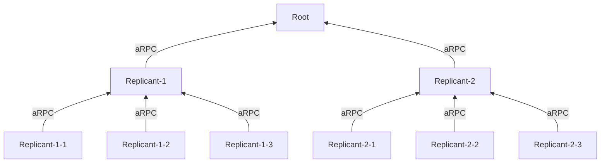

#  /example/tree_state_source

[`cd /`](/README.md)

> [!NOTE]
> **Asyncmachine-go** is an AOP Actor Model library for distributed workflows, built on top of a clock-based state
> machine. It has atomic transitions, subscriptions, RPC, logging, TUI debugger, metrics, tracing, and soon diagrams.

State source of flight statuses - in the real world this data-oriented problem should be modelled using composition and
handler delegation, but it's flat in this example for simplicity and research purposes.



## States

The repo version has 5 flights and 3 gates (149 states). The amount of flights and gates can be adjusted and
re-generated using `go run ./gen_states`. Full states file is available at [`./states/ss_flights.go`](./states/ss_flights.go).
Sample definition without relations can be found below.

```go
// FlightsStatesDef contains all the states of the Flights state machine.
type FlightsStatesDef struct {
    *am.StatesBase

    Flight1OnTime string
    Flight1Delayed string
    Flight1Departed string
    Flight1Arrived string
    Flight1Scheduled string
    Flight1Inbound string
    Flight1Outbound string
    Flight1GoToGate string
    Flight1GateUnknown string
    Flight1Gate1 string
    Flight1Gate2 string
    Flight1Gate3 string
    Flight1Gate4 string
    Flight1Gate5 string

    // ...

    // inherit from rpc/WorkerStatesDef
    *ssrpc.WorkerStatesDef
}
```

## Actors

- [root](./state_root/state_root.go)
- [replicant L1](./state_root/state_root.go)
- [replicant L2](./state_root/state_root.go)

Scenario:

- root process runs the flight-status state machine
- replicants of the 1st level connect to the root
- replicants of the 2st level connect to replicants of the 1st level
- state clocks flow from the root to replicants
- http clients GET active states from the 2nd level replicants
- all state machines are connected to am-dbg, prometheus, and loki

## Running

From the monorepo root:

1. `task web-metrics`
2. `task gen-grafana-tree-state-source`
3. `task tree-state-source`
4. [http://localhost:3000](http://localhost:3000) -> Dashboards -> tree-state-source

## Possibilities

- L1 and L2 replicants can execute handlers locally (TODO)
- root-L1 can have shorter push interval than L1-L2

## Benchmark

HTTP endpoints have been benchmarked using [go-wrk](https://github.com/tsliwowicz/go-wrk), see [/examples/benchmark_state_source](/examples/benchmark_state_source/README.md)
for more info.

## Config

```bash
# grafana sync

GRAFANA_TOKEN=
GRAFANA_URL=http://localhost:3000

# metrics

PUSH_GATEWAY_URL=http://localhost:9091
LOKI_ADDR=localhost:3100
AM_LOG=2

# AM debugging

#AM_DEBUG=1
#AM_DBG_ADDR=:6831
#AM_HEALTHCHECK=1

#AM_RPC_LOG_SERVER=1
#AM_RPC_LOG_CLIENT=1
#AM_RPC_LOG_MUX=1

#AM_NODE_LOG_SUPERVISOR=1
#AM_NODE_LOG_CLIENT=1
#AM_NODE_LOG_WORKER=1
```

## monorepo

[Go back to the monorepo root](/README.md) to continue reading.
