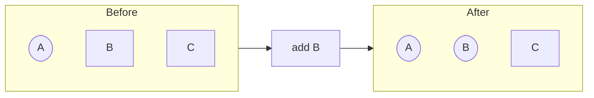
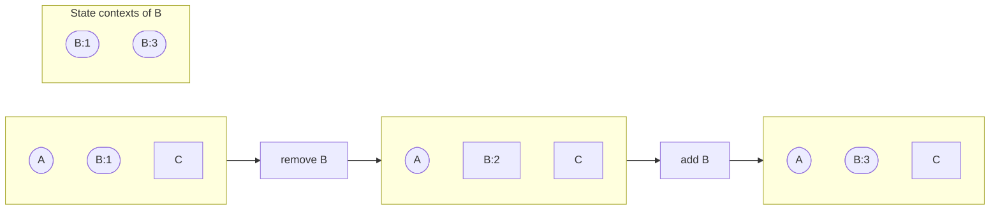
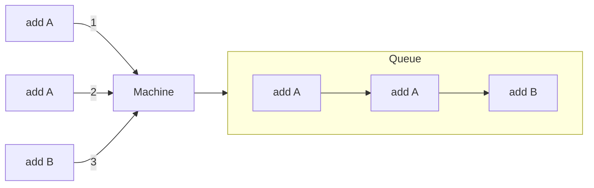
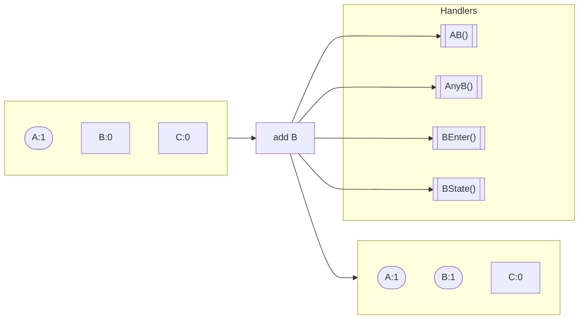
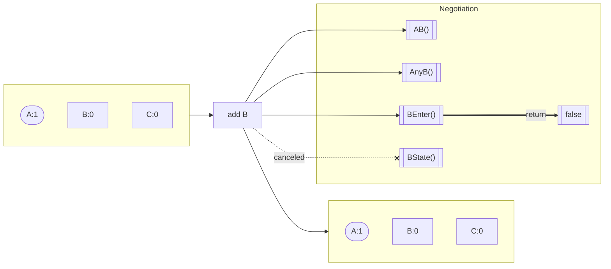
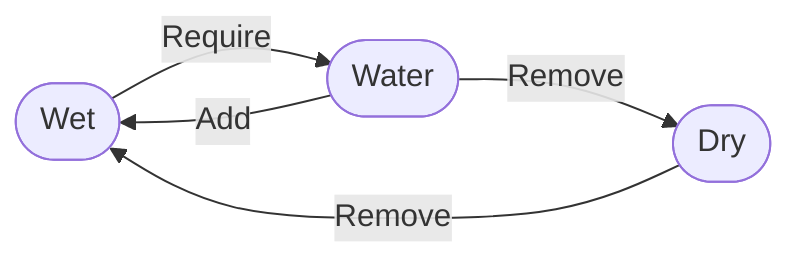
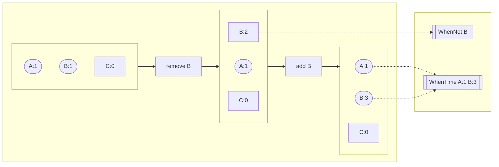

[](https://goreportcard.com/report/github.com/pancsta/asyncmachine-go)
[](https://codecov.io/gh/pancsta/asyncmachine-go)
[](https://pkg.go.dev/github.com/pancsta/asyncmachine-go)
[](https://github.com/pancsta/asyncmachine-go/commits/main/)

[](https://matrix.to/#/#room:asyncmachine)

#  /pkg/machine _ [cd /](/)

> [!NOTE]
> **Asyncmachine-go** is an AOP Actor Model library for distributed workflows, built on top of a lightweight state
> machine (nondeterministic, multi-state, clock-based, relational, optionally-accepting, and non-blocking). It has
> atomic transitions, RPC, logging, TUI debugger, metrics, tracing, and soon diagrams.

**/pkg/machine** is a minimal implementation of [AsyncMachine](https://github.com/TobiaszCudnik/asyncmachine)
(2012-2019; [video](http://tobiaszcudnik.github.io/asyncmachine-inspector/sample.mp4)) in Golang. It can transform
blocking APIs into fully-controllable, clock-based state machines with ease.

## Features

### [Many active states](/docs/manual.md#introduction)



### [Clock and state contexts](/docs/manual.md#clock-and-context)



### [Queue](/docs/manual.md#queue-and-history)



### [AOP handlers](/docs/manual.md#transition-handlers)



### [Negotiation](/docs/manual.md#transition-lifecycle)



### [Relations](/docs/manual.md#relations)



### [Subscriptions](/docs/manual.md#waiting)



### [Error handling](/docs/manual.md#error-handling)

```go
val, err := someOp()
if err {
    mach.AddErr(err, nil)
    return
}
```

### [Tracers](/docs/manual.md#tracing-and-metrics)

```text
TransitionInit TransitionStart TransitionEnd HandlerStart HandlerEnd
MachineInit MachineDispose NewSubmachine QueueEnd StructChange VerifyStates
```

## Usage

### [Raw Strings](/examples/raw_strings/raw_strings.go)

```go
// ProcessingFile to FileProcessed
// 1 async and 1 sync state
package main

import am "github.com/pancsta/asyncmachine-go/pkg/machine"

func main() {
    // init the state machine
    mach := am.New(nil, am.Struct{
        "ProcessingFile": { // async
            Remove: am.S{"FileProcessed"},
        },
        "FileProcessed": { // async
            Remove: am.S{"ProcessingFile"},
        },
        "InProgress": { // sync
            Auto:    true,
            Require: am.S{"ProcessingFile"},
        },
    }, nil)
    mach.BindHandlers(&Handlers{
        Filename: "README.md",
    })
    // change the state
    mach.Add1("ProcessingFile", nil)
    // wait for completed
    select {
    case <-time.After(5 * time.Second):
        println("timeout")
    case <-mach.WhenErr(nil):
        println("err:", mach.Err())
    case <-mach.When1("FileProcessed", nil):
        println("done")
    }
}

type Handlers struct {
    Filename string
}

// negotiation handler
func (h *Handlers) ProcessingFileEnter(e *am.Event) bool {
    // read-only ops
    // decide if moving fwd is ok
    // no blocking
    // lock-free critical zone
    return true
}

// final handler
func (h *Handlers) ProcessingFileState(e *am.Event) {
    // read & write ops
    // no blocking
    // lock-free critical zone
    mach := e.Machine
    // tick-based context
    stateCtx := mach.NewStateCtx("ProcessingFile")
    // unblock
    go func() {
        // re-check the tick ctx
        if stateCtx.Err() != nil {
            return // expired
        }
        // blocking call
        err := processFile(h.Filename, stateCtx)
        if err != nil {
            mach.AddErr(err, nil)
            return
        }
        // re-check the tick ctx after a blocking call
        if stateCtx.Err() != nil {
            return // expired
        }
        // move to the next state in the flow
        mach.Add1("FileProcessed", nil)
    }()
}
```

### [Waiting](/examples/subscriptions/example_subscriptions.go)

```go
// wait until FileDownloaded becomes active
<-mach.When1("FileDownloaded", nil)

// wait until FileDownloaded becomes inactive
<-mach.WhenNot1("DownloadingFile", nil)

// wait for EventConnected to be activated with an arg ID=123
<-mach.WhenArgs("EventConnected", am.A{"ID": 123}, nil)

// wait for Foo to have a tick >= 6 and Bar tick >= 10
<-mach.WhenTime(am.S{"Foo", "Bar"}, am.Time{6, 10}, nil)

// wait for DownloadingFile to have a tick increased by 2 since now
<-mach.WhenTicks("DownloadingFile", 2, nil)

// wait for an error
<-mach.WhenErr(nil)
```

### States File

```go
// BasicStatesDef contains all the states of the Basic state machine.
type BasicStatesDef struct {
    *am.StatesBase

    // ErrNetwork indicates a generic network error.
    ErrNetwork string
    // ErrHandlerTimeout indicates one of state machine handlers has timed out.
    ErrHandlerTimeout string

    // Start indicates the machine should be working. Removing start can force
    // stop the machine.
    Start string
    // Ready indicates the machine meets criteria to perform work, and requires
    // Start.
    Ready string
    // Healthcheck is a periodic request making sure that the machine is still
    // alive.
    Healthcheck string
}

var BasicStruct = am.Struct{

    // Errors

    ssB.ErrNetwork:        {Require: S{am.Exception}},
    ssB.ErrHandlerTimeout: {Require: S{am.Exception}},

    // Basics

    ssB.Start:       {},
    ssB.Ready:       {Require: S{ssB.Start}},
    ssB.Healthcheck: {},
}
```

### Passing Args

```go
// Example with typed state names (ssS) and typed arguments (A).
mach.Add1(ssS.KillingWorker, Pass(&A{
    ConnAddr:   ":5555",
    WorkerAddr: ":5556",
}))
```

See [docs/cookbook.md](/docs/cookbook.md) for more snippets.

### Mutations and Relations

[Mutations](/docs/manual.md#mutations) are the heartbeat of asyncmachine, while [relations](/docs/manual.md#relations)
define the rules of the flow. Check out the [relations playground](https://play.golang.com/p/e8FCW1bzPz1) and quiz
yourself (or a [fancier playground](https://goplay.tools/snippet/e8FCW1bzPz1)).

```go
mach := newMach("DryWaterWet", am.Struct{
    "Wet": {
        Require: am.S{"Water"},
    },
    "Dry": {
        Remove: am.S{"Wet"},
    },
    "Water": {
        Add:    am.S{"Wet"},
        Remove: am.S{"Dry"},
    },
})
mach.Add1("Dry", nil)
mach.Add1("Water", nil)
// TODO quiz: is Wet active?
```

## Demos

- [Relations playground](https://play.golang.com/p/e8FCW1bzPz1)
- Interactively use the [TUI debugger](/tools/cmd/am-dbg) with data pre-generated by
  - **libp2p-pubsub-simulator** in
    - web terminal: [http://188.166.101.108:8080/wetty/ssh](http://188.166.101.108:8080/wetty/ssh/am-dbg?pass=am-dbg:8080/wetty/ssh/am-dbg?pass=am-dbg)
    - remote terminal: `ssh 188.166.101.108 -p 4444`
    - local terminal: `go run github.com/pancsta/asyncmachine-go/tools/cmd/am-dbg@latest --import-data https://pancsta.github.io/assets/asyncmachine-go/am-dbg-exports/pubsub-sim.gob.br`
  - **remote integration tests** in
    - web terminal: [http://188.166.101.108:8081/wetty/ssh](http://188.166.101.108:8081/wetty/ssh/am-dbg?pass=am-dbg:8081/wetty/ssh/am-dbg?pass=am-dbg)
    - remote terminal: `ssh 188.166.101.108 -p 4445`
    - local terminal: `go run github.com/pancsta/asyncmachine-go/tools/cmd/am-dbg@latest --import-data https://pancsta.github.io/assets/asyncmachine-go/am-dbg-exports/remote-tests.gob.br`

## [Examples](/examples/README.md)

All examples and benchmarks can be found in [/examples](/examples/README.md).

## Tools


- **[`/tools/cmd/am-dbg`](/tools/cmd/am-dbg/README.md)** am-dbg is a multi-client TUI debugger.
- [`/tools/cmd/am-gen`](/tools/cmd/am-gen/README.md) am-gen generates states files and Grafana dashboards.
- `/tools/cmd/am-vis` Planned.

## Case Studies

Bigger implementations worth reading:

- [libp2p PubSub Simulator](https://github.com/pancsta/go-libp2p-pubsub-benchmark/#libp2p-pubsub-simulator) Sandbox
  simulator for libp2p-pubsub.
- [libp2p PubSub Benchmark](https://github.com/pancsta/go-libp2p-pubsub-benchmark/#libp2p-pubsub-benchmark)
  Benchmark of libp2p-pubsub ported to asyncmachine-go.
- [am-dbg TUI Debugger](/tools/debugger/README.md) Single state machine TUI app.

## Documentation

- [API](https://pkg.go.dev/github.com/pancsta/asyncmachine-go/pkg/machine)
- [diagrams](/docs/diagrams.md) \| [cookbook](/docs/cookbook.md)
- [manual.md](/docs/manual.md) \| [manual.pdf](https://pancsta.github.io/assets/asyncmachine-go/manual.pdf)
  - [Machine and States](/docs/manual.md#machine-and-states)
  - [Changing State](/docs/manual.md#changing-state)
  - [Advanced Topics](/docs/manual.md#advanced-topics)
  - [Cheatsheet](/docs/manual.md#cheatsheet)

## API

The most common API methods are listed below. There's more for [local state machines](https://pkg.go.dev/github.com/pancsta/asyncmachine-go/pkg/machine),
but all of these are also implemented in the [transparent RPC layer](/pkg/rpc/README.md).

```go
// A (arguments) is a map of named arguments for a Mutation.
type A map[string]any
// S (state names) is a string list of state names.
type S []string
type Time []uint64
type Clock map[string]uint64
type Result int
type Struct = map[string]State

// Api is a subset of Machine for alternative implementations.
type Api interface {
    // ///// REMOTE

    // Mutations (remote)

    Add1(state string, args A) Result
    Add(states S, args A) Result
    Remove1(state string, args A) Result
    Remove(states S, args A) Result
    Set(states S, args A) Result
    AddErr(err error, args A) Result
    AddErrState(state string, err error, args A) Result

    // Waiting (remote)

    WhenArgs(state string, args A, ctx context.Context) <-chan struct{}

    // Getters (remote)

    Err() error

    // ///// LOCAL

    // Checking (local)

    IsErr() bool
    Is(states S) bool
    Is1(state string) bool
    Not(states S) bool
    Not1(state string) bool
    Any(states ...S) bool
    Any1(state ...string) bool
    Has(states S) bool
    Has1(state string) bool
    IsTime(time Time, states S) bool
    IsClock(clock Clock) bool

    // Waiting (local)

    When(states S, ctx context.Context) <-chan struct{}
    When1(state string, ctx context.Context) <-chan struct{}
    WhenNot(states S, ctx context.Context) <-chan struct{}
    WhenNot1(state string, ctx context.Context) <-chan struct{}
    WhenTime(
        states S, times Time, ctx context.Context) <-chan struct{}
    WhenTicks(state string, ticks int, ctx context.Context) <-chan struct{}
    WhenTicksEq(state string, tick uint64, ctx context.Context) <-chan struct{}
    WhenErr(ctx context.Context) <-chan struct{}

    // Getters (local)

    StateNames() S
    ActiveStates() S
    Tick(state string) uint64
    Clock(states S) Clock
    Time(states S) Time
    TimeSum(states S) uint64
    NewStateCtx(state string) context.Context
    Export() *Serialized
    GetStruct() Struct
    Switch(groups ...S) string

    // Misc (local)

    Log(msg string, args ...any)
    Id() string
    ParentId() string
    SetLogId(val bool)
    GetLogId() bool
    SetLogger(logger Logger)
    SetLogLevel(lvl LogLevel)
    SetLoggerEmpty(lvl LogLevel)
    SetLoggerSimple(logf func(format string, args ...any), level LogLevel)
    Ctx() context.Context
    String() string
    StringAll() string
    Inspect(states S) string
    Index(state string) int
    BindHandlers(handlers any) error
    StatesVerified() bool
    Tracers() []Tracer
    DetachTracer(tracer Tracer) bool
    BindTracer(tracer Tracer)
    Dispose()
    WhenDisposed() <-chan struct{}
    IsDisposed() bool
}
```

## Tests

It's very easy to get a grasp of how asyncmachine works by reading the [idiomatic test suite](/pkg/machine/machine_test.go).
Consider the example below of a method used to wait for certain arguments passing via a state activation:

```go
func TestWhenArgs(t *testing.T) {
    // init
    m := NewRels(t, nil)

    // bind
    whenCh := m.WhenArgs("B", A{"foo": "bar"}, nil)

    // incorrect args
    m.Add1("B", A{"foo": "foo"})
    select {
    case <-whenCh:
        t.Fatal("whenCh shouldnt be selected")
    default:
        // pass
    }

    // correct args
    m.Add1("B", A{"foo": "bar"})
    select {
    case <-whenCh:
        // pass
    default:
        t.Fatal("whenCh should be selected")
    }

    // dispose
    m.Dispose()
    <-m.WhenDisposed()
}
```

## Status

Release Candidate, semantically versioned, not optimized yet.

## monorepo

[Go back to the monorepo root](/README.md) to continue reading.
