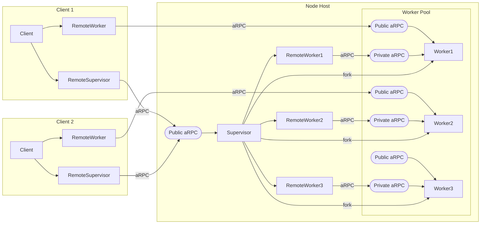

[](https://goreportcard.com/report/github.com/pancsta/asyncmachine-go)
[](https://codecov.io/gh/pancsta/asyncmachine-go)
[](https://pkg.go.dev/github.com/pancsta/asyncmachine-go)
[](https://github.com/pancsta/asyncmachine-go/commits/main/)

[](https://matrix.to/#/#room:asyncmachine)

#  /pkg/node

[cd /](/README.md)

> [!NOTE]
> **Asyncmachine-go** is an AOP Actor Model library for distributed workflows, built on top of a lightweight state
> machine (nondeterministic, multi-state, clock-based, relational, optionally-accepting, and non-blocking). It has
> atomic transitions, RPC, logging, TUI debugger, metrics, tracing, and soon diagrams.

**/pkg/node** provides distributed workflows via state-based orchestration of worker pools. Features a failsafe
supervision, and state machines for workers and clients. All the components communicate via [aRPC](/pkg/rpc/README.md),
and each worker is started in a separate OS process.

## Workflow Rules

- worker can serve only **1 client**
- supervisor can serve **many clients**
- client has a **direct connection** to the worker
- supervisor can supervise only **1 kind** of workers
- client can be connected to **1 supervisor**

> [!NOTE]
> Node Worker and RPC Worker are different things. RPC Worker reports it's state to the RPC Client, which can mutate it,
> while a Node Worker performs work for a Node Client. Node Worker is also an RPC Worker, just like Node Supervisor is.

## Flow

- OS starts the supervisor
- supervisor opens a public port
- supervisor starts workers based on pool criteria
- supervisor connects to all the workers via private ports
- client connects to supervisor's public port and requests a worker
- supervisor confirms with a worker and provides the client with connection info
- client connects to the worker, and delegates work via states
- worker reports state changes to both the client and supervisor
- supervisor maintains the worker, eg triggers log rotation, monitors errors and restarts
- worker delivers payload to the client via ClientSendPayload



## Components

### Worker

Any state machine can be exposed as a Node Worker, as long as it implements `/pkg/node/states/WorkerStructDef`. This can
be done either manually, or by using state helpers ([StructMerge](https://pkg.go.dev/github.com/pancsta/asyncmachine-go/pkg/machine#Machine.TimeSum),
[SAdd](https://pkg.go.dev/github.com/pancsta/asyncmachine-go/pkg/machine#SAdd)), or by generating a states file with [am-gen](/tools/cmd/am-gen/README.md).
It's also required to have the states verified by [Machine.VerifyStates](https://pkg.go.dev/github.com/pancsta/asyncmachine-go/pkg/machine#Machine.VerifyStates).
Worker should respond to `WorkRequested` and produce `ClientSendPayload` to send data to the client.

- [states file](/pkg/node/states/ss_node_worker.go)

```go
import (
    am "github.com/pancsta/asyncmachine-go/pkg/machine"
    amnode "github.com/pancsta/asyncmachine-go/pkg/node"
    arpc "github.com/pancsta/asyncmachine-go/pkg/rpc"
)

// ...

type workerHandlers struct {
    t *testing.T
}

func (w *workerHandlers) WorkRequestedState(e *am.Event) {
    // client-defined input
    input := e.Args["input"].(int)

    // create payload
    payload := &rpc.ArgsPayload{
        Name:   "mypayload",
        Data:   input * input,
        Source: e.Machine.ID,
    }

    // send payload
    e.Machine.Add1(ssW.ClientSendPayload, arpc.Pass(&arpc.A{
        Name:    payload.Name,
        Payload: payload,
    }))
}

// ...

// inherit from Node worker
ssStruct := am.StructMerge(ssnode.WorkerStruct, am.Struct{
    "Foo": {Require: am.S{"Bar"}},
    "Bar": {},
})
ssNames := am.SAdd(ssnode.WorkerStates.Names(), am.S{"Foo", "Bar"})

// init
mach := am.New(ctx, ssStruct, nil)
mach.VerifyStates(ssNames)
worker, err := NewWorker(ctx, workerKind, mach.GetStruct(), mach.StateNames(), nil)
```

### Supervisor

Supervisor needs a path to the worker's binary (with optional parameters) for `exec.Command`. It exposes states like
`Ready`, `PoolReady`, `WorkersAvailable` and awaits `ProvideWorker`.

- [states file](/pkg/node/states/ss_supervisor.go)

```go
import (
    am "github.com/pancsta/asyncmachine-go/pkg/machine"
    amnode "github.com/pancsta/asyncmachine-go/pkg/node"
)

// ...

var ssNames am.S
var ssStruct am.Struct
var workerKind string
var workerBin []string

// supervisor
super, err := amnode.NewSupervisor(ctx, workerKind, workerBin, ssStruct, ssNames, nil)
if err != nil {
    t.Fatal(err)
}
super.Start("localhost:1234")
err := amhelp.WaitForAll(ctx, 2*time.Second,
    super.When1(ssnode.SupervisorStates.PoolReady, ctx))
```

## Client

Any state machine can a Node Client, as long as it implements `/pkg/node/states/ClientStructDef`. This can be done
either manually, or by using state helpers ([StructMerge](https://pkg.go.dev/github.com/pancsta/asyncmachine-go/pkg/machine#Machine.TimeSum),
[SAdd](https://pkg.go.dev/github.com/pancsta/asyncmachine-go/pkg/machine#SAdd)), or by generating a states file with [am-gen](/tools/cmd/am-gen/README.md).
Client also needs to know his worker's states structure and order. To connect to the worker pool, client accepts a list
of supervisor addresses (PubSub discovery in on the roadmap), and will be trying to connect to them in order. After
`SuperReady` activates, client can call [`Client.ReqWorker(ctx)`](https://pkg.go.dev/github.com/pancsta/asyncmachine-go/pkg/rpc#Client.ReqWorker),
which will request a worker from the supervisor, resulting in `WorkerReady`. At this point client can access the worker
at [`Client.WorkerRpc.Worker`](https://pkg.go.dev/github.com/pancsta/asyncmachine-go/pkg/rpc#Client), add
`WorkRequested` multiple times, and handle `WorkerPayload`.

- [states file](/pkg/node/states/ss_node_client.go)

```go
import (
    am "github.com/pancsta/asyncmachine-go/pkg/machine"
    amnode "github.com/pancsta/asyncmachine-go/pkg/node"
)

// ...

var ssWorkerNames am.S
var ssWorkerStruct am.Struct
var workerKind string
var superAddrs []string

// inherit from Node client
ssStruct := am.StructMerge(ssnode.ClientStruct, am.Struct{
    "Foo": {Require: am.S{"Bar"}},
    "Bar": {},
})
ssNames := am.SAdd(ssnode.ClientStates.Names(), am.S{"Foo", "Bar"})

// describe client and worker
deps := &ClientStateDeps{
    WorkerSStruct: ssWorkerStruct,
    WorkerSNames:  ssWorkerNames,
    ClientSStruct: states.ClientStruct,
    ClientSNames:  states.ClientStates.Names(),
}

// init
client, err := amnode.NewClient(ctx, "myclient", workerKind, deps, nil)
client.Start(superAddrs)
err := amhelp.WaitForAll(ctx, 2*time.Second,
    super.When1(ssnode.ClientStates.SuperReady, ctx))

// request a worker
client.ReqWorker(ctx)
err := amhelp.WaitForAll(ctx, 2*time.Second,
    super.When1(ssnode.ClientStates.WorkerReady, ctx))
worker := client.WorkerRpc.Worker
worker.Add1(ssnode.WorkerStates.WorkRequested, am.A{"input": 2})
```

## Documentation

- [godoc /pkg/node](https://pkg.go.dev/github.com/pancsta/asyncmachine-go/pkg/node)

## Tests

At this point only a test suite exists, but a reference implementation is on the way. See [/pkg/node/node_test.go](/pkg/node/node_test.go),
eg `TestClientWorkerPayload` and uncomment `amhelp.EnableDebugging`. Below a command to run an exported debugging
session (no installation needed).

```bash
go run github.com/pancsta/asyncmachine-go/tools/cmd/am-dbg@latest \
  --select-machine ns-TCSF-dev-170605-0 \
  --select-transition 1 \
  --import-data https://pancsta.github.io/assets/asyncmachine-go/am-dbg-exports/worker-payload.gob.br
````

## Status

Alpha, work in progress, not semantically versioned.

## monorepo

[Go back to the monorepo root](/README.md) to continue reading.
