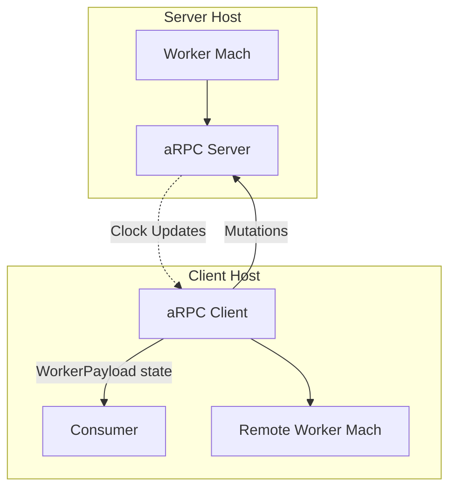

[](https://goreportcard.com/report/github.com/pancsta/asyncmachine-go)
[](https://codecov.io/gh/pancsta/asyncmachine-go)
[](https://pkg.go.dev/github.com/pancsta/asyncmachine-go)
[](https://github.com/pancsta/asyncmachine-go/commits/main/)

[](https://matrix.to/#/#room:asyncmachine)

#  /pkg/rpc _ [cd /](/)

> [!NOTE]
> **Asyncmachine-go** is an AOP Actor Model library for distributed workflows, built on top of a lightweight state
> machine (nondeterministic, multi-state, clock-based, relational, optionally-accepting, and non-blocking). It has
> atomic transitions, RPC, logging, TUI debugger, metrics, tracing, and soon diagrams.

**aRPC** is a transparent RPC for state machines implemented using [asyncmachine-go](/). It's
clock-based and features many optimizations, e.g. having most of the API methods executed locally (as state changes are
regularly pushed to the client). It's built on top of [cenkalti/rpc2](https://github.com/cenkalti/rpc2), `net/rpc`,
and [soheilhy/cmux](https://github.com/soheilhy/cmux). Check out a [dedicated example](/examples/arpc/), [gRPC benchmark](/examples/benchmark_grpc/README.md),
and [integration tests tutorial](/pkg/rpc/HOWTO.md).

## Features

- mutation methods
- wait methods
- clock pushes (from worker-side mutations)
- remote contexts
- multiplexing
- reconnect / fail-safety
- worker sending payloads to the client
- initial optimizations

Not implemented (yet):

- `WhenArgs`, `Err()`
- `PushAllTicks`
- chunked payloads
- TLS
- compression
- msgpack encoding

Each server can handle 1 client at a time, but 1 worker can have many servers attached to itself (via [Tracer API](https://pkg.go.dev/github.com/pancsta/asyncmachine-go/pkg/machine#Tracer)).
Additionally, remote workers can also have servers attached to themselves, creating a tree structure (see [/examples/benchmark_state_source](/examples/benchmark_state_source/README.md)).



## Components

### Worker

Any state machine can be exposed as an RPC worker, as long as it implements [`/pkg/rpc/states/WorkerStructDef`](/pkg/rpc/states/ss_rpc_worker.go).
This can be done either manually, or by using state helpers ([StructMerge](https://pkg.go.dev/github.com/pancsta/asyncmachine-go/pkg/machine#Machine.TimeSum),
[SAdd](https://pkg.go.dev/github.com/pancsta/asyncmachine-go/pkg/machine#SAdd)), or by generating a states file with
[am-gen](/tools/cmd/am-gen/README.md). It's also required to have the states verified by [Machine.VerifyStates](https://pkg.go.dev/github.com/pancsta/asyncmachine-go/pkg/machine#Machine.VerifyStates).
Worker can send data to the client via the `SendPayload` state.

- [states file](/pkg/rpc/states/ss_rpc_worker.go)

```go
import (
    am "github.com/pancsta/asyncmachine-go/pkg/machine"
    arpc "github.com/pancsta/asyncmachine-go/pkg/rpc"
    ssrpc "github.com/pancsta/asyncmachine-go/pkg/rpc/states"
)

// ...

// inherit from RPC worker
ssStruct := am.StructMerge(ssrpc.WorkerStruct, am.Struct{
    "Foo": {Require: am.S{"Bar"}},
    "Bar": {},
})
ssNames := am.SAdd(ssrpc.WorkerStates.Names(), am.S{"Foo", "Bar"})

// init
worker := am.New(ctx, ssStruct, nil)
worker.VerifyStates(ssNames)

// ...

// send data to the client
worker.Add1(ssrpc.WorkerStates.SendPayload, arpc.Pass(&arpc.A{
    Name: "mypayload",
    Payload: &arpc.ArgsPayload{
        Name: "mypayload",
        Source: "worker1",
        Data: []byte{1,2,3},
    },
}))
```

### Server

Each RPC server can handle 1 client at a time. Both client and server need the same worker states definition (structure
map and ordered list of states). After the initial handshake, server will be pushing local state changes every [PushInterval](https://pkg.go.dev/github.com/pancsta/asyncmachine-go/pkg/rpc#Server),
while state changes made by an RPC client are delivered synchronously. Server starts listening on either
[Addr](https://pkg.go.dev/github.com/pancsta/asyncmachine-go/pkg/rpc#Server), [Listener](https://pkg.go.dev/github.com/pancsta/asyncmachine-go/pkg/rpc#Server),
or [Conn](https://pkg.go.dev/github.com/pancsta/asyncmachine-go/pkg/rpc#Server). Basic ACL is possible via [AllowId](https://pkg.go.dev/github.com/pancsta/asyncmachine-go/pkg/rpc#Server).

- [states file](/pkg/rpc/states/ss_rpc_server.go)

```go
import (
    amhelp "github.com/pancsta/asyncmachine-go/pkg/helpers"
    am "github.com/pancsta/asyncmachine-go/pkg/machine"
    arpc "github.com/pancsta/asyncmachine-go/pkg/rpc"
    ssrpc "github.com/pancsta/asyncmachine-go/pkg/rpc/states"
)

// ...

var addr string
var worker *am.Machine

// init
s, err := arpc.NewServer(ctx, addr, worker.ID, worker, nil)
if err != nil {
    panic(err)
}

// start
s.Start()
err = amhelp.WaitForAll(ctx, 2*time.Second,
    s.Mach.When1(ssrpc.ServerStates.RpcReady, ctx))
if ctx.Err() != nil {
    return
}
if err != nil {
    return err
}

// react to the client
<-worker.When1("Foo", nil)
print("Client added Foo")
worker.Add1("Bar", nil)
```

### Client

Each RPC client can connect to 1 server and needs to know worker's states structure and order. Data send by a worker via
`SendPayload` will be received by a [Consumer machine](https://pkg.go.dev/github.com/pancsta/asyncmachine-go/pkg/rpc/states#ConsumerStatesDef)
(passed via [ClientOpts.Consumer](https://pkg.go.dev/github.com/pancsta/asyncmachine-go/pkg/rpc#ClientOpts)) as an Add
mutation of the `WorkerPayload` state (see a [detailed diagram](/docs/diagrams.md#rpc-getter-flow)). Client supports
fail-safety for both connection (eg [ConnRetries](https://pkg.go.dev/github.com/pancsta/asyncmachine-go/pkg/rpc#Client),
[ConnRetryBackoff](https://pkg.go.dev/github.com/pancsta/asyncmachine-go/pkg/rpc#Client)) and calls (eg [CallRetries](https://pkg.go.dev/github.com/pancsta/asyncmachine-go/pkg/rpc#Client),
[CallRetryBackoff](https://pkg.go.dev/github.com/pancsta/asyncmachine-go/pkg/rpc#Client)).

After the client's `Ready` state becomes active, it exposes a remote worker at `client.Worker`. Remote worker implements
most of [Machine](https://pkg.go.dev/github.com/pancsta/asyncmachine-go/pkg/machine#Machine)'s methods, many of which
are evaluated locally (like [Is](https://pkg.go.dev/github.com/pancsta/asyncmachine-go/pkg/rpc#Worker.Is), [When](https://pkg.go.dev/github.com/pancsta/asyncmachine-go/pkg/rpc#Worker.When),
[NewStateCtx](https://pkg.go.dev/github.com/pancsta/asyncmachine-go/pkg/rpc#Worker.NewStateCtx)). See [machine.Api](https://pkg.go.dev/github.com/pancsta/asyncmachine-go/pkg/machine#Api)
for a full list.

- [states file](/pkg/rpc/states/ss_rpc_client.go)

```go
import (
    amhelp "github.com/pancsta/asyncmachine-go/pkg/helpers"
    am "github.com/pancsta/asyncmachine-go/pkg/machine"
    arpc "github.com/pancsta/asyncmachine-go/pkg/rpc"
    ssrpc "github.com/pancsta/asyncmachine-go/pkg/rpc/states"
)

// ...

var addr string
// worker state structure
var ssStruct am.Struct
// worker state names
var ssNames am.S

// consumer
consumer := am.New(ctx, ssrpc.ConsumerStruct, nil)

// init
c, err := arpc.NewClient(ctx, addr, "clientid", ssStruct, ssNames, &arpc.ClientOpts{
    Consumer: consumer,
})
if err != nil {
    panic(err)
}

// start
c.Start()
err := amhelp.WaitForAll(ctx, 2*time.Second,
    c.Mach.When1(ssrpc.ClientStates.Ready, ctx))
if ctx.Err() != nil {
    return
}
if err != nil {
    return err
}

// use the remote worker
c.Worker.Add1("Foo", nil)
<-c.Worker.When1("Bar", nil)
print("Server added Bar")
```

### Multiplexer

Because 1 server can serve only 1 client (for simplicity), it's often required to use a port multiplexer. It's very
simple to create one using [NewMux](https://pkg.go.dev/github.com/pancsta/asyncmachine-go/pkg/rpc#NewMux) and a callback
function, which returns a new server instance.

- [states file](/pkg/rpc/states/ss_mux.go)

```go
import (
    amhelp "github.com/pancsta/asyncmachine-go/pkg/helpers"
    arpc "github.com/pancsta/asyncmachine-go/pkg/rpc"
    ssrpc "github.com/pancsta/asyncmachine-go/pkg/rpc/states"
)

// ...

// new server per each new client (optional)
var newServer arpc.MuxNewServer = func(num int64, _ net.Conn) (*Server, error) {
    name := fmt.Sprintf("%s-%d", t.Name(), num)
    s, err := NewServer(ctx, "", name, w, nil)
    if err != nil {
        t.Fatal(err)
    }

    return s, nil
}

// start cmux
mux, err := arpc.NewMux(ctx, t.Name(), newServer, nil)
if err != nil {
    t.Fatal(err)
}
mux.Listener = listener // or mux.Addr := ":1234"
mux.Start()
err := amhelp.WaitForAll(ctx, 2*time.Second,
    mux.Mach.When1(ssrpc.MuxStates.Ready, ctx))
if ctx.Err() != nil {
    return
}
if err != nil {
    return err
}
```

## Documentation

- [godoc /pkg/rpc](https://pkg.go.dev/github.com/pancsta/asyncmachine-go/pkg/rpc)
- [Example - Setup](/examples/arpc)
- [Example - Tree State Source](/examples/tree_state_source/README.md)
- [manual.md](/docs/manual.md#remote-machines)

## Benchmark: aRPC vs gRPC

A simple and opinionated benchmark showing a `subscribe-get-process` scenario, implemented in both gRPC and aRPC. See
[/examples/benchmark_grpc](/examples/benchmark_grpc/README.md) for details and source code.


```text
> task benchmark-grpc
...
BenchmarkClientArpc
    client_arpc_test.go:136: Transferred: 609 bytes
    client_arpc_test.go:137: Calls: 4
    client_arpc_test.go:138: Errors: 0
    client_arpc_test.go:136: Transferred: 1,149,424 bytes
    client_arpc_test.go:137: Calls: 10,003
    client_arpc_test.go:138: Errors: 0
BenchmarkClientArpc-8              10000            248913 ns/op           28405 B/op        766 allocs/op
BenchmarkClientGrpc
    client_grpc_test.go:117: Transferred: 1,113 bytes
    client_grpc_test.go:118: Calls: 9
    client_grpc_test.go:119: Errors: 0
    client_grpc_test.go:117: Transferred: 3,400,812 bytes
    client_grpc_test.go:118: Calls: 30,006
    client_grpc_test.go:119: Errors: 0
BenchmarkClientGrpc-8              10000            262693 ns/op           19593 B/op        391 allocs/op
BenchmarkClientLocal
BenchmarkClientLocal-8             10000               434.4 ns/op            16 B/op          1 allocs/op
PASS
ok      github.com/pancsta/asyncmachine-go/examples/benchmark_grpc      5.187s
```

## API

**aRPC** implements `/pkg/machine#Api`, which is a large subset of `/pkg/machine#Machine` methods. Below the full list,
with distinction which methods happen where (locally or on remote).

```go
// Api is a subset of Machine for alternative implementations.
type Api interface {
    // ///// REMOTE

    // Mutations (remote)

    Add1(state string, args A) Result
    Add(states S, args A) Result
    Remove1(state string, args A) Result
    Remove(states S, args A) Result
    Set(states S, args A) Result
    AddErr(err error, args A) Result
    AddErrState(state string, err error, args A) Result

    // Waiting (remote)

    WhenArgs(state string, args A, ctx context.Context) <-chan struct{}

    // Getters (remote)

    Err() error

    // ///// LOCAL

    // Checking (local)

    IsErr() bool
    Is(states S) bool
    Is1(state string) bool
    Not(states S) bool
    Not1(state string) bool
    Any(states ...S) bool
    Any1(state ...string) bool
    Has(states S) bool
    Has1(state string) bool
    IsTime(time Time, states S) bool
    IsClock(clock Clock) bool

    // Waiting (local)

    When(states S, ctx context.Context) <-chan struct{}
    When1(state string, ctx context.Context) <-chan struct{}
    WhenNot(states S, ctx context.Context) <-chan struct{}
    WhenNot1(state string, ctx context.Context) <-chan struct{}
    WhenTime(
        states S, times Time, ctx context.Context) <-chan struct{}
    WhenTicks(state string, ticks int, ctx context.Context) <-chan struct{}
    WhenTicksEq(state string, tick uint64, ctx context.Context) <-chan struct{}
    WhenErr(ctx context.Context) <-chan struct{}

    // Getters (local)

    StateNames() S
    ActiveStates() S
    Tick(state string) uint64
    Clock(states S) Clock
    Time(states S) Time
    TimeSum(states S) uint64
    NewStateCtx(state string) context.Context
    Export() *Serialized
    GetStruct() Struct
    Switch(groups ...S) string

    // Misc (local)

    Log(msg string, args ...any)
    Id() string
    ParentId() string
    SetLogId(val bool)
    GetLogId() bool
    SetLogger(logger Logger)
    SetLogLevel(lvl LogLevel)
    SetLoggerEmpty(lvl LogLevel)
    SetLoggerSimple(logf func(format string, args ...any), level LogLevel)
    Ctx() context.Context
    String() string
    StringAll() string
    Inspect(states S) string
    Index(state string) int
    BindHandlers(handlers any) error
    StatesVerified() bool
    Tracers() []Tracer
    DetachTracer(tracer Tracer) bool
    BindTracer(tracer Tracer)
    Dispose()
    WhenDisposed() <-chan struct{}
    IsDisposed() bool
}
```

## Tests

**aRPC** passes the [whole test suite](/pkg/rpc/rpc_machine_test.go) of [`/pkg/machine`](/pkg/machine/machine_test.go)
for the exposed methods and provides a couple of [optimization-focused tests](/pkg/rpc/rpc_test.go) (on top of tests for
basic RPC).

## Optimizations

**aRPC** implements several optimization strategies to achieve the results.

- `net/rpc` method names as runes
- binary format of `encoding/gob`
- index-based clock
  - `[0, 100, 0, 120]`
- diff-based clock updates
  - `[0, 1, 0, 1]`
- debounced server-mutation clock pushes
  - `[0, 5, 2, 1]`
- partial clock updates
  - `[[1, 1], [3, 1]]`

## Status

Testing, not semantically versioned.

## monorepo

- [`/examples/arpc`](/examples/arpc)
- [`/examples/tree_state_source`](/examples/tree_state_source/README.md)
- [`/pkg/rpc/HOWTO.md`](/pkg/rpc/HOWTO.md)
- [`/examples/benchmark_grpc/README.md`](/examples/benchmark_grpc/README.md)

[Go back to the monorepo root](/README.md) to continue reading.
